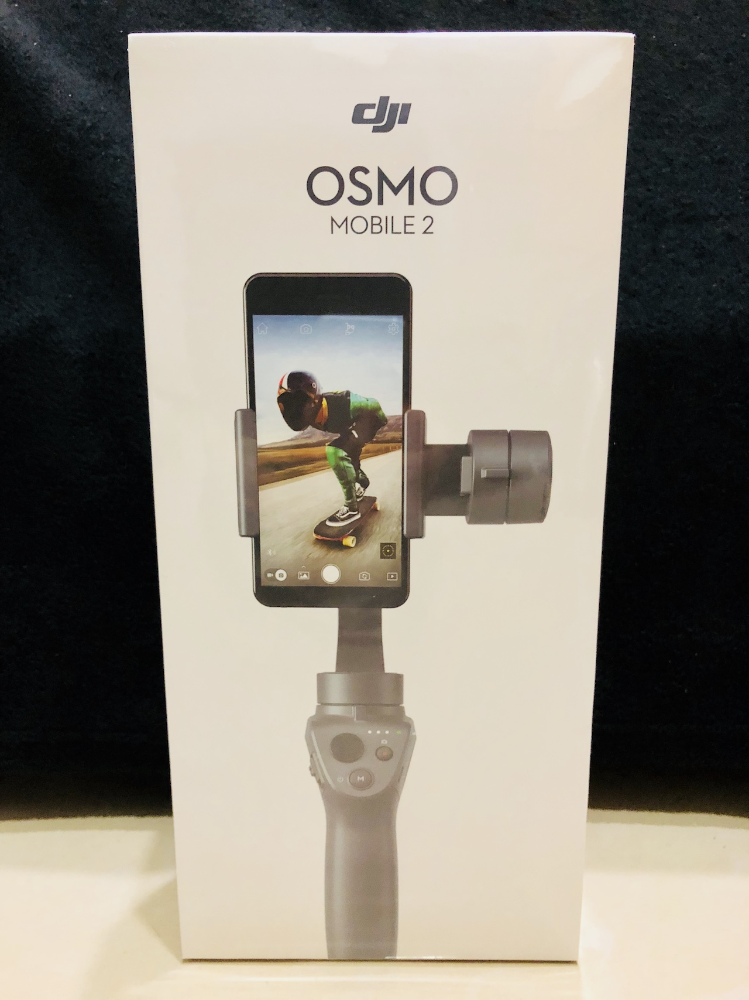
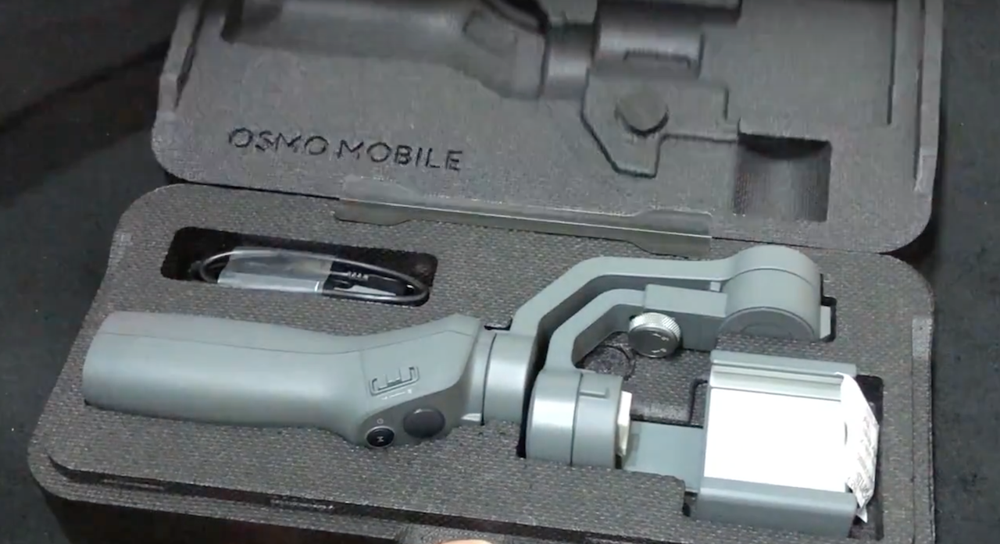
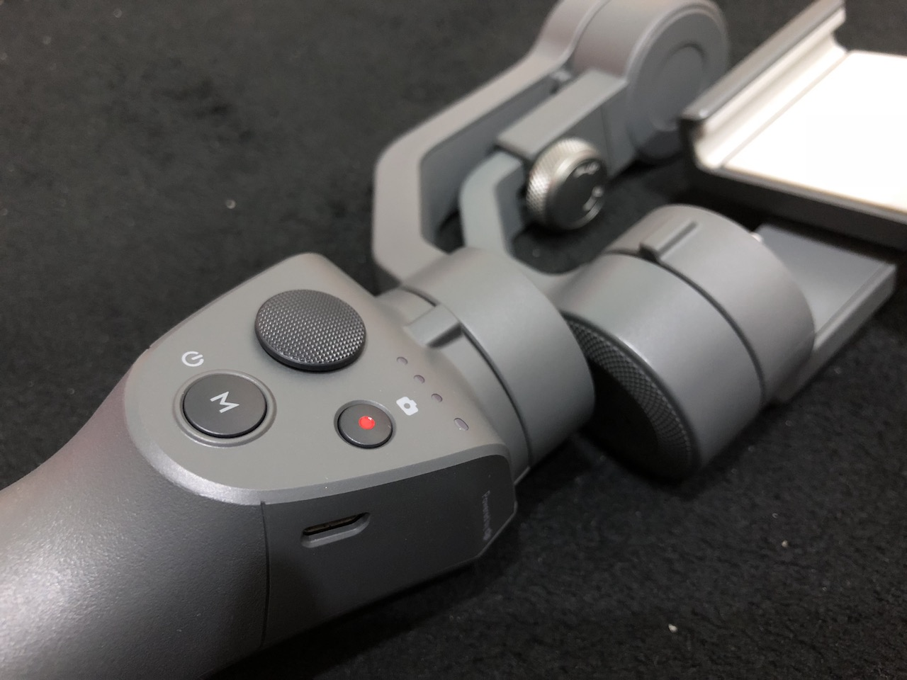
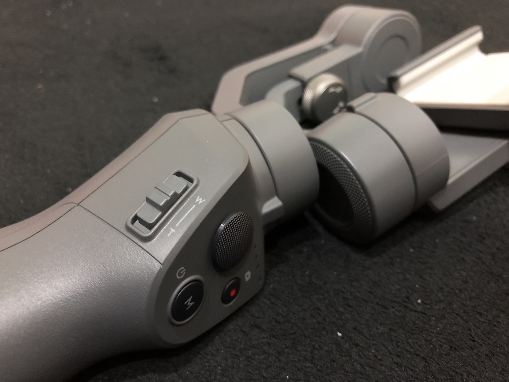
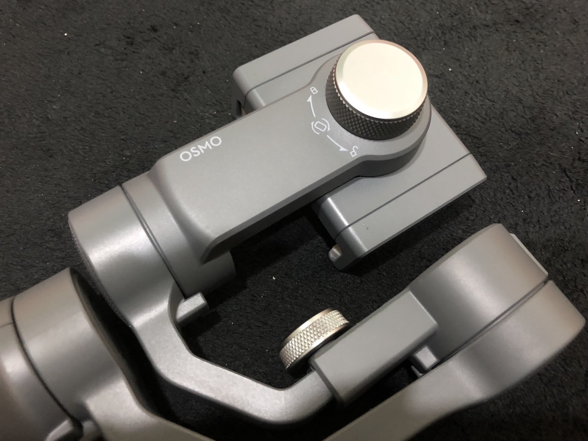

终於拿到从DJI官网上订购的Osmo Mobile 2稳定器。原本二月便已在Apple专门店上市，然而台湾的Apple却迟迟未上架，最终只好直接从官网购买。官网也一度没货，有货以後才发现，下单後需要20天才会出货，等到寄到已经差不多一个月了。只能说DJI官网的购物体验实在不能符合2018年的消费者的期待。所幸产品本身是相当令人满意，马上来开箱。
<!--more-->

##DJI Osmo Mobile 2开箱影片

[点击前往YOUKU观看影片](http://v.youku.com/v_show/id_XMzUxMTE4MTM3Mg==.html)

包装上可说是中规中矩，没太多可说的，大家也习惯了这种白底的苹果式包装。

打开白色外盒，里面只有一个黑色的保护盒，而这个保护盒里面便是Osmo Mobile 2三轴稳定器以及其充电线。可惜的是，充电线是Micro USB而不是最新的Type C，意味着，我又要多带一条线。

##DJI Osmo Mobile 2细节照片

作为DJI Osmo Mobile系列的第二代，这台机器定价仅为上一代的一半：第一代发售价为299美元，而第二代的官方售价只是129美元（当然在台湾买会比较贵）。很多人认为这是为了对抗智云（Zhiyu）等品牌推出的较低价的三轴稳定器。由於价格下降，第二代的机身从金属转为的塑胶（强化尼龙）。相较上代，质感却是有所下降，但却换来更轻的机身以及续航由5个小时增加到15个小时，还有售价减半，个人感觉相当值得。

DJI Osmo Mobile 2的正面可以看到三个按键，最大的是摇杆，可控制相机往上下左右方向转动。不过，其敏感度相当高，要花一些时间练习，才能适应。最下方的 M 键是模式切换键，只有跟随和锁定两种模式可供选择，同时它也是开关机键，长按约5秒可开关机。最後右侧有个红点在中间的便是摄影／录影键，根据手机设定的模式可进行摄影或启动录影。

Osmo Mobile 2的侧面加入了一个zoom in/out推钮，下拉可zoom in，上推则zoom out。若你的手机有光学变焦功能（如iPhone Plus系列），便能在不影响画质的情况下实现平滑缩放，否则这个功能会影响解释度。

背面可以看到手机夹的锁定旋钮，平衡好手机後，记得将它锁定。至於怎样平衡手机，可以参考DJI的官方教学。

接着，来看一下我用Osmo Mobile 2加上iPhone 8拍的一些样片。

##DJI Osmo Mobile 2 样片 + iPhone 8

[点击前往YOUKU观看影片](http://player.youku.com/embed/XMzUxMTE5MzA4OA==)

最基本的操作：平移，模式为跟随（Follow）。地点为林口师大侨先部。

[点击前往YOUKU观看影片](http://player.youku.com/embed/XMzUxMTIwMDYwMA==)

模式同样为跟随（Follow），低位移动。

慢动作样片：

[点击前往YOUKU观看影片](http://player.youku.com/embed/XMzUxMTIwMzI2OA==)

慢动作基本上是依赖手机本身的功能，Osmo Mobile 2是让影片的抖动降到最低。在室内灯光条件下，可能会出现闪烁，但这是慢动作影片的问题，与稳定器无关。

[点击前往YOUKU观看影片](http://player.youku.com/embed/XMzUxMTIxODgwNA==)

另外，慢动作影片刚开始的一两秒和结束前的一两秒会是正常速度，不过这也应该是手机的设计，而不是稳定器造成。

而最好玩的就一定是延时摄影（Timelapse），或称缩时略影。Osmo Mobile 2提供三种不同的延时摄影：静态延时（Timelapse）丶动态延时（Hyperlapse）以及轨迹延时（Motion Timelapse）。以下是我在林口三井Outlet门口拍的轨迹延时：

[点击前往YOUKU观看影片](http://player.youku.com/embed/XMzUxMTIyNDE1Ng==)

出来的效果非常好，设定很简单，我加了一个小小的三脚架，放在地上等十分钟就完成。唯一比较麻烦的是天上的太阳，要是太热的话，站在一旁等也不是滋味，但手机放在那里，你也不能走太远。而且路过的人也会向你投来好奇的眼光。

以下是用动态延时在三井Outlet里走一圈：

[点击前往YOUKU观看影片](http://player.youku.com/embed/XMzUxMTI1OTg2MA==)

再来一段户外的影片：

[点击前往YOUKU观看影片](http://player.youku.com/embed/XMzUxMTI1MDgzMg==)

个人感觉动态延时的效果也是很让人满意的，影片看起来很有意思。

##总结：DJI Osmo Mobile 2是一款优秀且高CP值的手机三轴稳定器

DJI Osmo Mobile 2以129美元的价格（台湾卖4600台币左右），提供优秀的稳定效果，丰富的功能，还有15个小时的续航（可为手机充电），可说是大疆最高CP值的产品。虽然只玩了几天，但我也已经相当喜欢这个新玩具，并想到很多东西可拍（主要是延时摄影，如由黄昏入夜等）。整体来讲，我对DJI Osmo Mobile 2是满意的，唯一可以抱怨的便是每次使用前都要调平衡，会花掉一点时间，而且我不太能确定稳定器是否（完美地）平衡了（感觉有点误差也不会有问题）。

[本文繁体中文版](https://nodejust.com/dji-osmo-mobile-2-gimbal-unbox/)
