这是《[程式学徒](/apprentice-coding/)》的第一个系列：《网页设计学徒》。这个系列适合完全没程式经验的新手。

程度：**完全新手**

视频链接：
* [Bilibili](https://www.bilibili.com/video/av22408533/)
* [YouTube](https://youtu.be/ePlosU44AKg)

##今天会学到什么？

1. 网页的本质是什么？认识HTML
2. 网页是怎么运作的？
3. 完成并发表你的第一个网页。

##网页是什么？

作为网页设计学徒的第一课，我们先来认识一下到底网页的本质是什么。

其实网页就是一个有著特殊格式的文本（纯文字）文件。这种特殊格式叫做HTML格式，它是专门为网页制订的文件格式，所有的网页都是这种格式的文本文件。

你可以用Google Chrome前往任何一个网站，右键点击，在弹出菜单中选择：查看源码（View source），接著在新分页便会跳这一页的水原码。通常在开头不远的地方你会看到“html”字样，代表这是一个HTML文件。以下是我的网站（ZackLive.com）的源码开头部分：

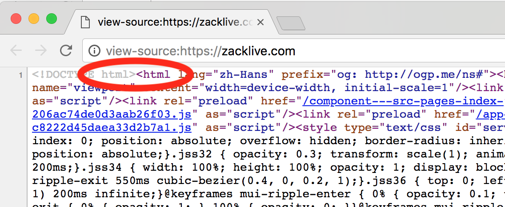

一般HTML文件以**.html**结尾，其中首页一般是**index.html**。HTML文件最重要的特点就是：**标签**（tag）。它用标签来标示不同的功能，例如：`<title>`这是标题`</title>`。其中：

`<title>`是开始标签；

`</title>`是结束标签；

而其中间的内容便具备让标签的功能。而`<title>`标签便是用来设定网页的标题，也就是`<title>`与`</title>`之间的就是这个网页的标题。

HTML标签有很多，你不需要全部记下来，随著学习的深入，你认识的会越来越多，而最常用的也就是那些，不用多久，你自然会记得。如果对标签的使用有不确定的地方，可以到**W3 School**查询：

**[W3School.com.cn/html](http://www.w3school.com.cn/html)**

##你的第一个网页（站）

那么现在我们就来建立你的第一个网页吧。这个网站的最终目标是成为你的线上履历，我们会一点一点地完成它。

首先，我们新建一个文件夹，命名为web，用来放所有跟这个网站相关的东西。正如前面所讲，网页只是一个文本文件，你可以在web文件夹里，新增一个文本文件，并将它改名为**index.html**作为首页。要注意文件名的结尾（即扩展名）已经是**.html**而不是.txt。

双击index.html的话，有可能会用浏览器打开，这样我们便无法进行编辑。你可以右键点击选择“编辑”或用笔记本打开。

现在我们便可以开始写HTML了。首先你要知道三个最基本的标签：

1. `<html></html>`：表示HTML文件的开始与结束。所有HTML的内容都要放在这中间。
2. `<head></head>`：HTML文件的“头部”，这里面放的是网站的设定，例如，设定这个网站的语言是中文等。这些内容一般不会出现在浏览器中间，
3. `<body></body>`：HTML文件的“身体”，也就是正文部分。所有网页上显示的内容都放在这里。

其中`<head>`和`<body>`都要放在`<html>`里面，请将以下程式码写进index.html：

```
<html>

  <head>
  </head>

  <body>
  </body>

</html>
```

以下是它们之间的关系示意图：

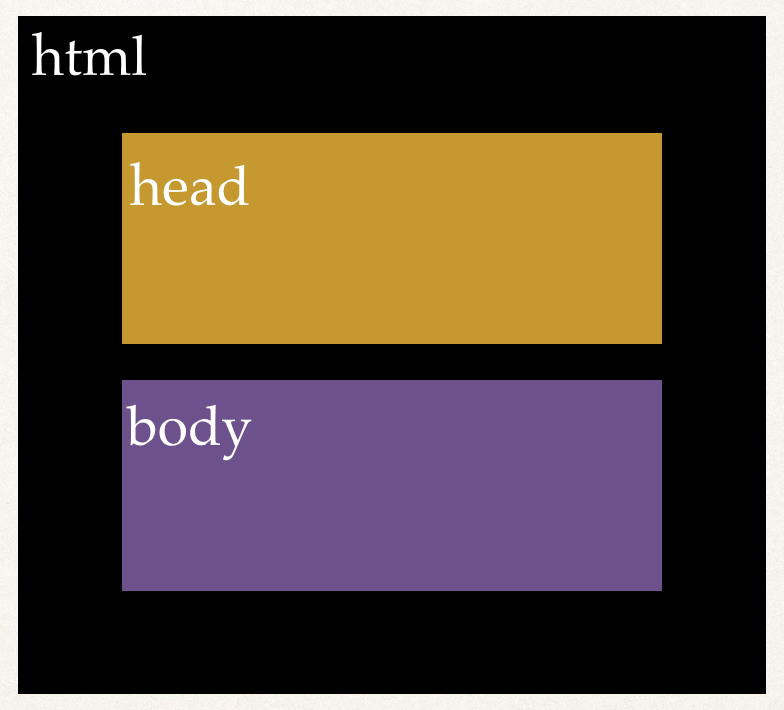

这样我们完成了一个HTML文件该有的架构，但内容却是空白的。那我们来加入一段文字。既然是一段文字，我们便要用到段落标签：`<p></p>`，来自段落的英文单字paragraph。而这段文字是会出现在网页正文，所以要放在`<body>`里面：

```
<html>

  <head>
  </head>

  <body>
    <p>Hi，我是Zack。</p>
  </body>

</html>
```

当然，`<p></p>`中间的文字便随你喜欢。现在我们将index.html用浏览器打开（直接拉进浏览器）。你会看到以下画面：

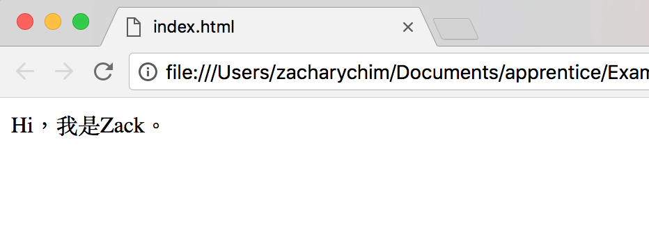

这里可以看到浏览器顶部写著index.html，也就是这个文件的名称。事实上，这个名称便是由我们前面提到过的`<title></title>`标签所决定的。很明显这不是网页正文，所以要放在`<head>`里面：

```
<html>

  <head>
    <title>Zack的履历</title>
  </head>

  <body>
    <p>Hi，我是Zack。</p>
  </body>

</html>
```

将`<title>`加入后，刷新浏览器上的index.html页面：

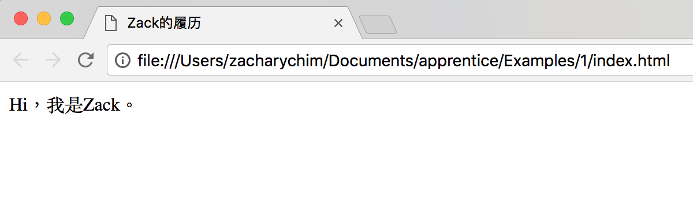

这个HTMl文件的头部（`<head>`）和正文（`<body>`）都有了内容，这已经是一个最基本的网页。在之后的课程中，我们会加入更多的功能，但现在，让我们将它公开发表，让所有人都能看到你的作品。

##网页是怎样运作的？

在发表前，我们先了解一下网页是怎运作的。

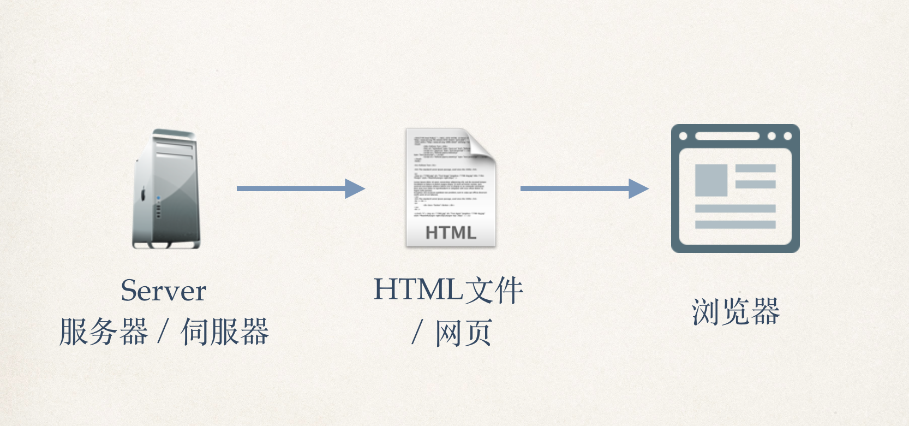

网页是放在一台24小时运行的电脑上，这台电脑24小时都在为你服务，因此被称为服务器或伺服器（Server）。我们透过网址（网上的地址）找到这个网页，将它下载到我们的浏览器上查看。

因此，我们需要服务器来放网页，才能让别人随时查看。

##GitHub：全球最大的程式仓库

GitHub是目前全世界最大的程式仓库。顾名思意，程式仓库就是一个让你管理程式的地方。GitHub聚集了来自全世界的开发者，可以说是每一位程式员都会到访的网站。它的Pages服务可以作为服务器，让我们存放网页。

GitHub有著大量实用功能，不要被它复杂的介面和英文吓倒，其实我们并不需要经常进入它的网站，只是偶尔来进行一些设定而已。目前我们只要做两件事：

1. 建立一个程式仓库，并上传我们的网页。
2. 启用Pages功能。

但首先当然要先注册一个帐号。前往[GitHub.com](https://github.com)：

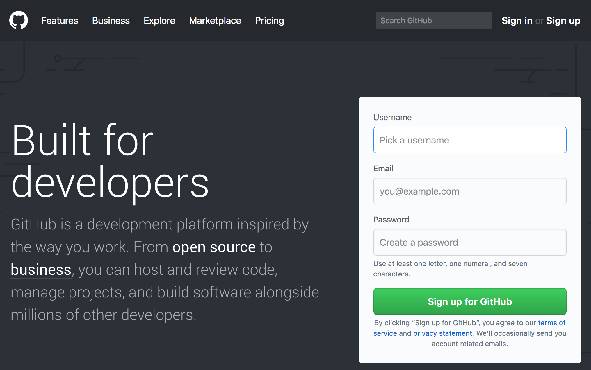

只要在右侧填入帐号名称，email和密码，按下Sign Up for GitHub即完成注册。

接著，点击右上角的加号，接著选第一项：New Repository（新仓库）：

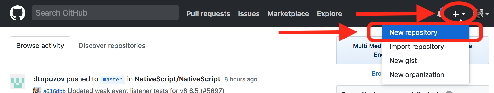

在下一个画面只要填入仓库名称（Repository Name），并勾选初始化仓库（Initialize this repository with a README）。你可以用任意仓库名，这里我就简单地用“web”作为仓库名。点下“Create Repository”便完成新仓库的建立。

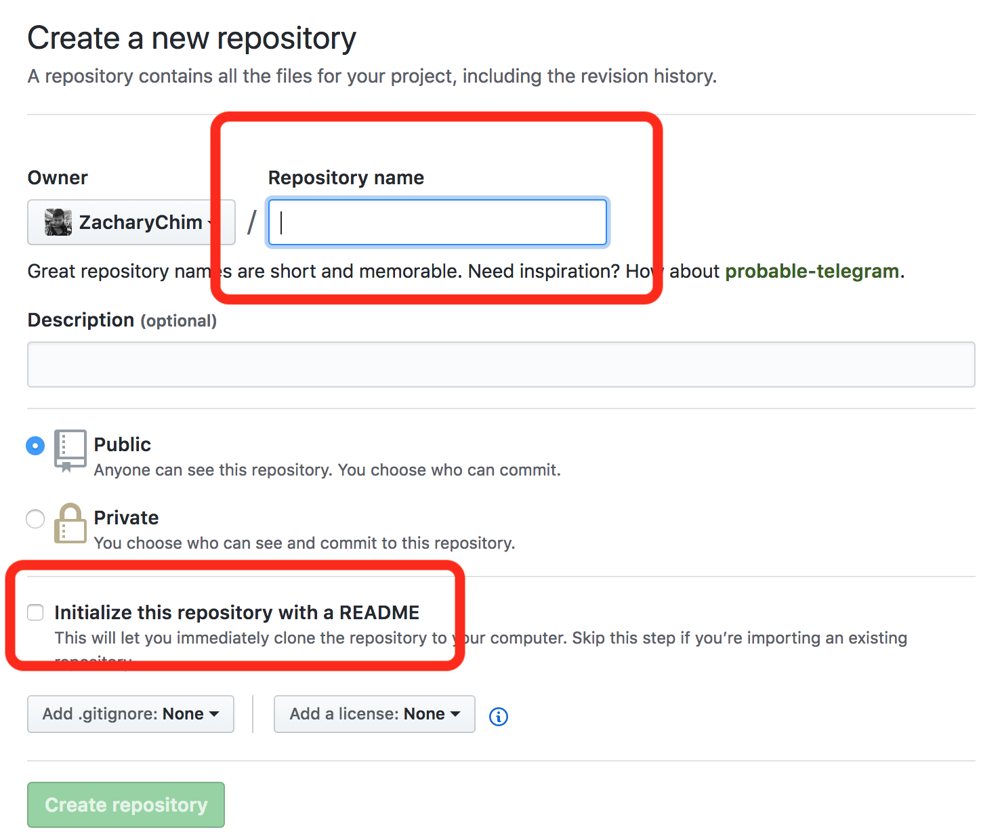

接著，我们会来到仓库管理页面。在这个页面中间偏右的地方有一个上传文件（Upload Files）按键，点击后便能进入上传页面：

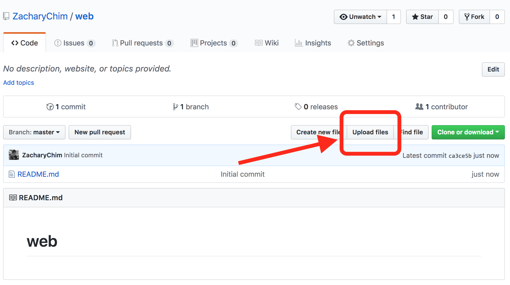

直接将我们的index.html拉到画面正中间或点击：Choose your files（选择你的文件）进行上传，下方的“Commit changes（提交变更）”的第一栏是让你做笔记的地方，这里你可以写（可任意）：上传index.html。最后按下底部的“Commit changes”按建提交。

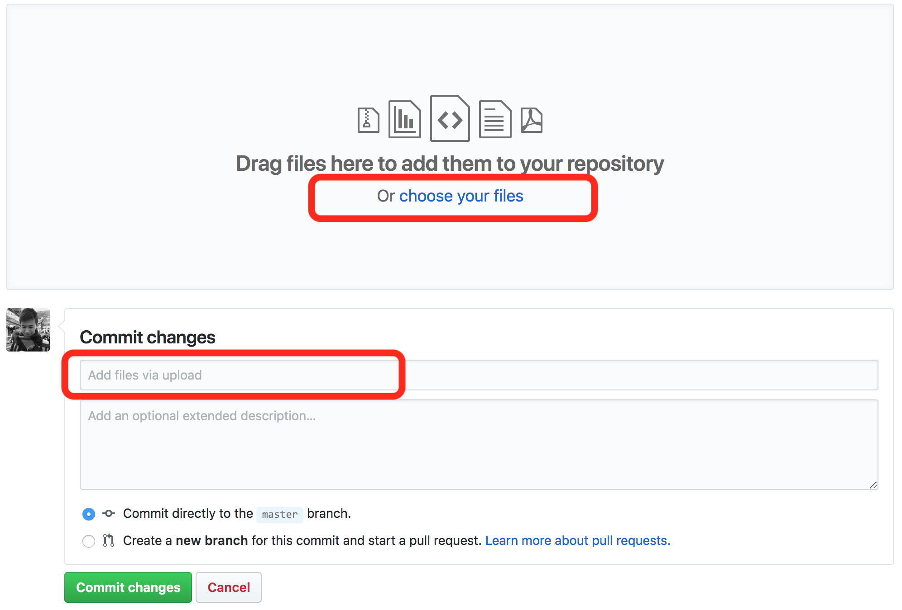

这样我们便成功地将网页上传到GitHub，接下来便要启用Pages功能。

提交后，我们会回到仓库管理页。在中间的文件列表中，我们可以看到刚刚上传index.html。现在我们要点选右上方的"Settings（设定）"。 进入设定页后，下拉到倒数第二个区块：GitHub Pages。点击”None（无）“，再选择”Master Branch（主分支）“，最后按下”Save（储存）“。

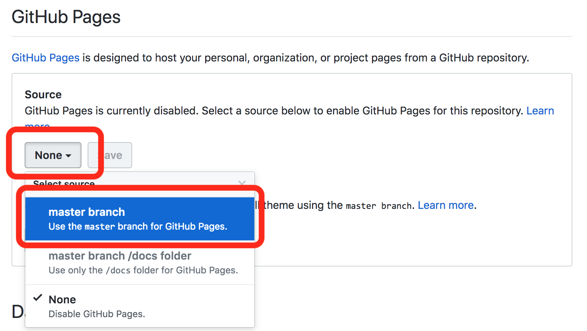

储存后，会跳回设定页顶部，再次拉到同一个位置，你会发现多了一个网址，这便是你的网页的网址：

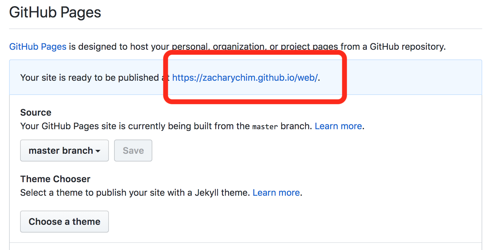

这个网址的格式是：`https://帐号名.github.io/仓库名/`

点击这个网址，你便会看到我们前面完成的网页，但这次是透过一个公开的网址来访问。以后你都可以用这个网址来查看你的网站。

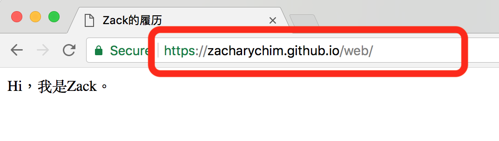

至此，你的第一个网页已经成功发表。

##今天学了什么？

最后我们来回顾一下今天学了些什么：

1. 网页的本质就是一个HTML格式的文本文件。
2. HTML文件的特点是用标签来代表各种功能；标签可以分开始标签，如<html>；和结束标签，如</html>。
3. 访客用浏览器将服务器上的HTML文件下载到自己的电脑上查看。
4. GitHub是全世界最大的程式管理平台，其Pages功能可以让你免费发表HTML网页。

在下一课中，我们会学习更多的HTML标签，并用这些标签来进一步完善我们的网页。

《网页设计学徒》课程链接：

1.  [网页设计学徒 01：什么是网页？](/web-design)
2.  [网页设计学徒 02：网页的语言、标题和图片](/html-tags)
3.  [网页设计学徒 03：VS Code 专业程式编辑器](/vs-code)
4.  [网页设计学徒 04：网页由哪些部分构成？](/html-sementic)
5.  [网页设计学徒 05：用 CSS 美化网页](/css)
6.  [网页设计学徒 06：CSS 盒子模型](/css-box-model)
7.  [网页设计学徒 07：CSS Grid 网页排版 2018](/css-grid)
8.  [网页设计学徒 08：媒体查询与响应式网页设计](/media-query)
9.  [网页设计学徒 09：移动优先设计原则](/mobile-first)
10. [网页设计学徒10：VS Code整合GitHub](/github-vscode)
11. [网页设计学徒11：履历网页实作（1）](/cv-website)
12. [网页设计学徒12：履历网页实作（2）HTML篇](/cv-html)
13. [网页设计学徒13（完结）：履历网页实作（3）CSS篇](/cv-css)

《网页设计学徒》番外篇：

1.  [CSS 中 px、em、rem 有什么分别？](/px-em-rem)
2.  [fr 介绍：CSS 网格带来的新单位](/fr-css-grid)
3.  [CSS 网格(CSS Grid)完整教学](/css-grid-grid)
4.  [中文网页字体设定2018篇](/chinese-font-family)