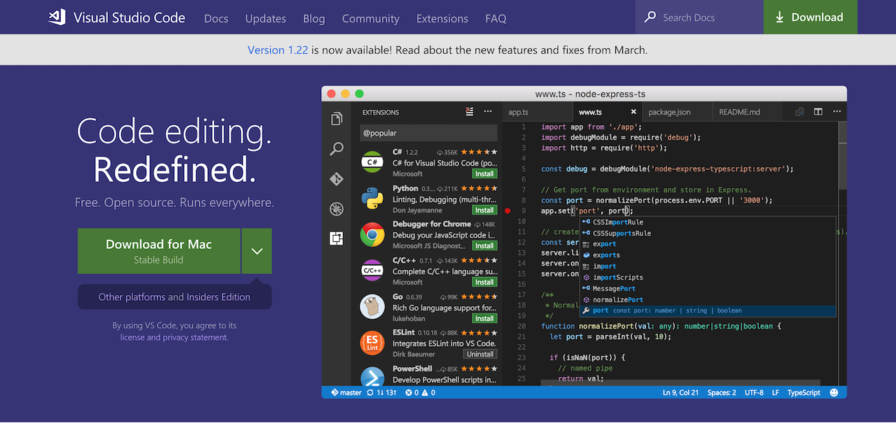

这是网页设计学徒的第三课。这一课我们会学习使用一个由微软推出的免费专业程式编辑器：VS Code。这个编辑器能够让你的编程事半功倍。

视频链接：
1. [YouKu](http://v.youku.com/v_show/id_XMzU2NzU5MTQ1Mg==.html)
2. [BiliBili](https://www.bilibili.com/video/av22615781/)
3. [YouTube](https://youtu.be/OcQxjvbUtSk)

这一课我们会学习VS Code的使用：

1. VS Code的下载与安装以及语言设定
   1. Windows: F1 或 Mac：Command + Shift + P，进入指令输入
   2. 输入：Configure Language 或 配置语言
   3. 修改：`"locale":"en"`为`"locale":"zh-CN"`。繁体中文为“zh-TW”。
   4. 重启VS Code。
2. VS Code输入提示与Emmet快速输入
3. 更换VS Code主题，于扩展中搜索以下任一主题
   - Material Theme
   - Atom One Dark Theme 
   - Dracula Official
   安装后，前往Windows：文件／Mac: Code -〉 首选项 -〉 颜色主题，选择刚安装的主题
4. 安装插件：vscode-icons 、 Chinese Lorem Ipsum 与 Live Server

[VS Code下载链接](https://code.visualstudio.com/)

若你实在不喜欢VS Code，还有两个同样十分受欢迎的专业编辑器，皆可免费使用：

1. [Sublime Text](https://www.sublimetext.com/)：虽是收费软件，但提供无限期免费试用，只是偶尔会弹出购买提示。其特点是速度非常快。

2. [Atom Text Editor](https://atom.io/)：开源，且由GitHub开发，同样非常强大，只是速度较慢。

下一课我们会用VS Code来编写程式，并介绍一下网页的常见结构。

《网页设计学徒》课程链接：
1. [网页设计学徒01：什么是网页？](/web-design)
2. [网页设计学徒02：网页的语言、标题和图片](/html-tags)
3. [网页设计学徒03：VS Code专业程式编辑器](/vs-code)
4. [网页设计学徒04：网页由哪些部分构成？](/html-sementic)
5. [网页设计学徒05：用CSS美化网页](/css)
6. [网页设计学徒06：CSS盒子模型](/css-box-model)

《网页设计学徒》番外篇：
1. [CSS中px、em、rem有什么分别？](/px-em-rem)