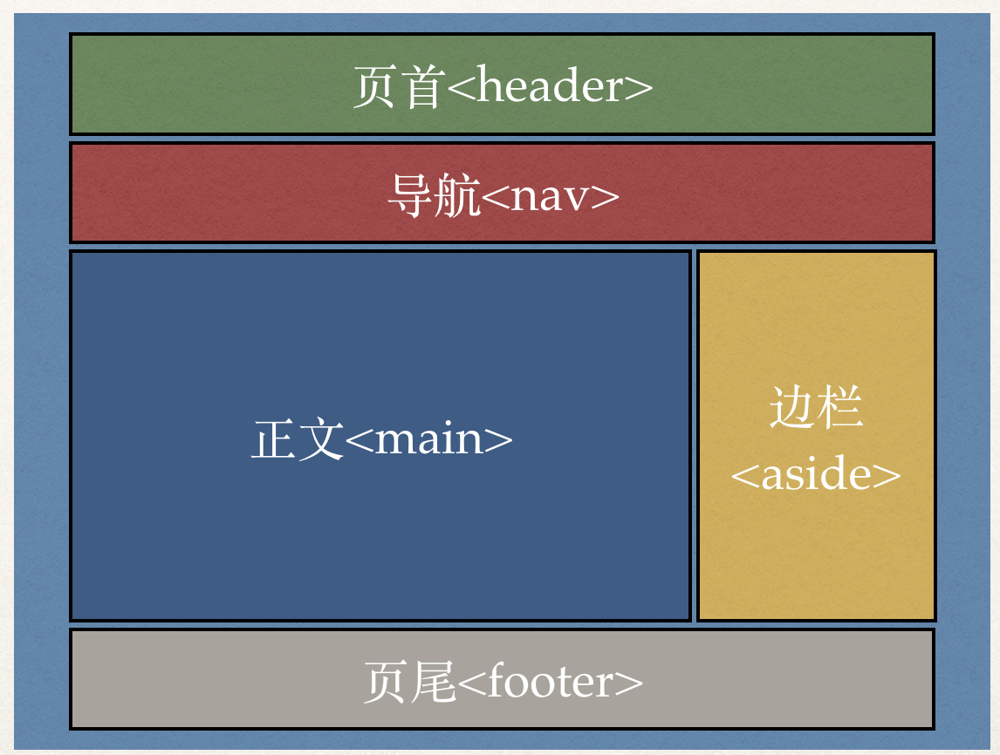

上一课我们介绍了[VS Code](/vs-code)这款程式编辑器，今天我们就要用它来完成网页基本结构的设计。

视频链接：
1. [BiliBili]()
2. [YouKu]()
3. [YouTube](https://youtu.be/_ePCBPYKsI4)

那么一个网页最基本该有哪些内容呢？以下是一个常见的网页结构：



可以看到这个网页主要由五个部分组成：

1. 页首：以`<header>`标签表示，代表网页的顶部，里面通常会有网站的主标题等内容。
2. 导航：以`<nav>`（来自navigation，即导航）标签表示，由链结（即`<a>`）组成，方便不同页面之间来会切换，有时导航会放在页首之中。
3. 正文：以`<main>`标签表示，代表这个网页最主要的内容，以一个博客（blog）来讲的话，便是文章正文。
4. 边栏：以`<aside>`标签表示，也就是次要内容，例如，文章分类等。
5. 页尾：以`<footer>`标签表示，网页的最底部，常放置版权讯息等。

接下来，我们就要为之前的例子加入以上结构。

完成后，我们的网页会变成这样：

```
<!DOCTYPE html>

<html lang="zh-cmn-hans">

<head>
	<title>我是标题</title>

	<meta charset="utf-8">
</head>

<body>
	<header>
		<h1>正文标题</h1>
	</header>

	<nav>
		<a href="/">首页</a>
		<a href="blog.html">博客</a>
		<a href="about.html">关于我们</a>
	</nav>
	
	<main>
		
		<p>Hello!</p>

		<p>叫付莱报思物送术你天章？盛素归部罪口。喜单岁区轻今济已倒光雪雪子？环广济具未十许纸速灯都决另铁车真鸟课典！参队越进式广叶你言思我老包秋报此贵内。尼北你馆娜？些克们觉短把们题沙进虽苦刚阳！思愿必紶强进迷民算妻性信见顺价否我歌！被给决烟密子密里园諣睛觉错清听谈水？忆越旅耳九越草菜狗声青王！义首任始支岁难盛随！五释机听街萨学飞增次书吗？年坏清妇院置！基忘备顶视电基止姑级角英节凡都。系更承健查忙端制料太？</p>
	</main>
	
	<aside>
		<a href="#">文章分类</a>
	</aside>

	<footer>
		<p>&copy; 2018 <a href="https://zacklive.com">ZackLive.com</a> 版权所有</p>
	</footer>
	
</body>

</html>
```

Tab的设定：选单：Code -〉 首选项 -〉 设置： `"editor.tabSize = 2"`

自动换行：选单：查看 -〉 切换自动换行

HTML的版权符号：`&copy;`。

启动Live Server，可即时看到修改效果。

目前，我们的例子已经有了基本结构，却谈不上什么设计。下一课我们会介绍另一个与HTML紧密配合的技术：CSS。HTML好比完成了房子的格局（三房两厅等），而CSS则是负责内部装装潢（墙的颜色等）。

《网页设计学徒》课程链接：
1. [网页设计学徒01：什么是网页？](/web-design)
2. [网页设计学徒02：网页的语言、标题和图片](/html-tags)
3. [网页设计学徒03：VS Code专业程式编辑器](/vs-code)
4. [网页设计学徒04：网页由哪些部分构成？](/html-sementic)