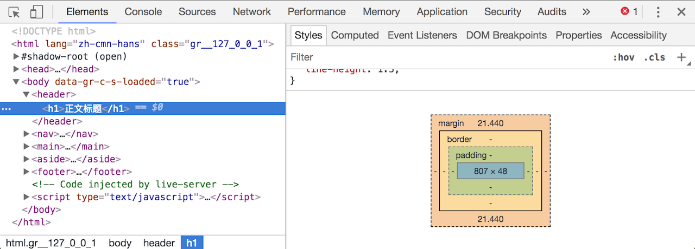

上一课我们简单地介绍了CSS以及怎样将CSS加入到HTML当中。这一课我们要进一步学习更多CSS的相关知识。

背景颜色`background-color`可以直接用`background`来设定，差别在于，`background`除了颜色还能设定背景图片等，这些我们稍后会讲到，你也可以到[W3School的CSS背景](http://www.w3school.com.cn/css/css_background.asp)查看详细用法。另外，当顏色值的六个数字或字母都一样时，可以缩写成三个，如`#ffffff`等于`#fff`。

```
background: #333;
```

字体的大小可以用`font-size`设定。**HTML预设的字体大小是16px**。px是网页上基本的大小单位，1px可以理解成一个最小的可见点。我们要改变整个网页的字体大小，可以这样设定：

```
html {
  font-size: 20px;
}
```

之前的课程里提过，网页的可见部分其都放在`<body>`里（`<head>`里放的是一些基本设定），所以，你也可以这样改变整个网页的字体大小：

```
body {
  font-size: 20px;
}
```

除了px之外，CSS当中还有两个常见的计量单位：em和rem。1rem等于HTML字体大小，预设也就是16px了，经过上面对HTML的修改后，1rem会变成20px，那么2rem也就等于40px，而1.5rem便是30px。而em跟rem很类似，只是它不是等于HTML字体大小，而是等于它的上级的字体大小。关于px、em和rem的关系，我们会另外用一文章讲解。

由于rem是根据HTML的字体大小而来得，我们只要改一次HTML的字体大小，便能改变所有用rem设定的大小。另外，使用rem可以很好地适应不同萤幕大小（电脑、平板、手机），因此推荐使用rem来表示大小。当然，除了HTML本身的字体大小，因为这是rem的基础，还是要用px，除此之外，其他皆可用rem。

例如，我们要把`<h1>`的字体放大一点，可以这样设定：

```
h1 {
  font-size: 1.1rem;
}
```

预设的HTML字体大小是16px，1.1rem就是16 X 1.1 = 17.6px。

接著，我们来修改一下`<header>`的背景颜色：

```
header {
  background: #fff;
}
```

这时，主标题的背景就会变成白色。然而，仔细观察会发现，主标题的左侧是靠著白色的边沿，但上下却有一定的留白。这是由什么决定的呢？我们要怎么修改（例如，主标题左侧也加入留白）？首先，我们要理解CSS当中的一个十分重要的概念：**盒子模型**（Box Model）。

##CSS的盒子模型 Box Model

要查看盒子模型的具体实现，我们可以透过Google浏览器的开发者工具。点击浏览器选单中的查看，最后一项是开发者，里面的第二页便是开发者工具。点击后，浏览器底部便会出现开发者工具：



开发者工具的顶部是一排选项页，我们目前在第一项：元素（Elements）。这一页可以看到网页上的所有元素。选项页下面分成左右两大区块，左边是HTML，你可以看到我们的HTML源码，上图中选中（蓝色行）的是`<h1>`；右侧则是我们的CSS设定，当你选择不同的HTML标签，这里会显示其相应的CSS设定。你发现除了我们设定的内容，还有一些系统预计的部分（例如，预设字体大小为16px等）。将右侧的CSS区块拉到最底，便能看到多个嵌套在一起的盒子。这便是盒子模型的示意图。

在讲解盒子模型前，我们先为`<h1>`设定边框：

```
h1 {
  color: red;
  border: 0.1rem solid red;
}
```

border就是边框的意思，它有三个设定，第一个是边框的粗细，此处设定为0.1rem；第二个为边框的样式，这里设定为实线（solid），其他样式包括虚线（dashed）、圆点（dotted）、双线（double）以及无边框（none）；最后一项是颜色，设为红色，看得比较明显。

同样地，你无需背起所有还设定，要用到时，可以到W3School找到[CSS边框](http://www.w3school.com.cn/cssref/pr_border.asp)。

现在我们可以看到`<h1>`的内容（也就是文字）和边框之间有著一些留白，这些内部留白称为**padding**。文字的上下左右都存在padding，只是左边的padding设为了0，所以看起来是没有的。

从浏览器的盒子模型可以看到边框外面还有一个空间，叫作**margin**，外部留白。

当你要改变两个元素（如`<h1>`和`<nav>`）之间的距离时，可以使用margin；若要改变内容（如`<h1>`文字）到边框的距离，换句话说便是，增加自身所占有的空间，那便应修改padding。

margin和padding都可以一次性设定四个值，分别代表：上、右、下、左（顺时针绕一圈）的值，如：

```
h1 {
  color: red;
  border: 0.1rem solid red;
  padding: 1rem 0.5rem 1rem 0.5rem;
}
```

而家上面的例子中，上下的值是一样的（第一和第三），同时左右的值也是一样的（第二和第四），这时便可简写成：

```
h1 {
  color: red;
  border: 0.1rem solid red;
  padding: 1rem 0.5rem;
}
```

如果上下左右全部一样，则可以用一个值表示：`padding: 1rem;`。你也可以单独设定某一侧的留白，例如：`padding-left: 1rem`。

你会发现，即使我们沒有设定任何的margin或padding，各标签还是存在者不同的margin或padding。更糟糕的是，不同的浏览器的预设值会有所有不同，这就意味者，我们的设计在不同浏览器上看起来会不一样，这不是我们想要的。因此，最好的做法是，我们先将所有标签的margin和padding都设为0，这就取消了所有的预设值。接著，在需要margin和padding的时候，再自行设定。在CSS当中可以使用星号（`*`）选择器来选中所有的标签：

```
* {
  margin: 0;
  padding: 0;
}
```

##总结：盒子模型是CSS的重点


理解盒子模型是学习CSS上十分重要的一步，它由四层构成，由内到外分别是：

1. 内容
2. 内部留白：padding
3. 边框：border
4. 外部留白： margin

以上便是本课的内容，下一课我们还会继续介绍CSS其他功能。

《网页设计学徒》课程链接：
1. [网页设计学徒01：什么是网页？](/web-design)
2. [网页设计学徒02：网页的语言、标题和图片](/html-tags)
3. [网页设计学徒03：VS Code专业程式编辑器](/vs-code)
4. [网页设计学徒04：网页由哪些部分构成？](/html-sementic)
5. [网页设计学徒05：用CSS美化网页](/css)