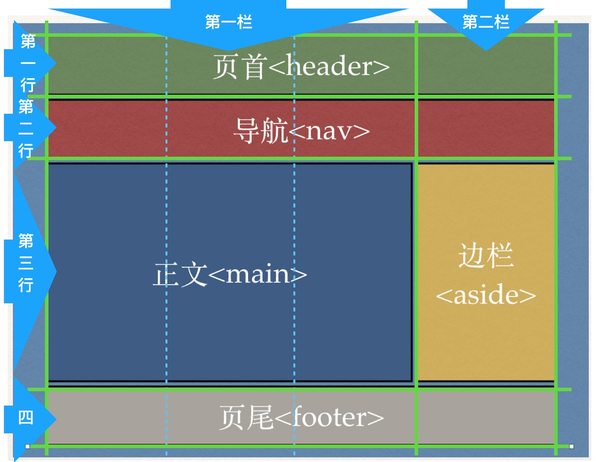
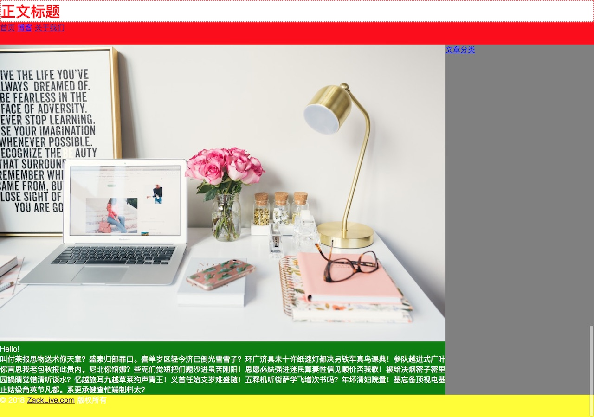

CSS Grid（网格）是最近一两年才引入CSS的新技术，可以让我们轻易地完成网页的布局设计。目前CSS Grid已得到大多数浏览器的支持，可以放心使用。

**视频链接**：

[Bilibili](https://www.bilibili.com/video/av23419060/)

[YouTube](https://youtu.be/prurO0Mm3h8)

##CSS Grid（网格）是什么？



网格由**栏**（**Columns**）和**行**（**rows**）构成。上图是一个2栏4行的设计。其中，第一栏的宽度为第二栏的三倍：3:1；而行的方面，第一、二和四行为同样大小，第三行是正文，会根据文章长短调整大小。也就是说第一、二和四行大小固定，而第三行则自动调整。

<!-- ##如何决定CSS Grid中栏的宽度和行的高度

以设计中最小的栏（宽度）作为单位决定要划分多少个栏，例如，上图中边栏`<aside>`是最小的栏，以它作为单位，这个设计可以划分为4栏，边栏占1栏，正文`<main>`占三栏，其他（页首、导航和页尾）占4栏。

行也一样，以最小的行，上图中页首、导航和页尾一样大，因此它们各占1行，而正文和边栏则占四行。 -->

##网格容器

我们要用一个容器将整个网格装起来，或者反过来说，我们在这个容器上画出这个2x4的网格。HTML有一个`<div>`的标签用作容器，也可以理解成区块（division）。其实`<header>`、`<nav>`等都是区块，只是它们比较特别，有自己专属的名字。

HTML标签属性：属性有多种，以下是ID属性：

```
<div id="site">
</div>
```

`id="site"`设定了`<div>`的ID属性，ID是唯一识别符，即在一个文件中（这里是index.html），只能有一个标签叫做site。

将前几课完成的index.html当中`<body>`里面的放到这个`<div>`里面，也就是用这个叫做site的区块包起整个网页。现在的index.html变成：

```
<!DOCTYPE html>

<html lang="zh-cmn-hans">

<head>
	<title>我是标题</title>

	<link rel="stylesheet" type="text/css" href="style.css">

	<meta charset="utf-8">
</head>

<body>
	<div id="site">
		<header>
			<h1>正文标题</h1>
		</header>

		<nav>
			<a href="/">首页</a>
			<a href="blog.html">博客</a>
			<a href="about.html">关于我们</a>
		</nav>
		
		<main>
			
			<p>Hello!</p>

			<p>叫付莱报思物送术你天章？盛素归部罪口。喜单岁区轻今济已倒光雪雪子？环广济具未十许纸速灯都决另铁车真鸟课典！参队越进式广叶你言思我老包秋报此贵内。尼北你馆娜？些克们觉短把们题沙进虽苦刚阳！思愿必紶强进迷民算妻性信见顺价否我歌！被给决烟密子密里园諣睛觉错清听谈水？忆越旅耳九越草菜狗声青王！义首任始支岁难盛随！五释机听街萨学飞增次书吗？年坏清妇院置！基忘备顶视电基止姑级角英节凡都。系更承健查忙端制料太？</p>
		</main>
		
		<aside>
			<a href="#">文章分类</a>
		</aside>

		<footer>
			<p>&copy; 2018 <a href="https://zacklive.com">ZackLive.com</a> 版权所有</p>
		</footer>
	</div>
</body>

</html>
```

##将区块设为网格

Site这个`<div>`便是我们的Grid，在CSS（style.css）中加入以下设定：
```
#site {
  display: grid;
  grid-template-columns: 3fr 1fr;
  grid-template-rows: 3rem 3rem 1fr 3rem;
  grid-template-areas: 
    "header header"
    "nav    nav"
    "main   aside"
    "footer footer"
}
```
**display: grid**：表示这个标签（ID为site）显示为网格。

**grid-template-columns: 3fr 1fr**：设定这个网格一共有2栏，每一个值代表一栏的宽度。**fr**是fraction，可以理解为一等份。这里总共为四等份（3+1），第一栏占三等份，第二栏占一等份。等份的好处是会根据萤幕的大小自动调整，始终保持著比例。

**grid-template-rows: 3rem 3rem 1fr 3rem**：设定这个网格一共有4行。他们分别对应：

第一行，3rem：页首

第二行，3rem：导航

第三行，1fr：正文和边栏

第四行，3rem：页尾

我们希望页首、导航和页尾一样大小，皆为3rem；而第三行则为1等份，由于没有其他行跟它分，这就意味著，它占掉剩下的全部，也就是能占多少就占多少。

**grid-template-areas**：设定网格的每一个区块放些什么。我们的网格是2栏4行，因此这里也是2x4个值。第一行的两栏都放了**header**，也就是header会在第一行横跨两栏。第二跟第四行也一样。但第三行的第一栏是**main**（占三等份3fr），第二栏是**aside**（占一等份1fr）。

##分别指定每一个grid-area

最后grid-template-areas里的区块要在CSS里用grid-area来设定。

```
header {
  grid-area: header;
  background: #fff;
}

nav {
  grid-area: nav;
  background: red;
}

main {
  grid-area: main;
  background: green;
}

aside {
  grid-area: aside;
  background: gray;
}

footer {
  grid-area: footer;
  background: yellow;
}
```

我们为每一个grid-area设定了不同的背景颜色，以便区分。

##不要让图片比容器还大

最后，图片要是太大，会影响到区块的大小，因此将图片的宽度设为其容器的100%:

```
img {
	width: 100%;
}
```

完整的style.css如下：

```
* {
  margin: 0;
  padding: 0;
}

h1 {
  color: red;
  font-size: 2rem;
  border: 0.1rem dotted red;
}

body {
  background: #333;
  color: #fff;
}

#site {
  display: grid;
  grid-template-columns: 3fr 1fr;
  grid-template-rows: 3rem 3rem auto 3rem;
  grid-template-areas: 
    "header header"
    "nav    nav"
    "main   aside"
    "footer footer"
}

img {
  width: 100%;
}

header {
  grid-area: header;
  background: #fff;
}

nav {
  grid-area: nav;
  background: red;
}

main {
  grid-area: main;
  background: green;
}

aside {
  grid-area: aside;
  background: gray;
}

footer {
  grid-area: footer;
  background: yellow;
}
```

保存后到浏览器查看，效果应如下：



##总结：CSS Grid网格可实现任何网页布局

这里介绍了CSS Grid，这是CSS最新的技术之一，功能十分强大，可以实现基本上所有你能想像到的网页布局。在以后的教学中我们会介绍更多CSS Grid的内容，你也可以参考以下网站（英文）：

1. [Learn CSS Grid](https://learncssgrid.com/)：CSS Grid基本教学。

2. [CSS Grid by Example](https://gridbyexample.com/)：大量CSS Grid的应用实例。

《网页设计学徒》课程链接：
1. [网页设计学徒01：什么是网页？](/web-design)
2. [网页设计学徒02：网页的语言、标题和图片](/html-tags)
3. [网页设计学徒03：VS Code专业程式编辑器](/vs-code)
4. [网页设计学徒04：网页由哪些部分构成？](/html-sementic)
5. [网页设计学徒05：用CSS美化网页](/css)
6. [网页设计学徒06：CSS盒子模型](/css-box-model)
7. [网页设计学徒07：CSS Grid网页排版2018](/css-grid)

《网页设计学徒》番外篇：
1. [CSS中px、em、rem有什么分别？](/px-em-rem)