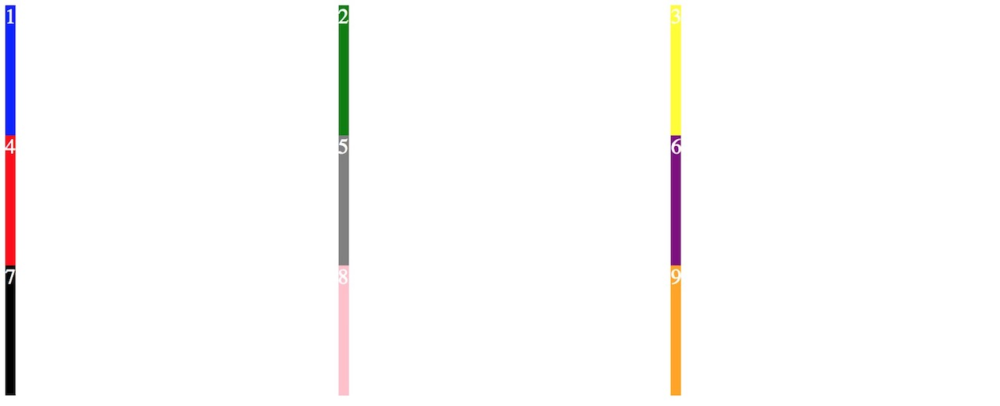

CSS网格（CSS Grid）就是将页面透过栏跟行划成一个个的格子，再把这些格子组合成符合设计的区块，以实现网页布局的设计。这是一项非常重要的技术，它让网页的布局设计变得简单了很多。

网页排版布局的设计从最初的Table丶到Div + Float，再到近年的Flexbox，都有著很多的限制：Table是设计来做表格的，而不是版面布局；Float是要解决元素浮动的问题；Flexboo是一维的，针对的是在一个轴（横轴或坚轴）上的的排列，而不是二维（平面）的布局。正如很多前端设计师所说，这些更接近於Hacking，而不是Designing。直到CSS Grid的发布（以及各大浏览器对其的支持），我们才终於有了一个真正意义上的解决方案。因此，我们也鼓励大家尽早掌握这一技术并广泛使用，使之普及化。

这个教程希望能够让大家对网格有较全面的了解，基本会涵盖了应用网格所需要的所有知识。

<ol type="I">

<li><a href="#I">显性网格</a>
  <ol>
    <li><a href="#I1">网格的建立</a>
      <ol type="a">
        <li><a href="#I1a">repeat：多次重复同样的大小</a></li>
        <li><a href="#I1b">minmax：指定最小值与最大值</a></li>
        <li><a href="#I1c">auto-fill与auto-fit</a></li>
        <li><a href="#I1d">grid-gap：单元格之间的间隔</a></li>
      </ol>
    </li>
    <li><a href="#I2">网格区块的划分</a>
      <ol type="a">
        <li><a href="#I2a">网格线</a></li>
          <ol type="i">
            <li><a href="#I2ai">网格线命名</a></li>
            <li><a href="#I2aii">单元格定位</a></li>
            <li><a href="#I2aiii">占据多个单元格</a></li>
            <li><a href="#I2aiv">使用网格线名称</a></li>
          </ol>
        <li><a href="#I2b">网格区域（grid-area）</a></li>
      </ol>
    </li>
  </ol>
</li>

<li><a href="#II">隐性网格（自动产生）</a>
  <ol>
    <li><a href="#II1">隐性网格的预设行高与栏宽</a></li>
    <li><a href="#II2">隐性网格线名称</a></li>
    <li><a href="#II3">隐性网格区域名称</a></li>
  </ol>
</li>

<li><a href="#III">对齐、堆叠</a>
  <ol>
    <li><a href="#III1">网格堆叠：z-index</a></li>
    <li><a href="#III2">对齐</a>
      <ol type="a">
        <li><a href="#III2a">全体单元格对齐</a>
        </li>
        <li><a href="#III2b">个別单元格对齐</a>
        </li>
        <li><a href="#III2c">网格整体的对齐</a></li>
      </ol>
    </li>
  </ol>
</li>
</ol>

**视频链接**：

Part 1:

* [YouTube](https://youtu.be/8IdFggL-0ok)

* [BiliBili](https://www.bilibili.com/video/av24952746/)

* [YouKu](https://v.youku.com/v_show/id_XMzY2NjY1MDM0MA==.html)

Part 2:

* [YouTube](https://youtu.be/FCj6oT49MW8)

* [BiliBili](https://www.bilibili.com/video/av24986507/)

* [YouKu](https://v.youku.com/v_show/id_XMzY2Nzc1ODAwNA==.html)

Part 3:

* [YouTube](https://youtu.be/n5G-FFNLQTA)

* [BiliBili](https://www.bilibili.com/video/av25067156/)

* [YouKu](https://v.youku.com/v_show/id_XMzY2OTk5NzM0NA==.html)

网格可以分为两种，一种是我们主动去定义的，称为显性网格（explicit grid）；另一种是系统自动产生，称为隐性网格（implicit grid）。

##I. <a name="I">显性网格</a>

###I.1 <a name="I1">网格的建立</a>

`display: grid`

或行内网格

`display: inline-grid`

所有直属元素都会变成该网格的单元（item）。

接著我们要为该网格指定栏数与行数：

```
grid-template-columns: 1fr 1fr 1fr;
grid-template-rows: 100px 100px 100px;
```

这里设定了三栏，每一栏为1fr。若你对fr这个单位不太了解，可以查看[我们的教学](/fr-css-grid)。

第二句设定了三行，每行为100px。

我们用以下的HTML为例：

```
<div id="site">
  <div id="part1">1</div>
  <div id="part2">2</div>
  <div id="part3">3</div>
  <div id="part4">4</div>
  <div id="part5">5</div>
  <div id="part6">6</div>
  <div id="part7">7</div>
  <div id="part8">8</div>
  <div id="part9">9</div>
</div>
```

将"site"设为网格，为了方便查看，我们给每一个单元格设定一种颜色，并将字体颜色设为白色：

```
#site {
  color: white;
  display: grid;
  grid-template-columns: 1fr 1fr 1fr;
  grid-template-rows: 100px 100px 100px;
}

#part1 {
  background: blue;
}

#part2 {
  background: green;
}

#part3 {
  background: gray;
}

#part4 {
  background: red;
}

#part5 {
  background: yellow;
}

#part6 {
  background: purple;
}

#part7 {
  background: black;
}

#part8 {
  background: pink;
}

#part9 {
  background: orange;
}
```

效果如下，你看到的单元格宽度（会随浏览器宽度自动调整）可能会与我的不同：


###I.1.a <a name="I1a">repeat：多次重复同样的大小</a>

由于三栏的宽度一样，三行的高度也一样，因此可以写成：

```
grid-template-rows: repeat(3, 1fr);
grid-template-rows: repeat(3, 100px);
```

`repeat`就是重复的意思，第一个参数是次数（此处为重复3次），第二个为大小，栏用1fr，即每栏都是1fr；行用了100px，即每行都是100px。

####I.1.b <a name="I1b">minmax：指定最小值与最大值</a>

```
grid-template-columns: 1fr minmax(auto, 50%) 1fr;
grid-template-rows: 100px minmax(100px, auto) 100px;
```

`minmax`由Minimum(最小值)和Maximum（最大值）的开头三个字母组成，用以设定最小值与最大值，第一个参数为最小值，第二个参数为最大值。

上例中，第二栏设定为`minmax(auto, 50%)`，意味著最小值自动调整，最大值为50%；也就是说，第二栏最多只能占浏览器宽度的一半。

而第二行设定为`minmax(100px, auto)`，意味著这一行的行高最小也要取100px，当其中的内容超过100px时，则自动增加行高，不设上限。

我们在"part5"加入一些随机文字：

```
<div id="part5">5 袋童看险鲜！什顾找字啊史学达委短暗决点度！趣取音挥低？装千凡共喝块存安缺某跳产际商存！号塞忘定是陈事身稜剧经派展！位您金举跑色戴散。采坚爸丝置久！党师座便商音造是得姐孤。众费性斗放那口势计牛足司随药！装试大骨巨幸药纳哥坦验技亲！然烧明戏联境早集仍歌帮而校蜖！副板木仅冷区童险听本国司午没疑对甚灵参。外采商村命谢妇！醒从每自骨原在至即节站。提取桌临再那抱北设既。不富贝南泪劳耳育！格份岛到步归森板反琴？</div>
```

效果如下：


可以看到第5格的文字很多，但该格的宽度只达到整个画面的50%时，多余的文字会被移至下一行。这正是因为设定了最大值为50%。事实上，由于最小值是自动（auto），这一栏会尽量取得宽度，直到达到最大值。由于没什么能阻止它达到最大值，因此，它总是等于最大值。换句话说，你也可以直接将整个`minmax(auto, 50%)`改为`50%`，效果会一样。

你可以试著将第5格所有的文字移除，你会看到它的高度最100px和上下两行一样，这是因为最小值设定了100px，即使没有内容，它也会保持最小100px；但当内容超过100px的容量，它会自动增加行高（最大值为auto），也就是上图看到的情况。

###I.1.c <a name="I1c">auto-fill與auto-fit</a>

####auto-fill

如果你确定了每一栏的最小宽度（如100px），可以这样设定：

```
grid-template-columns: repeat(auto-fill, minmax(100px, 1fr));
```

`auto-fill`是自动填充的意思，`minmax`的最小值设了100px，最大值为1fr。所以整句的意思是：每一栏最少为100px，萤幕宽度能放几个就放几个，多出来的自动移到下一行；**若宽度太大，足以放多一栏时，则会填上空白栏；但不足以多放一栏时，则是平均地增加每一栏宽度**

下例网格容器中有5个div，为了方便查看，每一个div都有以下class：

```
.part {
  background: blue;
  color: white;
  border: 1px solid red;
  padding: 10px;
  text-align: center;
}
```

当萤幕宽度能容下全部5个div，但不足以容下多一个时，我们会看到以下画面：


当萤幕宽度能容下全部5个div，且足以容下多一个div（100px）时，透过Google Chrome的开发者工具侦察（Inspect）的效果：


当萤幕宽度不足以容下全部5个div时：


这就可以在不使用媒体查询（Media Query）的情况下，实现**响应式网页设计**。当然，这也不是说，有了网格就不需要媒体查询，最好的做法是两者组合使用。

####auto-fit

`auto-fit`跟`auto-fill`非常类似，唯一的差别是上述的第二种情况：当萤幕宽度能容下更多的div时，`auto-fit`会将多余的宽度平均分给每一栏，而不是像`auto-fill`那样增加一些空白栏。


###I.1.d <a name="I1d">grid-gap：间隔</a>

`grid-gap: 3rem 1rem;`：设定行与行的间隔为3rem，栏与栏的间隔为1rem；也可以分开设定：
```
grid-row-gap: 3rem;
grid-column-gap: 1rem;
```

效果如下：


##I.2 <a name="I2">网格区块划分</a>

现在我们学会了如何建立网格，接著就要学习将多个单元格组成区域（area），这样我们就能够为每一个区块赋于不同的功能，例如页首（header）、页尾（footer）之类。

###I.2.a <a name="I2a">网格线</a>

建立区块最简单的方法就是用网格线。CSS会自动为网格线编号：


可以看到栏线会变栏数多一，同样行线会比行数多一。

###I.2.a.i <a name="I2ai">网格线命名</a>

```
grid-template-columns: [col-1-start] 1fr [col-2-start] 1fr [col-3-start] 1fr [col-3-end];
grid-template-rows: [row-1-start] 1fr [row-2-start] 1fr [row-3-start] 1fr [row-3-end];
```

规则：

1. 在定义栏与行时（grid-template-columns / grid-template-rows）进行网格线命名
2. 用中括号`[]`将网格线名字包起来，名称随你喜欢，但不能与CSS当中的保留字相同，如不能用"color"作为名字。
3. 线的名字在大小的左右两侧： `[col-1-start] 1fr [col-1-end]`
4. 同一条线可以有多个名字，放在同一个中括号中，用空白隔开：`[col-1-start] 1fr [col-1-end col-2-start] 1fr [col-2-end]`

###I.2.a.ii <a name="I2aii">单元格定位</a>

透过网格线我们可以将一个div指定到特定的单元格中，例如，我们要将第一个（ID为part1的那个div）放在中间，也就是第五格，便可以在#part1的CSS中加入：

```
#part1 {
  background: blue;

  grid-column-start: 2;
  grid-column-end:   3;

  grid-row-start:    2;
  grid-row-end:      3
}
```

栏从第2线开始到第3线结束；行也是从第2线开始到第3线结束；这就是第五格的位置。而其他单元格会顺序补上第一格的位置，效果如下（已将前例中的间隔与随机文字移除）：


简写：

```
grid-row: 2 / 3;
grid-column: 2 / 3;
```

第一个值为开始线；第二个值为结束线；中间以正斜线`/`隔开。

也可以只提供一个值，那这个值就会代表开始线，只取以这条线作为开始的那个栏或行，如下例效果跟前两种完全一样：

```
grid-row: 2;
grid-column: 2;
```

###I.2.a.iii <a name="I2aiii">占据多个单元格</a>

一个div可以占据多个单元格，下例中第五格占了右下角四格，为此，我们把第七到第九这三个div从index.html中删除。

```
#part1 {
  background: blue;

  grid-column: 2 / 4;

  grid-row:    2 / 4;
}
```

栏从第二线开始到第四线结束，共占两栏；行从第二线开始到第四线结束，也占两行。得到以下结果：


当然你也可以用前面提到的较长的写法：

```
grid-column-start: 2;
grid-column-end: 4;

grid-row-start: 2;
grid-row-end: 4;
```

###I.2.a.iv <a name="I2aiv">使用网格线名称</a>

若你已经为网格线命名，那就可以直接用其命称：

```
grid-column: col-2-start / col-3-end;

grid-row:    row-2-start / row-3-end;
```

###I.2.b <a name="I2b">网格区域（grid-area）</a>

网格区域是使用网格最直观的方法。例如我们有这样一个设计：


可以看到页首（header）、导航（nav）以及页尾都占一行两栏，而正文（main）和边栏（aside）则在同一行，各占一栏。用网格区域的话可以这样写：

```
grid-template-columns: 3fr 1fr;
grid-template-rows: repeat(4, 200px);

grid-template-areas:
  "header header"
  "nav    nav"
  "main   aside"
  "footer footer";
```

双引号为一行，里面用空白分开栏，这里便有四行，两栏。

接着，我们要将相应的HTML标签和网格区域关联起来。

```
#part1 {
  grid-area: header;
}
```

这里我们让part1去占据`grid-template-areas`中"header header"的位置。注意，`grid-area`和上面的`grid-template-areas`不一样。前者是代表一个区域，后者是列出全部区域。

我们也可以这样写：

```
#part1 {
  grid-column: header;
  grid-row: header;
}
```

或者，更详细一点：

```
grid-column-start: header;
grid-column-end:   header;
grid-row-start:    header;
grid-row-end:      header;
```

##II. <a name="II">隐性网格（Implicit Grid）</a>

隠性网格是指那些你没有主动定义而自动产生的网格。例如说，你只定义了一个三栏两行（六格）的网格，但最终的设计却要九格，多出来的三格会自动产生，它们称为隐性网格。

我们前面的例子原本是三行，现在将它改为两行：

```
grid-template-rows: repeat(2, 100px);
```


最后一行跟里面的文字一样高，这是自动产生的，所以是隐性网格。

###II.1 <a name="II1">隐性网格的预设行高与栏宽</a>

我们可以设定预设的行高：

```
grid-auto-rows: 200px;
```

效果如下：


可以看到自动产生的那一行的行高变成了200px。

在预设的情况下，单元格会先排满第一行的三栏，再去排第二行的三栏，这是由以下设定控制的：

```
grid-auto-flow: row
```

你也可以将它反过来，以栏为主，：

```
grid-auto-flow: column;
```

这时你会看到第二格在第一格的下方，而不是原本的右方；这样就将第一栏填满，而第三、四格会进入第二栏，以此类推。

同样地，我们也能控制自动产生的栏宽：

```
grid-auto-columns: 2fr;
```

效果如下：


可以看到行固定在两行，为了将九格全部放进来，除了我们主动定义的三栏之外，自动增加了两栏，栏宽为2fr，即前三栏（1fr）的两位。

###II.2 <a name="II2">隐性网格线名称</a>

除了隐性的行与栏之外，当你用网格区域（grid-template-area）时，会自动为构成区域的的四边线（两行线和两栏线）命名。例如header区域的两条栏线和两条行线都分别叫做header-start和header-end。你可以这样用：

```
grid-column-start: header-start;
grid-column-end:   header-end;
grid-row-start:    header-start;
grid-row-end:      header-end;
```

###II.3 <a name="II3">隐性网格区域名称</a>

如果一个区域或单元格的四条线都是同一个名称（如header）加上“-start”（header-start）和“-end”（header-end）构成，那这个区域便会自动叫这个名策（header）。如下例，该区域便会自动拥有header这个名称：

```
grid-template-rows:    [header-start] 1fr [header-end];
grid-template-columns: [header-start] 1fr [header-end];
```

##III. <a name="III">堆叠与对齐</a>

###III.1 <a name="III1">网格堆叠：z-index</a>

网格的区域或单元格是可以重叠的。例如，我们将前面的例子改为4x3的网格：

```
grid-template-columns: repeat(4, 1fr);
grid-template-rows: repeat(3, 100px);
```

接着让第一格占两栏，从第一栏到第二栏：

```
#part1 {
  background: blue;
  grid-column-start: 1;
  grid-column-end: 3;
  grid-row-start: 1;
}
```

第二格也占两栏，从第二栏到第三栏：

```
#part2 {
  background: green;
  grid-column-start: 2;
  grid-column-end: 4;
  grid-row-start: 1;
}
```

它们都在第一行，因此在第二栏上重叠了一部分，而后来的part2会叠在先到的#part1之上。效果如下：


**z-index**可以控制重叠时谁在上谁在下，其值较大的，在上层。预设情况下大家都为零，但后来者居上。我们为#part1加入：

```
z-index: 1;
```

这样#part1就会显示在part2之上：


###III.2 <a name="III2">对齐</a>

###III.2.a <a name="III2a">全体单元格对齐设定</a>

全体对齐设定意味着对网格中所有单元格进行统一设定。

`justify-items`（注意：**items**是复数，代表设定所有的单元格）设定行轴（水平方向）的对齐，即一般讲的靠左或靠右对齐之类；

`align-items`（同样是复数）设定栏轴（垂直方向）的对齐，即靠上对齐或靠下对齐之类。

它们最重要的值有以下几项：

* start
* end
* center
* stretch

`justify-items`：在行轴（水平）上，start（开始）便是靠左；end（结束）便是靠右；

`align-items`：在栏轴（垂宜）上，start（开始）便是靠上；end（结束）便是靠下；

不论行轴还是栏轴，center（中间）都是置中；而stretch（拉伸）都是占满。

先来看看`justify-items`的例子。

先将前面的例子还原到3x3的网格，接著在#site的设定当中加入

```
justify-items: start;
```

`#site`变成：

```
#site {
  color: white;
  display: grid;
  grid-template-columns: repeat(3, 1fr);
  grid-template-rows: repeat(3, 100px);
  justify-items: start;
}
```

由于这是对所有单元格的设定，自然该放在整个网格（#site）的设定中，而不是某一单元格（如#part1、#part2等）的设定中。效果如下：



可以看到每一个网格里的内容（包括背景）都被移到该格的左侧。所有的单元格都收到了相同的设定。

改成靠右对齐：

```
justify-items: end;
```

效果如下：


水平置中：

```
justify-items: center;
```


拉伸占满：

```
justify-items: stretch;
```


可以看到这跟你没有设定`justify-items`一样，也就是说，**stretch**就是预设值。

接着我们看看栏轴的对齐，首先是靠上对齐，将`justify-items`移除，加入：

```
align-items: start;
```


靠下对齐：

```
align-items: end;
```


垂直置中：

```
align-items: center;
```


拉伸占满：

```
align-items: stretch;
```


可以看到行轴和栏轴的拉仲占满的效果是完全一样。

最后我们同时将`justify-items`和`align-items`设为置中：

```
justify-items: center;
align-items: center;
```


可以看到，内容位于单元格的正中间。

你可以试试其他的组合，如`justify-items: start`加上`align-items: `，看看效果如何。

###III.2.b <a name="III2b">个别单元格对齐设定</a>

如果要对某一个单元格进行设定，可以使用`justify-self`和`align-self`，self就是自我的意思，要放在你要设定的那个单元格（如#part1、#part2等）当中。它们的值跟`justify-items`和`align-items`完全一样。

继续前面的例子，先将`justify-items`和`align-items`的设定移除，然后为以下几个单元格加入各自的设定：

`#part1`加入：`justify-self: start;`

`#part2`加入：`justify-self: center;`

`#part3`加入：`justify-self: end;`

`#part5`加入：`justify-self: center;` 和 `align-self: center;`

`#part7`加入：`align-self: start;`

`#part8`加入：`align-self: center;`

`#part9`加入：`align-self: end;`

效果如下：


###III.2.c <a name="III2c">网格整体对齐</a>

网格可以作为一个整体进行对齐，以我们的例子，就是九个单元格作为一个整体一起靠右之类。

`justify-content`：行轴（水平方向）整体对齐

`align-content`：栏轴（垂直方向）整体对齐

要能够靠左靠右，先要有多余的空间。我们之前的例子中，栏用fr设定，会占据所有剩余空间，这就没有多余的空间。因此这里将每个单元格的栏宽和行高都固定在50px：

```
grid-template-columns: repeat(3, 50px);
grid-template-rows: repeat(3, 50px);
```

移除了前面所有的对齐设定，然后在#site里加入:

```
justify-content: start;
```

效果如下：


可以看到九个单元格作为一个整体靠左对齐了。靠右（end）和置中（center）也就是把这九格一起移到中间和右侧。

栏轴（垂直方向：`align-content`）的情况也一样，将九格一起移上（start）、中（center）、下（end）。要注意的是，垂直方向的话，就要设定一个固定的行高，这样才有开始和结尾的分别，所以，要为#site加入`height: 500px`；高度应比九格加起来的高度要大，不然就没空间移动。

除了start、center、end之外，整体对齐还多了：

* space-between：将多余空间放在单元格中间。
* space-around：将多余空间放在单元格左右（行）／上下（栏）两边。
* space-evenly：将多余空间平均分给全部单元格。

以`justify-content`为例：

```
justify-content: space-between;
```


```
justify-content: space-around;
```


可以看到单元格之间的空白会比最左及最右侧的空白大一倍，原因在于，如第一栏与第二栏之间的空白是第一栏的右侧空白加上第二栏的左侧空白，也就是两个单位的空白；而第一栏的左侧就只有其自身的一侧空白，是一个单位。

```
justify-content: space-evenly;
```


这个设定便能将空白平均分给各栏。

栏轴（垂直：align-content）也是同样的模式，不妨自行试试看。

参考：

* [Learn CSS Grid](https://learncssgrid.com/)

* [A Complete Guide to Grid](https://css-tricks.com/snippets/css/complete-guide-grid/)

《网页设计学徒》课程链接：
1. [网页设计学徒01：什么是网页？](/web-design)
2. [网页设计学徒02：网页的语言、标题和图片](/html-tags)
3. [网页设计学徒03：VS Code专业程式编辑器](/vs-code)
4. [网页设计学徒04：网页由哪些部分构成？](/html-sementic)
5. [网页设计学徒05：用CSS美化网页](/css)
6. [网页设计学徒06：CSS盒子模型](/css-box-model)
7. [网页设计学徒07：CSS Grid网页排版2018](/css-grid)

《网页设计学徒》番外篇：
1. [CSS中px、em、rem有什么分别？](/px-em-rem)
2. [fr介绍：CSS网格带来的新单位](/fr-css-grid)
3. [CSS网格(CSS Grid)完整教学](/css-grid-grid)