[之前的课程](/web-design)中，我们已经提到过GitHub。它是一个程式员的社区，也是一个方便好用的源码管理工具。GitHub的源码管理技术叫做Git，这是目前全世界最多人使用的源码管理技术。这一课，我们会讲一下如何在VS Code里面使用这一项技术。

##上传修改过的文件至GitHub

我们在第一课时已经在GitHub上建立了一个程式仓库，但已经有好几课的程式没有没新到仓库上面。今天我们先将之前修改过的文件上传到GitHub之上。方法其实已经讲过，这里就简单地带一下。

前往[GitHub的官网](https://github.com)，进入仓库管理页面，在文件列表的右上方有四个按钮，其中一个便是上传文件(Upload files)，点击它进入上传页面：

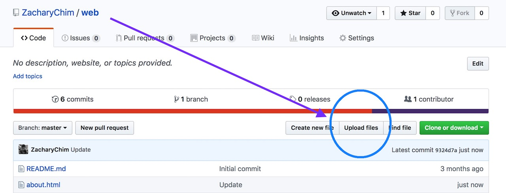

上传页面的正中会有：选择你的文件(choose your files)连结，点击后，可以将练习文件夹里的全部文件上传，有重覆的会自动被新文件覆盖。接著在"Commit changes"栏位输入修改注释（说明一下改了什么），便可以按下最下面的"Commit changes"按钮。

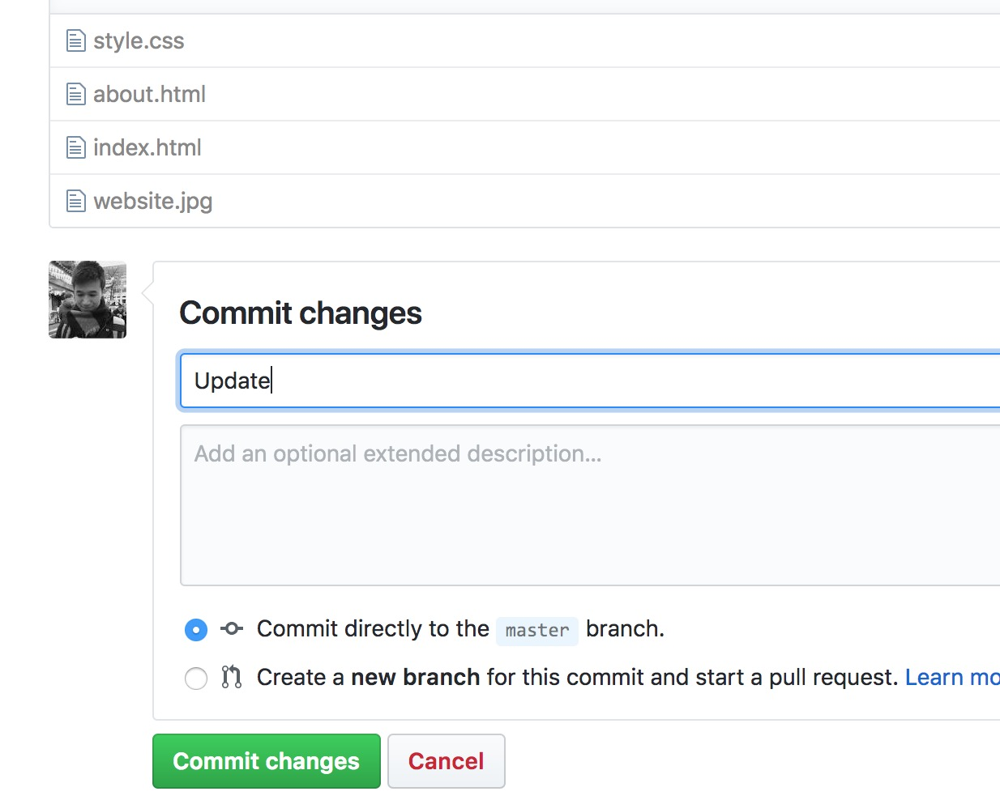

这样更新就完成了。

这个过程虽然不难，但每次都要通过GitHub的网页进行，效率不高。我们可以通过将GitHub和VS Code整合，直接在VS Code里面完成这些操作。

##安装Git

GitHub是基于Git的技术，所以我们要先安装Git。前往Git的官网：[https://git-scm.com/](https://git-scm.com/)

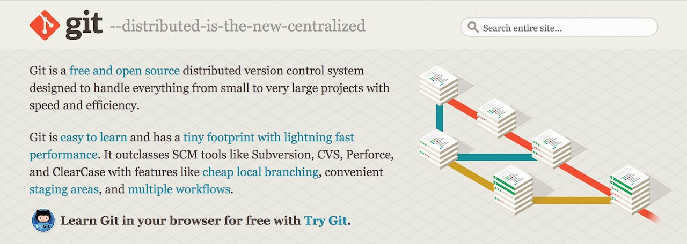

在中间右侧便能下载Git的安装文件，Windows和Mac的版本都有提供，根据你的电脑选择相应的版本下载安装即可。

##克隆仓库

我们的仓库放在GitHub上面，现在要把它克隆(clone)下来，这两个仓库便能“连结“起来。

首先前往GitHub的仓库管理页，在上传文件(Upload files)按钮旁边有一个克隆或下载(Clone or download)按钮，按下后会出现仓库连结，点击连结旁边的复制到剪贴板按钮，这样便取得了仓库的连结：

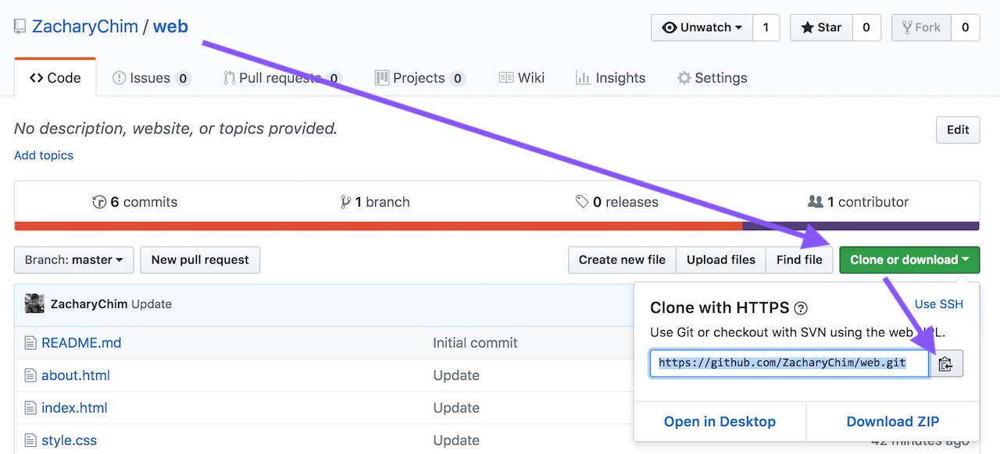

打开VS Code，进入命令面板(Command Palette)，你可以按下顶部选单的检视／查看（View），第一项便是；如果你用的是Windows，可以按下F1键；若是Mac则是⇧+⌘+P。

接著输入：git clone

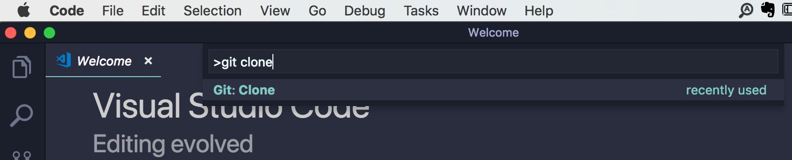

这时便会问你仓库的连结是什么，将前面取得的连结贴上再按下回车(enter)：

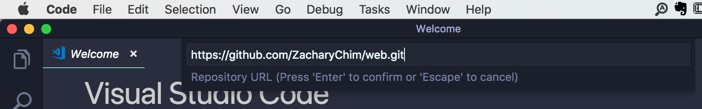

最后会问你克隆下来的仓库要放在哪里。选择你想要的地点并按下右下角的按钮确认即可。要注意的是，克隆下来的是一个以仓库名为名的文件夹，因此，你选的地点不应该有同名的文件夹。

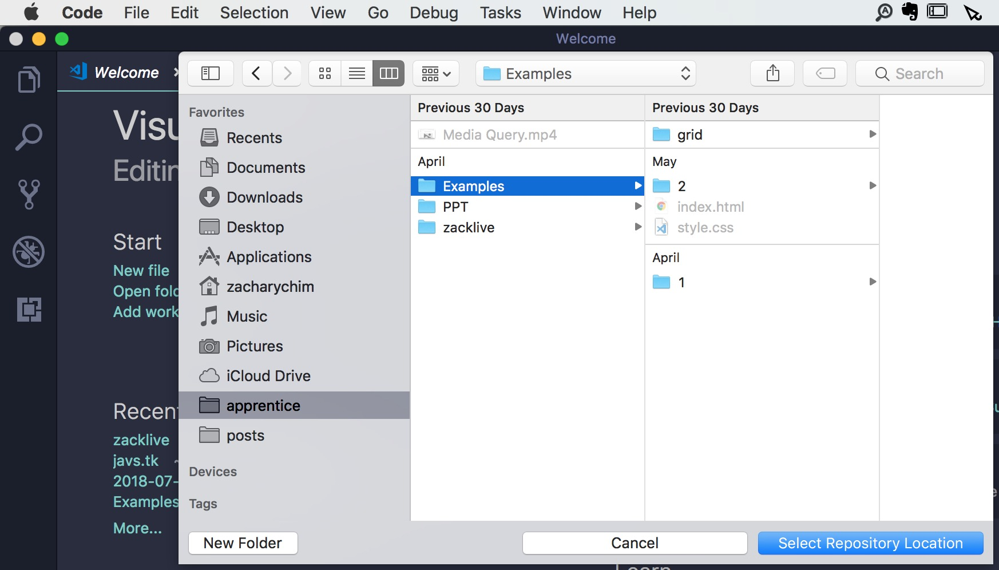

克隆完成后，VS Code右下角会问你要不要打开仓库，点击打开：

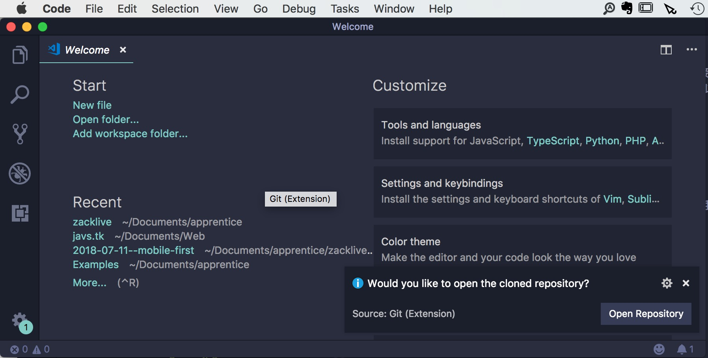

当然，你也可以从文件选单里面的打开文件夹选项来打开。打开后会看到，文件夹里面的文件和GitHub上的完全一样。

##Git的工作流程

现在，我们已经将仓库从GitHub上面克隆了下来，以后便可以在本地（我们的电脑）里对文件进行修改，然后透过VS Code快速地更新到GitHub上。马上就试试看：

打开index.html，将`<title>`里面的“我是标题”改为“新网站”并保存。

保存后，你会发现左侧的第三个图标会出现一个写著“1”的圆圈：

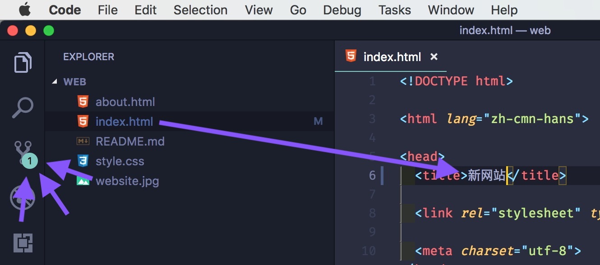

这是Git的专属区，这个小圆圈告诉我们有几项修改还没更新到GitHub上的仓库。

点击这个图标进入Git的专属区，你会看到在“修改(changes)”底下列出了所有修改过的文件。将鼠标移到这个文件，会看到三个图标出现在右侧，它们从左到右分别代表：打开文件；取消修改；确定修改。

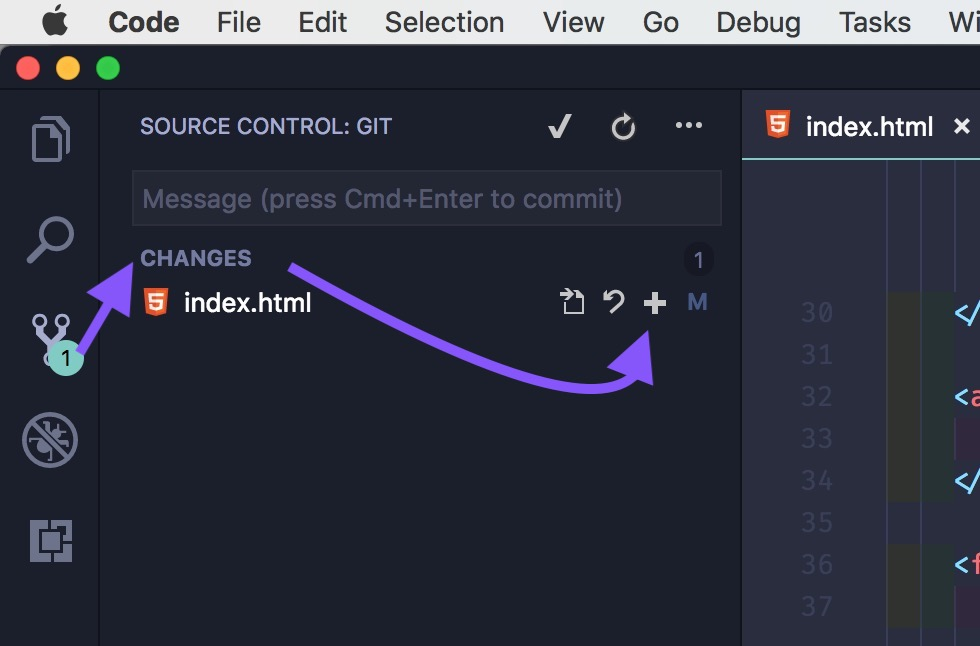

按下最右侧的“确定修改”图标，这个文件便会上移到“已确定修改”区域，再将鼠标移到这个文件上，则会出现减号图标，让你取消确定动作。

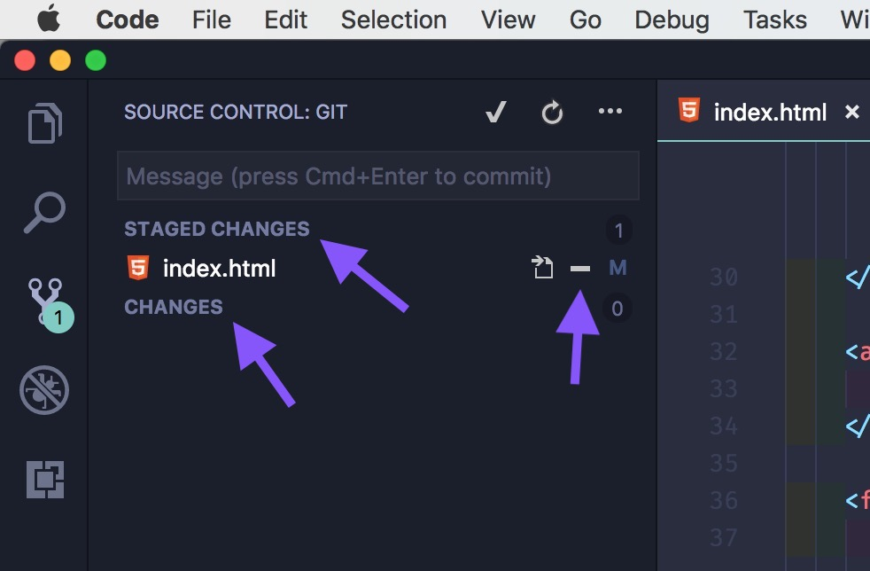

确定过的修改就可以提交(Commit)到本地（我们的电脑上）的Git系统，最后推送(Push)到GitHub上。

Git专属区右上角的勾便是提交功能：

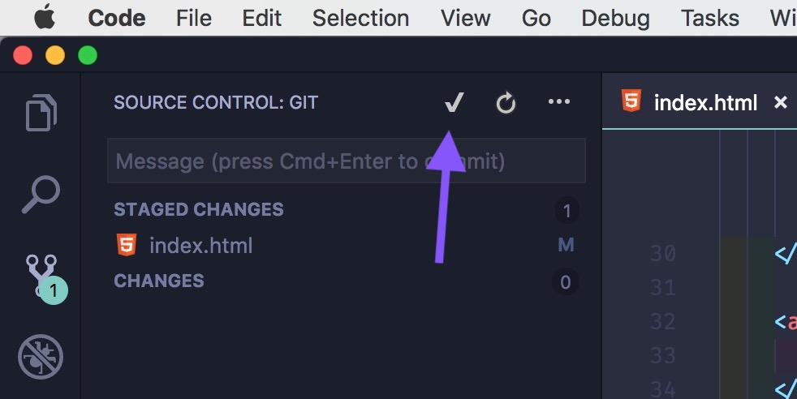

点击后，会要求输入注释，说明一下改了些什么。

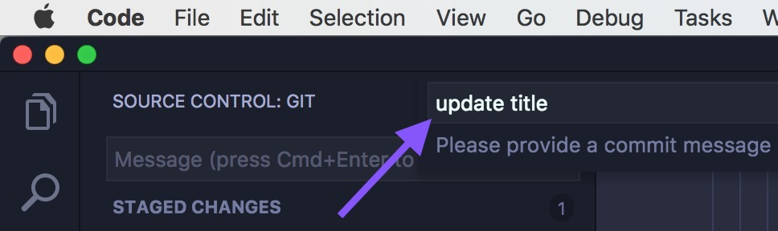

按下回车(Enter)后，提交便完成，你会发现修改文件列表会被清空，而且Git专属区图标的小圆圈也会消失。但是，我们的操作还没结束，已提交的修改还要上传到GitHub上。

按下勾右侧的三个小点，在弹出选单中，点推送(Push)，推送完成后，我们的修改便会保存到GitHub上。

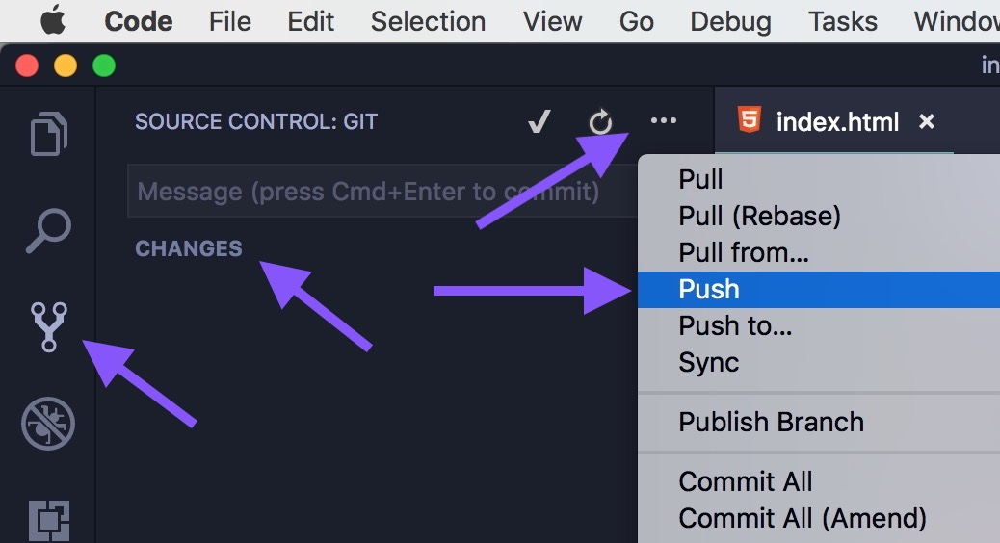

这时，你可以进入GitHub的官网查看一下index.html里的标题是不是也改了。

《网页设计学徒》课程链接：
1. [网页设计学徒01：什么是网页？](/web-design)
2. [网页设计学徒02：网页的语言、标题和图片](/html-tags)
3. [网页设计学徒03：VS Code专业程式编辑器](/vs-code)
4. [网页设计学徒04：网页由哪些部分构成？](/html-sementic)
5. [网页设计学徒05：用CSS美化网页](/css)
6. [网页设计学徒06：CSS盒子模型](/css-box-model)
7. [网页设计学徒07：CSS Grid网页排版2018](/css-grid)
8. [网页设计学徒08：媒体查询与响应式网页设计](/media-query)
9. [网页设计学徒09：移动优先设计原则](/mobile-first)

《网页设计学徒》番外篇：
1. [CSS中px、em、rem有什么分别？](/px-em-rem)
2. [fr介绍：CSS网格带来的新单位](/fr-css-grid)
3. [CSS网格(CSS Grid)完整教学](/css-grid-grid)