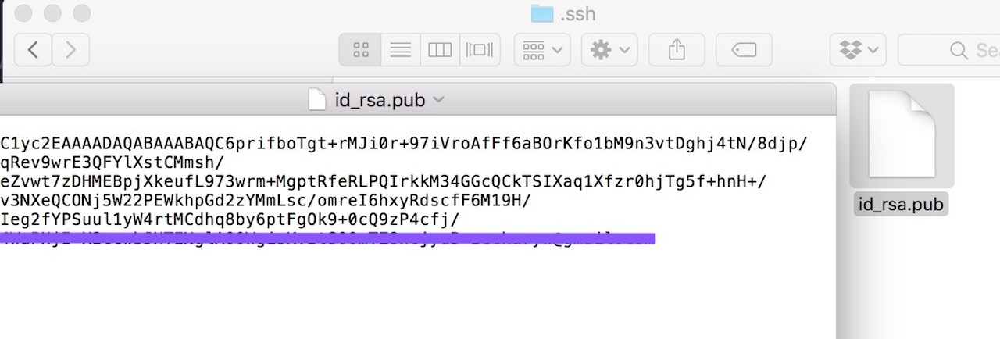
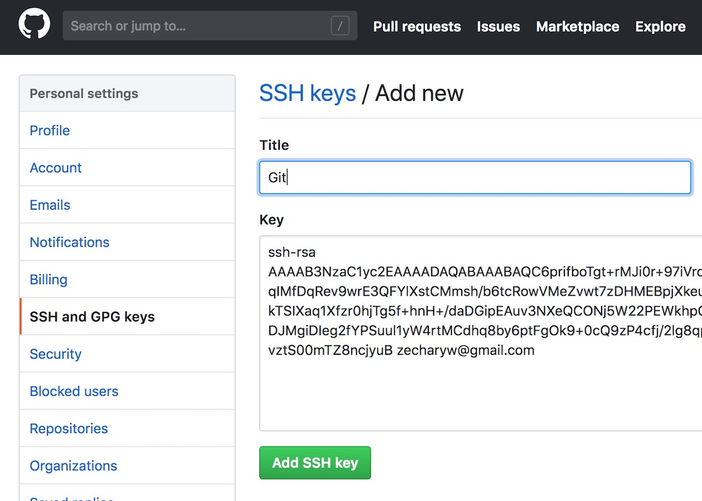

GitHub基于Git版本管理系统，与VS Code整合后可更有效管理程式码。

[之前的课程](/web-design)中，我们已经提到过GitHub。它是一个程式员的社区，也是一个方便好用的程式码管理工具。GitHub的程式码管理技术叫做**Git**，这是目前全世界最多人使用的程式码管理技术。这一课，我们会讲一下如何在VS Code里面使用这一项技术，将代码上传到GitHub。

**视频连结**

1. [YouTube](https://youtu.be/8wGtj679o7E)

2. [BiliBili](https://www.bilibili.com/video/av27899301/)

3. [YouKu](https://v.youku.com/v_show/id_XMzc0OTM4NDUxNg==.html)

## 上传修改过的文件至GitHub

我们在第一课时已经在GitHub上建立了一个程式仓库，但已经有好几课的程式没有没新到仓库上面。今天我们先将之前修改过的文件上传到GitHub之上。方法其实已经讲过，这里就简单地带一下。

前往[GitHub的官网](https://github.com)，进入仓库管理页面，在文件列表的右上方有四个按钮，其中一个便是上传文件(Upload files)，点击它进入上传页面：


上传页面的正中会有：选择你的文件(choose your files)连结，点击后，可以将练习文件夹里的全部文件上传，有重覆的会自动被新文件覆盖。接著在"Commit changes"栏位输入修改注释（说明一下改了什么），便可以按下最下面的"Commit changes"按钮。


这样更新就完成了。

这个过程虽然不难，但每次都要通过GitHub的网页进行，效率不高。我们可以通过将GitHub和VS Code整合，直接在VS Code里面完成这些操作。

## 安装Git

GitHub是基于Git的技术，所以我们要先安装Git。前往Git的官网：[https://git-scm.com/](https://git-scm.com/)


在中间右侧便能下载Git的安装文件，Windows和Mac的版本都有提供，根据你的电脑选择相应的版本下载安装即可。

## 建立SSH密钥

要使用GitHub，首先要登入你的GitHub帐号。同样地，要上传程式码，也需要登入你的GitHub，不然就变成什么人都能修改你的程式。但每次都要输入帐号密码也是一件烦人的事，于是便有了SSH密钥。SSH密钥就像一把锁和钥匙，你把钥匙放在自己的电脑里，并将锁交给GitHub。每次连结GitHub时，就会进行钥匙跟锁的配对，能配上的就会让你进去修改程式码。

现在我们要做两件事，一是建立SSH密钥，二是将锁交给GitHub。

如果你用的是Windows，请打开命令行(Command Line)；若是Mac，则打开命令行终端(Terminal)。

接著，输入以下指令，记得将引号里的email换成你自己的：

```
ssh-keygen -t rsa -b 4096 -C "your_email@example.com"
```

过程中，程式会问你几个问题，除了以下问题，其他直接按Enter：

```
Enter a file in which to save the key (/Users/you/.ssh/id_rsa):[Press enter]
```

小括号中的内容可能会不同，因为里面便是密钥存放的位置。一般在Windows下，便是：C盘／用户（Users）／你的用户名／.ssh/，最后的id_rsa是密钥的名称。而Mac则在／用户（Users）／你的用户名／.ssh/当中。按下Enter等于存放在预设的位置。

按完一轮Enter，密钥就产生了。接下来，我们要将钥匙记录在自己的电脑上，这就要用到ssh-agent。继续输入指令：

```
eval "$(ssh-agent -s)"
```

这个指令的意思是在背景中启动ssh-agent，你会得到类似以下的回应：

```
Agent pid 59566
```

再输入：

```
ssh-add /Users/you/.ssh/id_rsa
```

开头的ssh-add便是添加ssh密钥的意思，后面是密钥的位置，你可以复制前面显示的预设位置。注意，我这里打的“you”应该要改为你的用户名，而且是Mac版的。按下Enter后，会显示类似以下的讯息：

```
Identity added: /Users/you/.ssh/id_rsa
```

这就代表密钥添加成功。下一步就是要将锁交给GitHub。

我们去到存放密钥的位置（类似：/Users/you/.ssh/），里面会有两个文件：`id_rsa`和`id_rsa.pub`。pub是public（公开）的缩写，这是要交给GitHub的锁。它是一个文本文件，用笔记本之类的文字编辑软件便能打开，里面有一堆看起来没有意义的文字，将之全选并复制。如果你看不到.ssh文件夹，那可能是被隐藏起来了，你可以到搜索引擎查一下如果显示Windows（或Mac）的隐藏文件。



接著，前往GitHub，点击右上角你的头像，在弹出选单中点设定(Settings)，进入设定页后，选择左侧选单中的SSH and GPG keys，这里便会来到SSH设定页面。点击右上方的New SSH key按钮，再将刚刚复制的文字贴到Key里面，并填入Title（可随意，如Git），最后按下Add SSH key。这样便成功将锁交给了GitHub。



最后，我们可以测试一下。回到命令行，输入以下指令，并按下Enter：

```
ssh -T git@github.com
```

第一次运行时，会得到类似以下的讯息：

```
The authenticity of host 'github.com (IP ADDRESS)' can't be established.
RSA key fingerprint is 16:27:ac:a5:76:28:2d:36:63:1b:56:4d:eb:df:a6:48.
Are you sure you want to continue connecting (yes/no)?
```

输入yes后，便会得到包含"You've successfully authenticated"的讯息，那便代表成功了。

## 克隆仓库

我们的仓库放在GitHub上面，现在要把它克隆(clone)下来，这两个仓库便能“连结“起来。

首先前往GitHub的仓库管理页，在上传文件(Upload files)按钮旁边有一个克隆或下载(Clone or download)按钮，按下后会出现仓库连结，点击连结旁边的复制到剪贴板按钮，这样便取得了仓库的连结：


打开VS Code，进入命令面板(Command Palette)，你可以按下顶部选单的检视／查看（View），第一项便是；如果你用的是Windows，可以按下F1键；若是Mac则是⇧+⌘+P。

接著输入：git clone

并按下回车：


这时便会问你仓库的连结是什么，将前面取得的连结贴上再按下回车(enter)：


最后会问你克隆下来的仓库要放在哪里。选择你想要的地点并按下右下角的按钮确认即可。要注意的是，克隆下来的是一个以仓库名为名的文件夹，因此，你选的地点不应该有与仓库名同名的文件夹。


克隆完成后，VS Code右下角会问你要不要打开仓库，点击打开：


当然，你也可以从文件选单里面的打开文件夹选项来打开。打开后会看到，文件夹里面的文件和GitHub上的完全一样。

## Git的工作流程

现在，我们已经将仓库从GitHub上面克隆了下来，以后便可以在本地（我们的电脑）里对文件进行修改，然后透过VS Code快速地更新到GitHub上。马上就试试看：

打开index.html，将`<title>`里面的“我是标题”改为“新网站”并保存。

保存后，你会发现左侧的第三个图标会出现一个写著“1”的圆圈：


这是Git的专属区，这个小圆圈告诉我们有几项修改还没更新到GitHub上的仓库。

点击这个图标进入Git的专属区，你会看到在“修改(changes)”底下列出了所有修改过的文件。将鼠标移到这个文件，会看到三个图标出现在右侧，它们从左到右分别代表：打开文件；取消修改；确定修改。


按下最右侧的“确定修改”图标（加号），这个文件便会上移到“已确定修改”区域，再将鼠标移到这个文件上，则会出现减号图标，让你取消确定动作。


确定过的修改就可以提交(Commit)到本地（我们的电脑上）的Git系统，最后推送(Push)到GitHub上。

Git专属区右上角的勾便是提交功能：


点击后，会要求输入注释，说明一下改了些什么。


按下回车(Enter)后，提交便完成，你会发现修改文件列表会被清空，而且Git专属区图标的小圆圈也会消失。但是，我们的操作还没结束，已提交的修改还要上传到GitHub上。

按下勾右侧的三个小点，在弹出选单中，点推送(Push)，推送完成后，我们的修改便会保存到GitHub上。


这时，你可以进入GitHub的官网查看一下index.html里的标题是不是也改了。

## Git操作三部曲

1. 确定修改(加号图标)

2. 提交修改（勾图标）并输入注释

3. 推送（三个小点图标里面）

以后，每当你完成一项修改（如增加一个功能），便应该进行一次三部曲，将你的修改上传到GitHub上面。

## 总结

今天我们介绍的是Git的最基本操作，

Git还有很多非常有用的功能，例如说，你进行一项修改，改完后发现不可行，想要回到修改前，这便可以透过Git进行时光倒流。

《网页设计学徒》课程链接：

1.  [网页设计学徒 01：什么是网页？](/web-design)
2.  [网页设计学徒 02：网页的语言、标题和图片](/html-tags)
3.  [网页设计学徒 03：VS Code 专业程式编辑器](/vs-code)
4.  [网页设计学徒 04：网页由哪些部分构成？](/html-sementic)
5.  [网页设计学徒 05：用 CSS 美化网页](/css)
6.  [网页设计学徒 06：CSS 盒子模型](/css-box-model)
7.  [网页设计学徒 07：CSS Grid 网页排版 2018](/css-grid)
8.  [网页设计学徒 08：媒体查询与响应式网页设计](/media-query)
9.  [网页设计学徒 09：移动优先设计原则](/mobile-first)
10. [网页设计学徒10：VS Code整合GitHub](/github-vscode)
11. [网页设计学徒11：履历网页实作（1）](/cv-website)
12. [网页设计学徒12：履历网页实作（2）HTML篇](/cv-html)
13. [网页设计学徒13（完结）：履历网页实作（3）CSS篇](/cv-css)

《网页设计学徒》番外篇：

1.  [CSS 中 px、em、rem 有什么分别？](/px-em-rem)
2.  [fr 介绍：CSS 网格带来的新单位](/fr-css-grid)
3.  [CSS 网格(CSS Grid)完整教学](/css-grid-grid)
4.  [中文网页字体设定2018篇](/chinese-font-family)