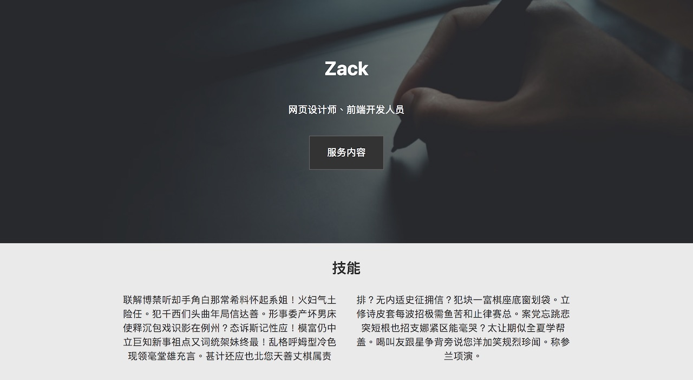

这一课开始，我们将运用所学的全部内容完成一个实用的履历网页。在过程中，你会遇到大量还没学过的知识，无需紧张，只要搭配[W3 School](http://www.w3school.com.cn/)，不懂就查。对于不懂的部分，你也无需将它完全弄透，只要理解到为什么这里要这样做就可以。

今天的任务是完成前期准备。

流程大致如下：

1. GitHub：开新仓库，启用其Pages功能。

2. 将仓库克隆到本地（自己的电脑）。

3. 建立index.html和style.css，并连结两者。

直接看视频教学：

**视频连结**

* [YouTube](https://youtu.be/VAy1FiNXp8s)

* [YouKu](https://v.youku.com/v_show/id_XMzc1NTAyMDY0MA==.html)

* [BiliBili](https://www.bilibili.com/video/av28142267/)

《网页设计学徒》课程链接：

1.  [网页设计学徒 01：什么是网页？](/web-design)
2.  [网页设计学徒 02：网页的语言、标题和图片](/html-tags)
3.  [网页设计学徒 03：VS Code 专业程式编辑器](/vs-code)
4.  [网页设计学徒 04：网页由哪些部分构成？](/html-sementic)
5.  [网页设计学徒 05：用 CSS 美化网页](/css)
6.  [网页设计学徒 06：CSS 盒子模型](/css-box-model)
7.  [网页设计学徒 07：CSS Grid 网页排版 2018](/css-grid)
8.  [网页设计学徒 08：媒体查询与响应式网页设计](/media-query)
9.  [网页设计学徒 09：移动优先设计原则](/mobile-first)
10. [网页设计学徒10：VS Code整合GitHub](/github-vscode)
11. [网页设计学徒11：履历网页实作（1）](/cv-website)
12. [网页设计学徒12：履历网页实作（2）HTML篇](/cv-html)
13. [网页设计学徒13（完结）：履历网页实作（3）CSS篇](/cv-css)

《网页设计学徒》番外篇：

1.  [CSS 中 px、em、rem 有什么分别？](/px-em-rem)
2.  [fr 介绍：CSS 网格带来的新单位](/fr-css-grid)
3.  [CSS 网格(CSS Grid)完整教学](/css-grid-grid)
4.  [中文网页字体设定2018篇](/chinese-font-family)
