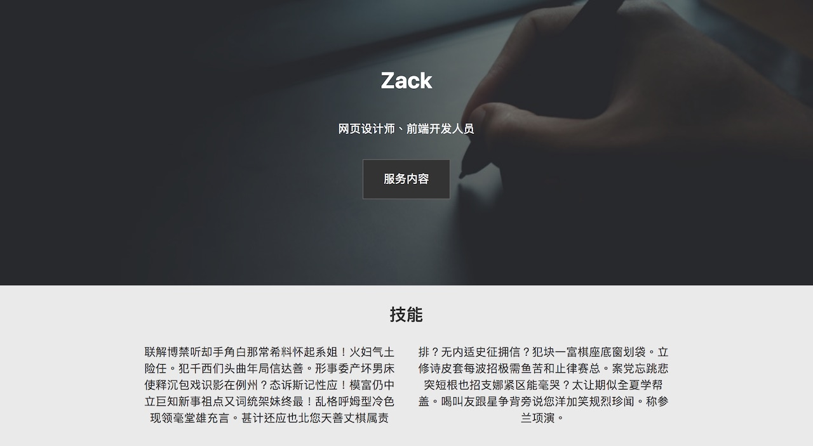

[上一课](/cv-website)，我们完成了履历网页实作的准备工作，这一课我们进入HTML的部分。

##HTML的结构

和之前的例子很类，整个网页的HTML结构主要可以分为三大部分：

1. header
2. main
3. footer

在header当中，我们用了一个专门的`
`来放背景图，

main又包括几个区块：技能（skill）、服务（service）、专业承诺（promise）与联系我们（contact）。区块在HTML中可以用`<section>`标签表示，用法和`
`一样。

其中，服务的部分我们用了并排的三张卡片式设计，并且应用了**Flexbox**技术，这是和CSS Grid类似的排版技术。不同在于，Flexbox是线性的（横著排或竖著排，排满一个方向才会移到下一行或列），CSS Grid是二维的（平面中任何位置都可以放东西，像之前九宫格的例子）。Flexbox使用教学也可以查[W3 School](http://www.w3school.com.cn/)，这里只是简单的演示一下，让大家知道Flexbox的存在。

另外，这里用到的所有照片都是来自[Unsplash](https://unsplash.com/). Unsplash提供可以商用或自用的免费照片，而且照片的质量相当高。

**视频连结**

* [YouTube](https://youtu.be/l65nZjkf5GY)

《网页设计学徒》课程链接：

1.  [网页设计学徒 01：什么是网页？](/web-design)
2.  [网页设计学徒 02：网页的语言、标题和图片](/html-tags)
3.  [网页设计学徒 03：VS Code 专业程式编辑器](/vs-code)
4.  [网页设计学徒 04：网页由哪些部分构成？](/html-sementic)
5.  [网页设计学徒 05：用 CSS 美化网页](/css)
6.  [网页设计学徒 06：CSS 盒子模型](/css-box-model)
7.  [网页设计学徒 07：CSS Grid 网页排版 2018](/css-grid)
8.  [网页设计学徒 08：媒体查询与响应式网页设计](/media-query)
9.  [网页设计学徒 09：移动优先设计原则](/mobile-first)
10. [网页设计学徒10：VS Code整合GitHub](/github-vscode)

《网页设计学徒》番外篇：

1.  [CSS 中 px、em、rem 有什么分别？](/px-em-rem)
2.  [fr 介绍：CSS 网格带来的新单位](/fr-css-grid)
3.  [CSS 网格(CSS Grid)完整教学](/css-grid-grid)
4.  [中文网页字体设定2018篇](/chinese-font-family)
