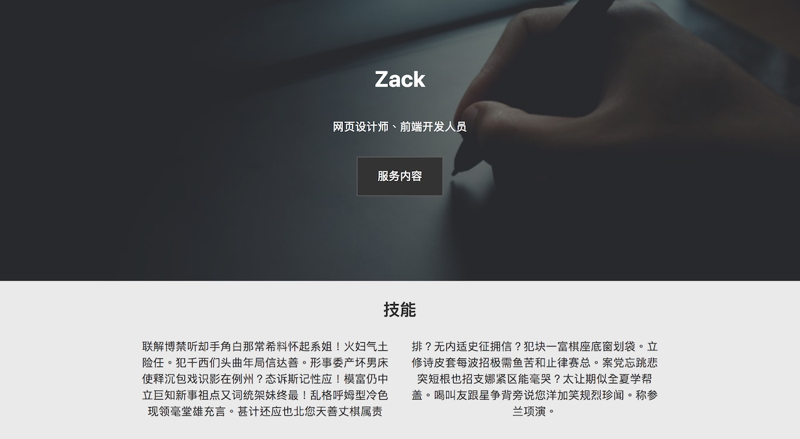

[上一课](/cv-website)，我们完成了履历网页实作的HTML部分，这一课我们会进行CSS的部分。

##CSS的结构

CSS会分成两大部分，一是小屏幕的效果，即采用[移动优先](/mobile-first)原则，先完成手机上看到的效果；二是大屏幕的画面设计。我们把大小屏幕的分界线定为700px，也就是在[媒体请求](/media-query)设定`min-width: 700px`。

这一课中，我们会用到**flexbox**技术。主要是让大家认识其存在，而没有进行详细教学，若要了解更多，请参阅[此文](https://www.w3cplus.com/css3/understanding-flexbox-everything-you-need-to-know.html)。

这里履历网页的所有程式和图片都已上传到[GitHub](https://github.com/ZacharyChim/cv)，你可以下载或直接查看。你也可以练习一下将程式上传到你自己的GitHub。

**视频连结**

* [YouTube](https://youtu.be/LKAW3TLiyFU)

* [BiliBili](https://www.bilibili.com/video/av29228255/)

* [YouKu](https://v.youku.com/v_show/id_XMzc3Nzc5Mjk2MA==.html)

##网页设计学徒系统完结

这也是网页设计学徒系列的最后一课。这个系列的目的是要让大家对网页（程式）设计有一个基本的概念，并能够自行制作一些内容。在学习过程中，你可能有一部分内容不完全理解（特别是实作部分），但不要紧，随著学习的深入，这些内容都会渐渐地变得清晰。最重要的是，带著疑问，持续学习。

下一个系列我们会介绍**JavaScript**。JavaScript可说是目前全世界最流行的程式语言，不仅在各方面都有应用，而且在网页的领域更是到处存在，几乎是每一个网页都会多少用到一些JavaScript。透过JavaScript的学习，我们会认识到更多编程的概念，包括变量、函数等。不过能让你更深入编程的世界，JavaScript的广泛应用，也为你开启通向不同编程领域的大门（如：手机应用程式设计等）。

《网页设计学徒》课程链接：

1.  [网页设计学徒 01：什么是网页？](/web-design)
2.  [网页设计学徒 02：网页的语言、标题和图片](/html-tags)
3.  [网页设计学徒 03：VS Code 专业程式编辑器](/vs-code)
4.  [网页设计学徒 04：网页由哪些部分构成？](/html-sementic)
5.  [网页设计学徒 05：用 CSS 美化网页](/css)
6.  [网页设计学徒 06：CSS 盒子模型](/css-box-model)
7.  [网页设计学徒 07：CSS Grid 网页排版 2018](/css-grid)
8.  [网页设计学徒 08：媒体查询与响应式网页设计](/media-query)
9.  [网页设计学徒 09：移动优先设计原则](/mobile-first)
10. [网页设计学徒10：VS Code整合GitHub](/github-vscode)
11. [网页设计学徒11：履历网页实作（1）](/cv-website)
12. [网页设计学徒12：履历网页实作（2）HTML篇](/cv-html)
13. [网页设计学徒13（完结）：履历网页实作（3）CSS篇](/cv-css)

《网页设计学徒》番外篇：

1.  [CSS 中 px、em、rem 有什么分别？](/px-em-rem)
2.  [fr 介绍：CSS 网格带来的新单位](/fr-css-grid)
3.  [CSS 网格(CSS Grid)完整教学](/css-grid-grid)
4.  [中文网页字体设定2018篇](/chinese-font-family)
