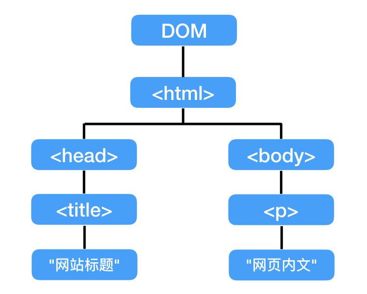
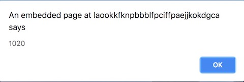

JavaScript是目前全球最流行的程式语言之一，广泛应用于不同领域，尤其是网页方面，几乎每一个成熟的网站都会用到JavaScript。而且最近几年JavaScript的发展势头更是锐不可挡，未来前景巨大。透过JavaScript深入编程的世界是一个错不了的选择。

JavaScript学徒系列会以经典书籍为教材制作影片，和大家一起学习JavaScript。

《JavaScript DOM 编程艺术》是知乎上最多人推荐的JavaScript入门书，因此，我们便选了此书作为学习JavaScript的第一本书。

学习JavaScript要掌握的第一个概念便是DOM。

##DOM：Document Object Model

DOM的概念是将整个网页视为一个文件（Document），网页上的每一个标签都视为这个文件的底下一个节点，如下图：



##JavaScript在HTML文件中的位置

JavaScript的程式可放在`<script></script>`当中，然后将这个`<script>`放在`<head>`或`<body>`里面。但更好的做法是，将JavaScript程式独立放在一个文件中，如myScript.js；再透过`<script src="myScript.js"></script>`将文件导入。如下：

```
<!DOCTYPE html>
<html lang="en">
<head>
  <meta charset="UTF-8">
  <title>Document</title>
</head>
<body>
  <h1>My Website</h1>
  <p>My content</p>

  <script src="myScript.js"></script>
</body>
</html>
``` 

接著你便可以在myScript.js里写JavaScript程式。

##JavaScript语法

1. 一行为一个指令，或称语句（Statement）。
2. 分号`;`也可以用来分隔语句，即两个以分号结尾的指令可以放同一行。
3. 建议：一行写一个语句，并加上分号作为结束。

##JavaScript注释

注释是用来提醒自己的讯息，就文未的注解，程式会忽略。写法有两种：

```
// 这是单行注释

/* 这是多行注释
  这一行也是注释
  直到出现 -> */
```

而在HTML当中，注释由`<!--`开始，以`-->`结束，可跨越多行：

```
<!-- 这是注释 -->
```

在JavaScript也可以用`<!--`作为单行注释，不需`-->`，但只能用于单行。

##JavaScript变量

**变量（variable）**可以理解为存放**值**的容器。例如，我们可以用一个叫做`age`的变量存放数字`33`:

```
var age = 33;
```

`var`来自变量的英文variable，它算是一个指令，声明了它后面接著的是一个变量。因此，这句指令称为声明。`=`在这里是赋值的意思，也就是把`33`这个数字放到`age`这个变量当中。

##JavaScript数据类型

JavaScript中的数据有著不同的类型，例如，`33`就是**数值**类型。JavaScript数据类型有：

1. 数值
   * 可以是整数，也可以是带小数点的（称为浮点数）：`var age = 33.5;`
   * 数字前加上减号`-`代表负数，整数与浮点数都可以是负数：`var temperature = -10;`

2. 字符串
   * 字符串由零个或多个字符构成，字符包括字母、数字、标点符号和空格等
   * 字符串须包在单引号或双引号中，它们可互相包含，即单中有双，双中有单：`var mood = "I'm happy";`
   * 若单引号中要出现单引号则须用反斜线（`\`）进行转义：`var mood = 'I\'m happy';`双引号亦同理。
   * 建议固定使用双引号表示字符串。

3. 布尔值
   * 布尔类型只有两个值：true（真）和false（假）：`var sleeping = true;`
   * 布尔值不是字符串，不须引号；`true`是布尔值，但`"true"`是字符串。

4. 数组
   * 数组（Array）即是一组变量，它们共享同一个变量名，以编号（index）区分。数组中的每一个变量称为数组的一个元素。例如，有三个人名，都存放在`names`这个变量当中，其中编号为0的`name[0]`放着`"David"`，编号为1的`name[1]`放着`"John"`，编号为2的`name[2]`放着`"Mike"`：
   ```
   var names = Array(3);
   names[0] = "David";
   names[1] = "John";
   names[2] = "Mike";
   ```
   * `Array(3)`：`Array`是建立数组的关键字，括号中的数字代表元素的个数，称为数组的长度，可以省略。
   * 编号（index）总是从`0`开始算，因此，最后一个元素的编号（上例为`names[2]`中的2）总是比数组的长度（上例为3）少1；
   * 上例的数组声明也可以这样写：
   
   ```
   var names = Array("David", "John", "Mike");
   var names = ["David", "John", "mike"];
   ```
   
   * 数组的元素可以是数值，字符串，布尔值，或混合这三种类型。也可以是变量，其他数组的元素，甚至直接是其他数组。
   ```
   var names = ["David", "John", "mike"];
   var students = [ names, "Jack"];
   ```
   * 关联数组：用字符串代替编号，不建议使用：
   ```
   var student = Array();
   student["name"] = "John";
   student["age"] = 15;
   ```

5. 对象
   * 对象（Object）也是用一个名称存放一组值，但对象的每一个值称为属性，用点号`.`取得。
   
   ```
   var student = Object();
   student.name = "John";
   student.age = 15;
   ```

   * 上例可以写成：
   
   ```
   var student = { name: "John", age: 15 };
   ```

##JavaScript运算

1. `+`、`-`、`*`（乘）、`/`（除）、还有小括号和我们学过的算法完全一样。

2. `++`和`--`代表自身加一或减一：
  ```
  var a = 1;
  a++;
  // a现在是2
  ```

3. `+=`和`-=`代表变量加上等号后面的值后再放回变量本身：
  ```
  var a = 1;
  a += 5;
  // a现在是6，上句可写成： a = a + 5;
  ```

4. `+`可用于字符串，代表拼接；数值加字符串的话，数值会变成字符串进行拼接；`+=`同理：
  ```
  alert("10" + 20);
  ```

  `alert()`是一个指令，让浏览器弹出一个窗口，将括号里的内容输出：

  

##条件语句

如果（if）条件成立，则执行大括号里的语句；否则，执行`else`后面的语句。条件放在小括号里，须为布尔值。

```
if (1 > 2) {
  alert("小括号里的条件成立！")；
} else {
  alert("条件不成立！")；
}
```

##比较操作

条件当中可进行比较操作
* 大于： >
* 小于： <
* 等于： == （一个等号是赋值，两个等号才是等于）
* 大于等于： >=
* 小于等于： <=
* 不等于： !=
* 严格等于： ===（比前面提到的等于更严格，建议使用）
* 严格不等于： !==（同理）

##逻辑操作

同样用于条件语句：

* 逻辑与：&& （必须左右同时成立）
```
if (n > 5 && n < 10) {
  alert(n必须同时大于5且小于10，即6到9之间，条件才成立);
}
```

* 逻辑或：|| （任一条件成立即可）
```
if (n < 5 || n > 10) {
  alert(n小于5或者大于10，条件都成立);
}
```

* 逻辑非： ! （相反）
```
if ( !(1 > 2) ) {
  alert(小括号里先运算，再反转，结果为true);
}
```