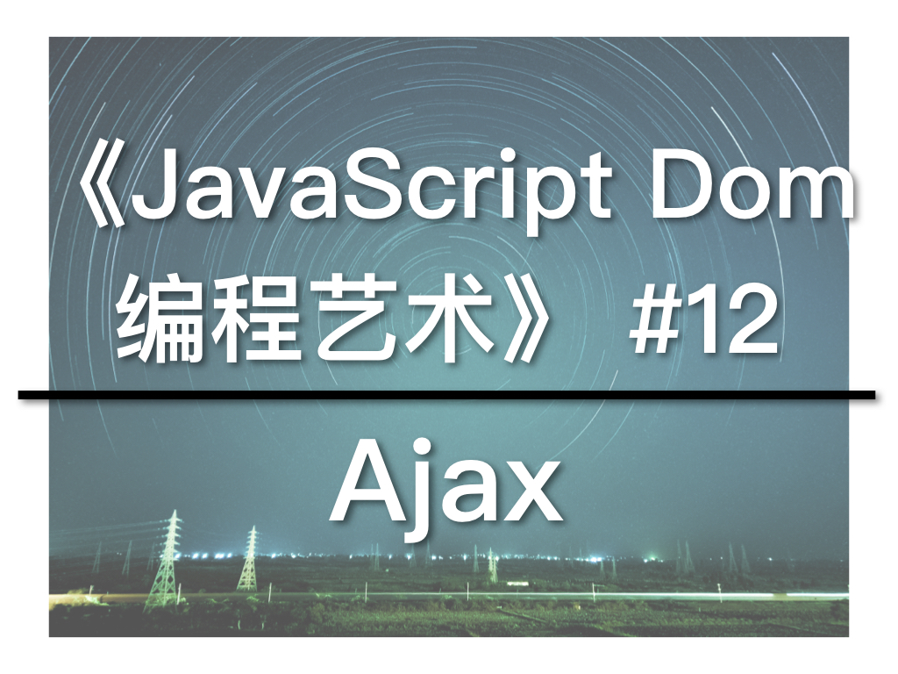

这是《JavaScript学徒》系列的第十二课，今天继续《JavaScript DOM编程艺术》第7章，我们会一起学习Ajax的概念。Ajax是异步加载页面内容的技术，意思是，点击连结后，并不会刷新整个页面，但也能载入并显示新内容。这样，我们就不用每次操作后都要等待网页刷新。你的网页用起来就像桌面应用一样，大大提高用户体验。

##教学视频连结


##XMLHttpRequest

Ajax的核心就是XMLHttpRequest对象：

```
var request = new XMLHttpRequest;
```
使用例子
```
function getNewContent() {
  var request = new XMLHttpRequest();
  if (request) {
    request.open( "GET", "scripts/example.txt", true);
    request.onreadystatechange = function() {
      if (request.readyState == 4) {
        alert("Received");
        alert(request.responseText);
      }
    };
    request.send(null);
  } else {
    alert('Sorry, your browser doesn\'t support XMLHttpRequest');
  }
  alert("Done");
}
```

`readyState`有5种值：

0: 未初始化
1: 正在加载
2: 加载完毕
3: 正在交互
4: 完成

传回来的数据有两种：

1. responseText: 文本字符串形式
2. responseXML: Content-Type为"text/xml"

XMLHttpRequest遵守同源策略，也就是只能下来同一个网域（网址）的数据。若是从其他网站取得数据或加载硬盘中的文件，会得到："Cross origin requests are only supported for HTTP..."跨来源请求错误消息。

异步请求不会等待数据传回，而是继续运行后面的程式，因此，有可能上例中的“Done”会先于“Received”显示。

这是Ajax的基本介绍，更深入的内容会在后面的章节讨论。