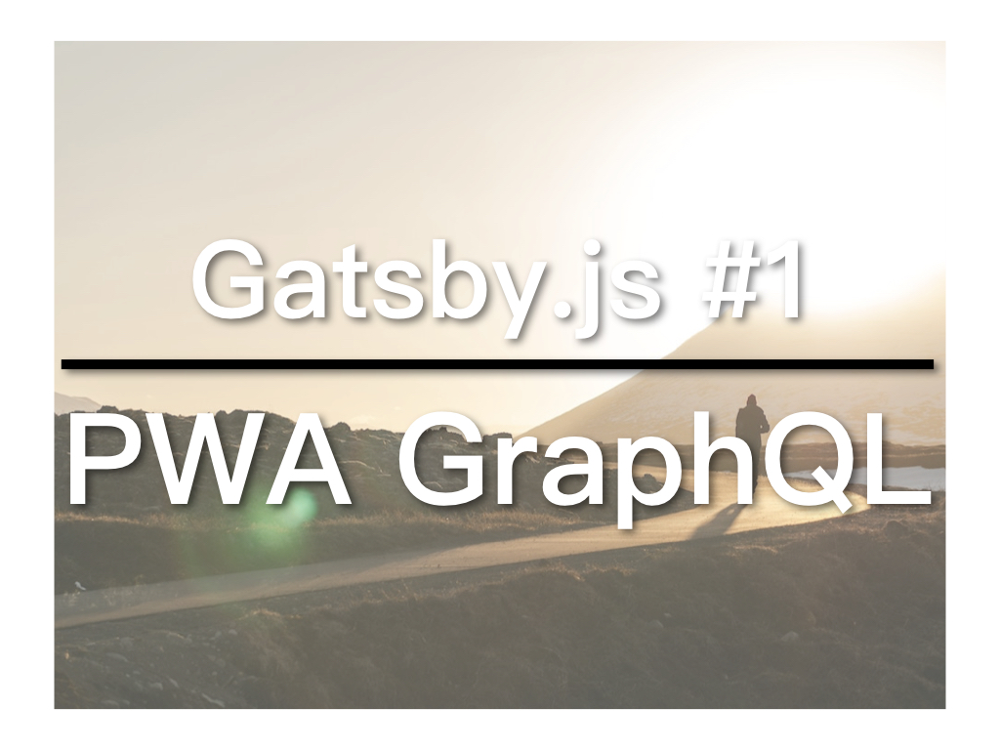

网页开发的世界日新月异，我目前最关心的技术包括：React Stack、PWA、GraphQL还有Serverless等。而Gatsby.js这个静态网页产生器用上了前三者，因此，我决定好好地研究一下Gatsby.js，并且要用它完成一个新网站。

## 未来的网页：渐进式网页应用程式

PWA: Progressive Web App，即渐进式网页应用程式，最近越来越多人讨论，那它到底有什么用？以下几点是让我最在意的：

1. 让网页取代手机应用程式，还不用安装
2. 让网页可离线浏览
3. 让网页变得超快

PWA透过Service Worker，将原本存放在Server上的data暂存在浏览器当中，这样网页就能直接和Service Worker沟通，而不用每次都要经过Server，从而实现让网页操作起来更快，更流畅，也能离线浏览。既然能离线浏览，只要将网页添加到桌面，它就跟手机上的应用程式完全一样，你可以剩下开发手机应用程式的成本。再者，现在要想透过App Store让人下载并长期使用你应用已经非常困难，很可能你费尽心力和财力开发的手机应用根本没用，还不如一个PWA，还免去安装应用的步骤。

## Gatsby.js：超快、易用、一堆最新技术

[Gatsby.js](https://www.gatsbyjs.org/)是一个基于React.js的静态网页产生器。

对于像我一样喜欢学习新技术的人来讲，Gatsby.js比起WordPress或者Jekyll之类的有趣太多了，如果你刚好也喜欢React.js和GraphQL，那就更不能错过。

和WordPress比起来，在资源方面，Gatsby.js远不如WordPress。但如果你只要完成一个企业介绍之类网站，那Gatsby.js或许还能帮你剩下Server的租金，因为静态网页能够直接利用GitHub Pages之类的服务，而且速度超快。

## GraphQL：REST API的进化版

简单来讲，[GraphQL](https://graphql.org/learn/)就是REST的进化版，具有比REST更“精准”，可以只取需要的data等等好处。个人觉得满有趣，具体可以参考其官网，我会在这个系列学习使用GraphQL。

## 关于这个系列

在Gatsby.js方面，我也是新手，这个系列是要分享我的学习经验（文字加影片）。我会用Gatsby.js制作一个真实的网站，透过这个过程瞭解更多PWA、GraphQL以及React.js相关的知识

本文参与<a href="https://ithelp.ithome.com.tw/articles/10201610">iT邦帮忙铁人赛</a>。<a href="https://nodejust.com/gatsbyjs/">繁体</a>