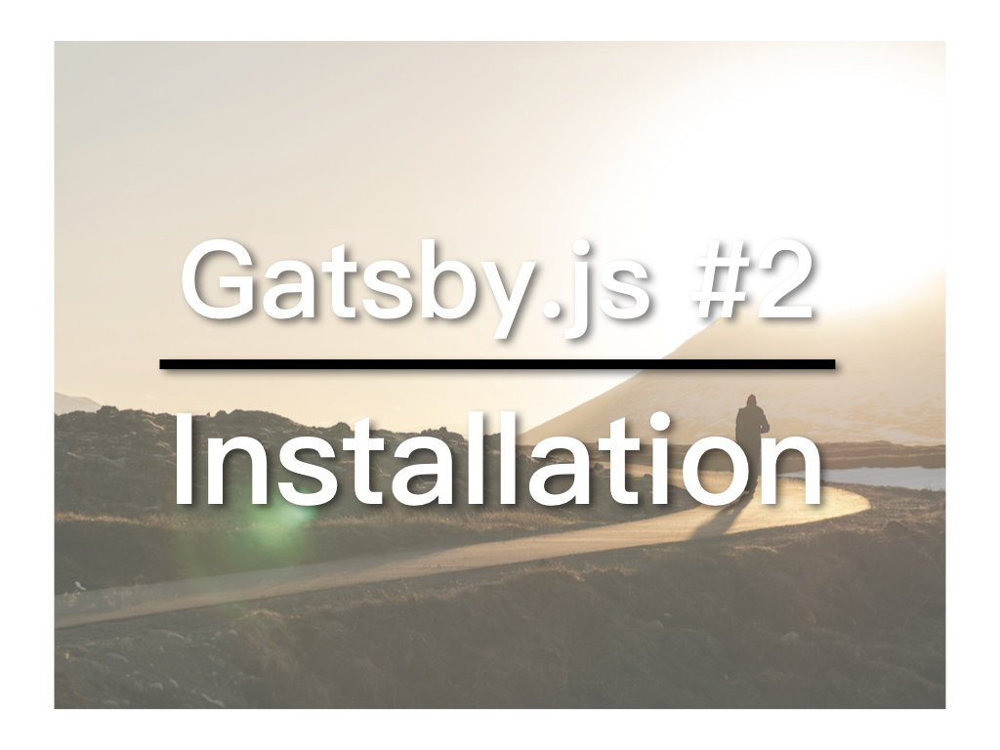

实作是最好的学习。今天要介绍Gatsby.js的安装及在local环境运行起来。

##视频教学连结
* [YouTube](https://youtu.be/OIDOKUvEyMY)
* [微博](https://weibo.com/1736214117/GE7hXc7gL)

##安装Gatsby CLI

```
npm install --global gatsby-cli
```

##用Gatsby建立新网站

```
gatsby new testing https://github.com/gatsbyjs/gatsby-starter-default
```

testing是新网站的名称，而后面的是这个新网站所使用的Starter，我们使用的是预设的，主要为了瞭解一下Gatsby网站的结构。之后，会换另一个Starter真正做我们的网站。

進入testing後，可使用：

```
gatsby develop
```

让网站运行起来，你可以透过http://localhost:8000/ 查看运行效果

今天先到此，明天我们会瞭解一下gatsby的目录结构。

本文参与[iT邦帮忙铁人赛](https://ithelp.ithome.com.tw/articles/10201974)。[繁体](https://nodejust.com/gatsbyjs-install/)