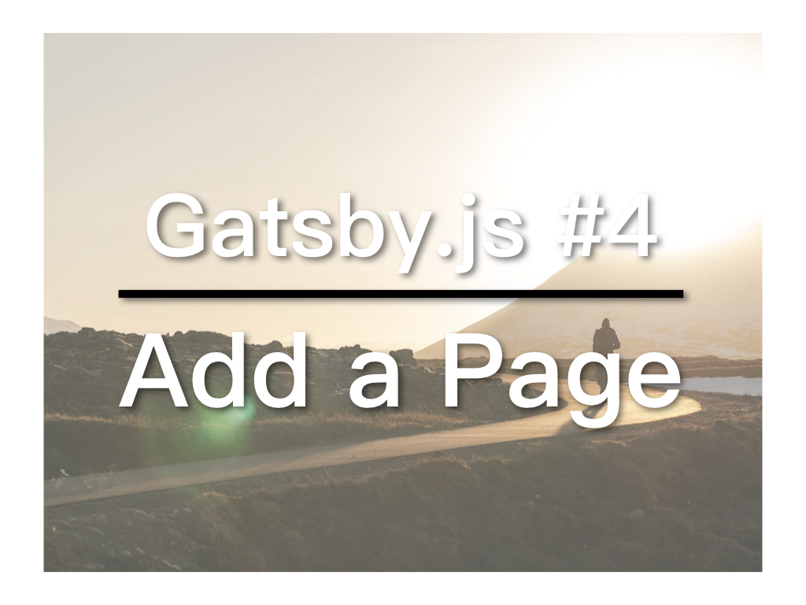

今天要介绍的内容很简单：如何在Gatsby中新增页面。新增页面的方法不只一种，今天先介绍最简单的方法。

## 视频教学连结
* [YouTube](https://youtu.be/r2rY18ZB35A)
* [微博](https://weibo.com/1736214117/GEqF0D9wX)
* [腾讯](https://v.qq.com/x/page/k07528mfmz7.html)

## layout.js vs pages

layout.js是网页的整体结构，pages里的页面也是由layout.js调用（作为`{children}`）。

pages里是各页面的主体内容。

## Link

在gatsby当中使用 Link 取代 a 连结。Link存放在gatsby里面：

```
import { Link } from 'gatsby'
```

## 新增页面

在pages里新增一个JS文件，命名为page-3.js。输入：

```
import React from 'react'
import { Link } from 'gatsby'

import Layout from '../components/layout'

const NewPage = () => (
  <Layout>
    <h1>Hi from the NEW page</h1>
    <p>Welcome to the new page</p>
    <Link to="/">Go back to the homepage</Link>
  </Layout>
)

export default NewPage
```

接着，在pages里的index.js中的Link那行下面加入：

```
<Link to="/page-3/">Go to NEW page</Link>
```

执行`gatsby develop`查看效果。