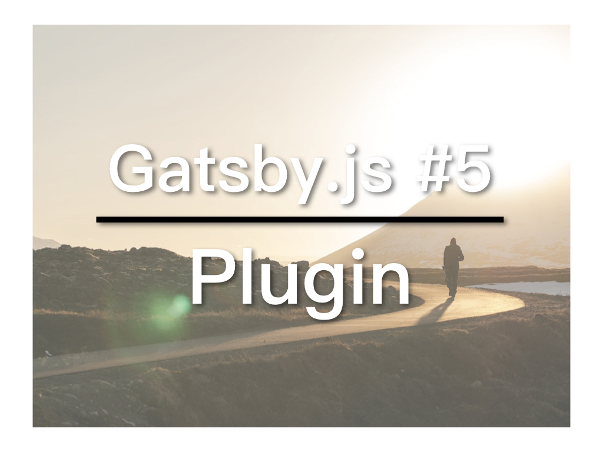

和WordPress一样，Gatsby.js也有plugin系统，透过NPM安装。你可以在[Gatsby.js 官网](https://www.gatsbyjs.org/plugins/)找到所有plugin。今天我们要学习怎样安装plugin。

## 视频教学连结
* [YouTube](https://youtu.be/1XQ3CphDDJ4)

## gatsby-config.js

gatsby-config.js当中的plugins部分设定了这个网站的所有plugins。以下是预设Starter的gatsby-config.js：

```
module.exports = {
  siteMetadata: {
    title: 'Gatsby',
  },
  plugins: [
    'gatsby-plugin-react-helmet',
    {
      resolve: `gatsby-plugin-manifest`,
      options: {
        name: 'gatsby-starter-default',
        short_name: 'starter',
        start_url: '/',
        background_color: '#663399',
        theme_color: '#663399',
        display: 'minimal-ui',
        icon: 'src/images/gatsby-icon.png', // This path is relative to the root of the site.
      },
    },
    'gatsby-plugin-offline',
  ],
}
```

可以看到plugins是一个array，里面一共有三个plugins，以逗号分开。其中，第二个plugin是一个object，以大括号包起来。这样做是为了对plugin进行设定。大括号里的`resolve`部分是plugin的名称，`options`部分便是针对这个plugin的设定，设定内容因不同plugin而异。

## 安装plugin

以gatsby-plugin-sass为例，官方文档提供了指令：

```
npm install --save node-sass gatsby-plugin-sass
```

在Command Line，这个网站的位置执行即可。

接着，要在gatsby-config.js中加入这个plugin，由于我们不需要额外设定，只要将plugin名称加到plugins array最后即可：

```
'gatsby-plugin-offline',
'gatsby-plugin-sass',
```

## 测试plugin

为了测试这个plugin，我们可以把/src/components/当中的layout.css，改为SASS专用的SCSS格式：layout.scss。并在layout.js里，找到：

```
import './layout.css'
```
同样改为：
```
import './layout.scss'
```
执行`gatsby develop`，查看效果，应该和之前完全一样。若你的gatsby网站一直跑着，记得先结束（Control + C），再执行一次`gatsby develop`，因为安装plugin后需要重启。

若要进一步测试，可以在layout.scss当中使用SASS语法，如：
```
body {
  margin: 0
  background: #ff0;
  p {
    color: #fff;
  }
}
```