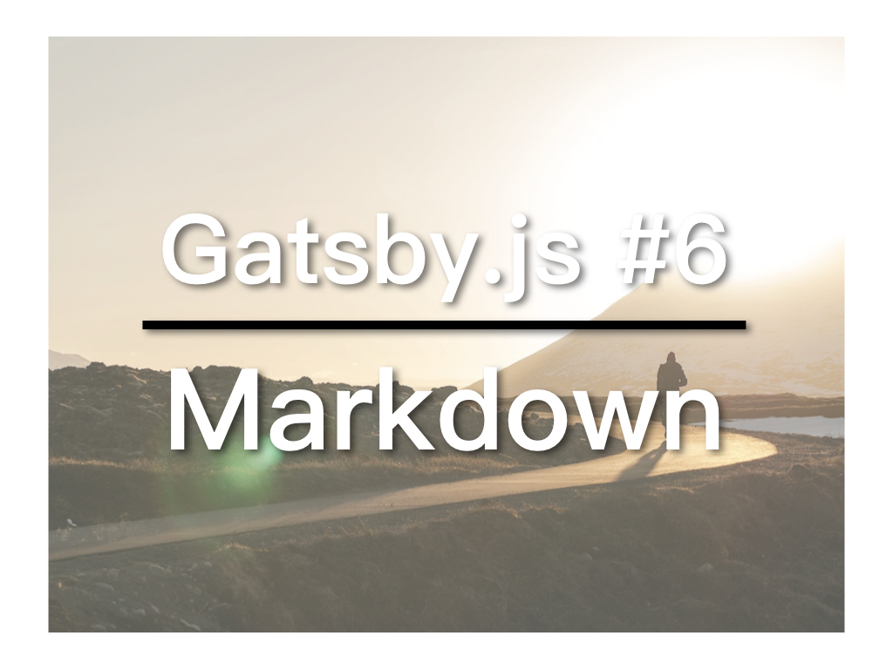

Gatsby可以以Markdown作为资料来源自动产生页面，这让我们可以轻易的建立Blog之类的网站：写blog只需写markdown。

## 视频教学连结
* [YouTube](https://youtu.be/auOyS_YLabs)
* [微博](https://weibo.com/1736214117/GETGpEJdV)
* [B站](https://www.bilibili.com/video/av34283084/)
* [腾讯](http://v.qq.com/x/page/u0757rz0ff0.html)

## gatsby-source-filesystem

我们要从Markdown文件中取得页面内容需要gatsby-source-filesystem的帮助：
```
npm install --save gatsby-source-filesystem
```
安装完成后，需要在gatsby-config.js的plugins部分，加入这个plugin。这次，我们要进行一些设定：
```
{
  resolve: 'gatsby-source-filesystem',
  options: {
    path: `${__dirname}/src/pages`,
    name: 'pages',
  }
}
```
resolve是plugin名称，options是设定，其中path是文件存放目录，`${__dirname}`是工作目录，即这个网站的所在目录，由于用到变量，我们用 backtick: ` （数字1左边的那个按键），而不是引号。name是存放文件的目录名称。

## gatsby-transformer-remark

接着，我们需要将从Markdown文件读取出来的数据转化成Gatsby能够透过GraphQL提取的内容，这就需要另一个plugin：gatsby-transformer-remark
```
npm install --save gatsby-transformer-remark
```
这个plugin功能很强大，也能透过gatsby-config.js进行设定，但目前我们只要把它加入plugins里：
```
'gatsby-transformer-remark'
```

有了这两个Plugin，Gatsby就能够从Markdown文件中透过GraphQL读取资料。

## 建立blog文章

在/src/pages底下，新增文件夹：20-08-2018-blog-post-1，在里面新增index.md文件，这便是blog文章所在位置。

这个文件的由frontmatter开始。frontmatter是网站的基本资料，如title。以下是我们的index.md：

```
---
path: '/blog-post-1'
title: 'My post'
---

# Post Heading
```

## templates

blog的文章要怎样呈现？这就需要用到模版，让所有的文章都使用相同的模版。

在/src底下，新增templates目录，在其中新增post.js作为模版文件，其内容为：
```
import React from 'react';
import Helmet from 'react-helmet';

export default function Template({data}) {
  const {markdownRemark: post} = data;
  return (
    <div>
      <h1>{post.frontmatter.title}</h1>
    </div>
  )
}
```
参数data是由GraphQL送进来的数据，也就是Markdown文件里面的内容。这些数据存放在markdownRemark变量当中，我们把它提取并存入post变量中，接着就可以透过post.frontmatter.title使用frontmatter中的title内容。

我们还要在template中加入GraphQL的query：

```
export const postQuery = graphql`
  query BlogPostByPath($path: String!) {
    markdownRemark(frontmatter: { path: { eq: $path } }) {
      html
      frontmatter {
        path
        title
      }
    }
  }
`
```
这段query是要透过路径（参数：$path）取得对应的文章。

graphql开始是GraphQL的内容。第二行的BlogPostByPath是这段query的名称，其接受一个参数：$path。我们要在markdownRemark中找frontmatter的path等于参数给予的$path的数据，找到后，我们要取得其html以及frontmatter中的path和title当中存放的内容。

下一步是要用Gatsby的createPages API创建页，这部分的内容，我们留到明天继续。

本文参与[iT邦帮忙铁人赛](https://ithelp.ithome.com.tw/articles/10201974)。[繁体](https://nodejust.com/gatsbyjs/)