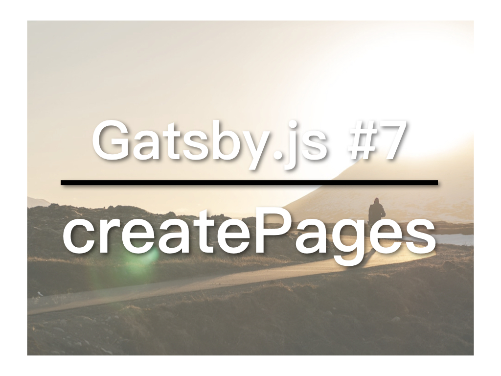

上一篇中我们准备好了Markdown丶post template，以及相应的一些GraphQL query，今天就要使用Gatsby提供的createPages API自动産生blog文章。

## 视频教学连结
* [YouTube](https://youtu.be/BTV_V2IokF0)
* [B站](https://www.bilibili.com/video/av34357580/)
* [微博](https://weibo.com/1736214117/GETGpEJdV)
* [腾讯](http://v.qq.com/x/page/g0758t0w9ki.html)

## gatsby-node.js
gatsby-node.js便是我们使用createPages的地方。Gatsby会根据这里面的设定産生相应的node（post, page等）。如果主目录下找不到这个文件，可自行新增，但名称必需使用gatsby-node.js。

在gatsby-node.js中加入：

```
const path = require('path');

exports.createPages = ({actions, graphql}) => {
  const {createPage} = actions;

  const postTemplate = path.resolve('src/templates/post.js');

  return graphql(`{
    allMarkdownRemark {
      edges {
        node {
          html
          id
          frontmatter {
            path
            title
          }
        }
      }
    }
  }`)
  .then(res => {
    if (res.errors) {
      return Promise.reject(res.errors);
    }

    res.data.allMarkdownRemark.edges.forEach(({node}) => {
      createPage({
        path: node.frontmatter.path,
        component: postTemplate
      })
    })
  })
}
```

我们用GraphQL取得所有的文章，用foreach针对每一篇文章使用createPage建立新页面，这里则需要用到path和postTemplate。

### 更正：
上一篇的templates/blog.js当中的：
```
import React from 'react'
```
React 需要大写。

另外，20-10-2018-blog-post-1/index.md当中：
```
path: '/blog-post-1'
```
引号後漏了“/”。

本文参与[iT邦帮忙铁人赛](https://ithelp.ithome.com.tw/articles/10201974)。[繁体](https://nodejust.com/gatsbyjs/)