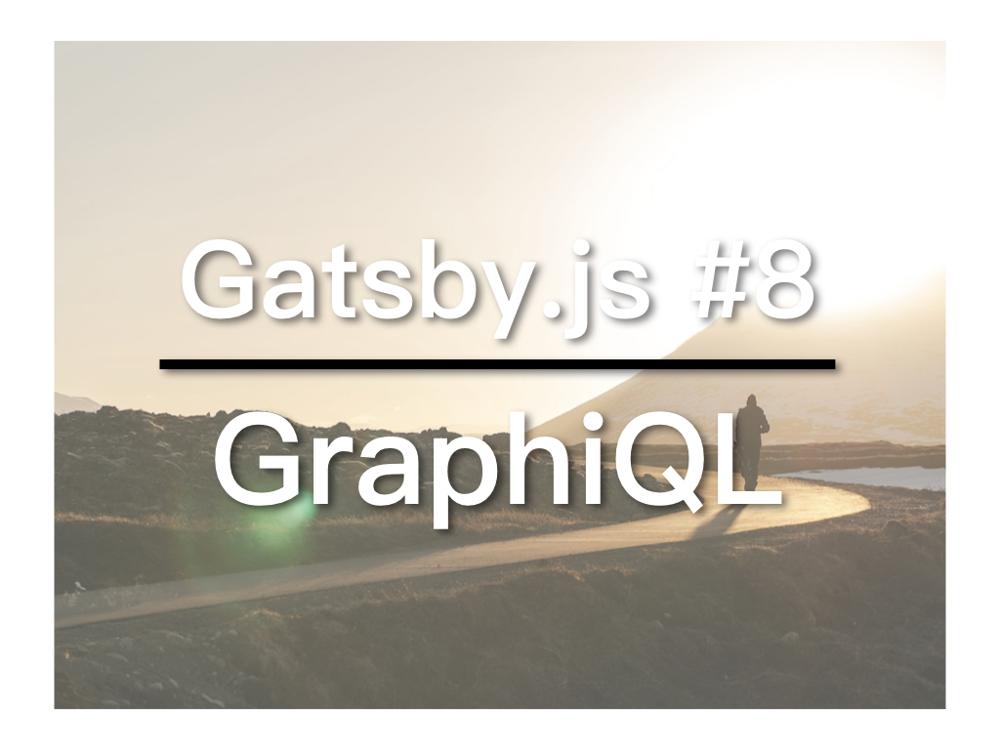

Gatsby提供了一個叫做 **GraphiQL** 的工具，帮助我们测试网站上的GraphQL查询。GraphiQL提供一个可视化界面，让我们可以直观地看到查询的结果，最后还能透过其Prettify功能对查询进行美化，以便用于Gatsby当中。今天，我们就来了解一下这个GraphiQL工具。

## 视频教学连结

## GraphiQL

当你执行`gatsby develop`之后，除了本地网站的连结之外，Gatsby还为你提供了GraphiQL的连结：

```
http://localhost:8000/___graphql
```

点击后便能在浏览器上看到GraphiQL的界面，左侧为查询输入区，右侧查询结果。输入完查询后，点击左上角的执行按钮便能看到查询结果。

请尝试输入：

```
{
  allMarkdownRemark {
    edges {
      node {
        frontmatter {
          title
          path
        }
      }
    }
  }
}
```
这跟我们之前在templates/index.js当中使用的基本一样。我们要找全部的Markdown文件，在edges当中的每一个node便是一份Markdown文件，里面还有frontmatter和html（上面没用到），frontmatter底下还有title和path。

按下执行后，你会看到我们的两篇Markdown的内容。

接着，再将`allMarkdownRemark`那行改为：
```
allMarkdownRemark(limit: 1) {
```
其他保持不变，执行后，便会看到只有一篇文章的资料，这便是受到`limit: 1`的限制。

以后需要用到GraphQL的时候，就可以先在GraphiQL中测试一下，没有问题后，按下左上方的Prettify，就能把查询复制到Gatsby当中。

本文参与[iT邦帮忙铁人赛](https://ithelp.ithome.com.tw/articles/10201974)。[繁体](https://nodejust.com/gatsbyjs/)