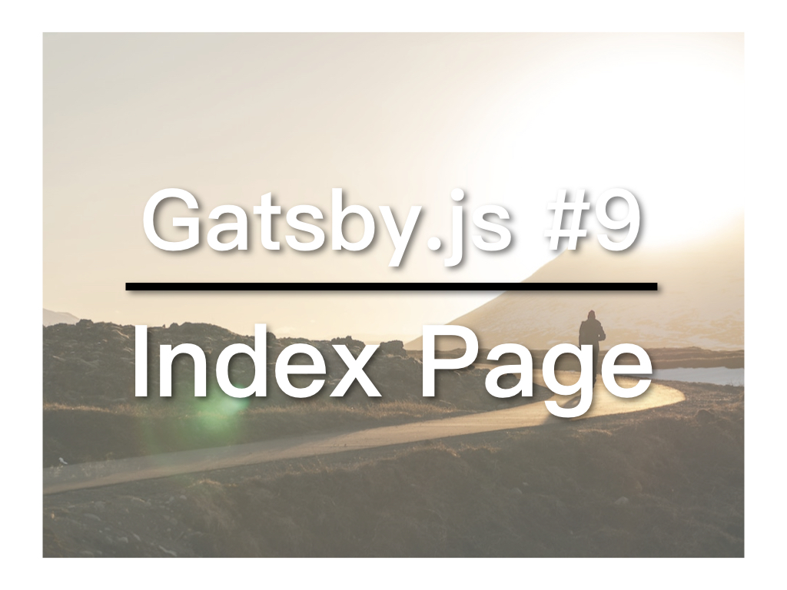

上一篇中，我们用GraphiQL测试了GraphQL的查询。今天，我们就要用这些查询来打造一个Index页面。


## 视频教学连结
* [YouTube](https://youtu.be/xa79RdkE9pk)

## 加入GraphQL

打开/pages/index.js，之前我们加入了Link，现在要使用GraphQL来取得资料，你可以参考/templates/post.js，两者很类似，差别在于，post是取得单篇文章资料，而index是取得多篇文章资料：
```
export const pageQuery = graphql`
  query IndexQuery {  
    allMarkdownRemark(limit: 10) {
      edges {
        node {
          id
          frontmatter {
            title
            path
          }
        }
      }
    }
  }
`
```
其中id是自动产生的，用于Link连结，因为每个component都需要一个唯一的Key。

接着就可以将GraphQL取得的数据交给IndexPage使用，完全的index.js程式如下：
```
import React from 'react'
import { Link } from 'gatsby'

import Layout from '../components/layout'

const IndexPage = ({data}) => (
  <Layout>
    <h1>Hi guys</h1>
    <p>Welcome to your new Gatsby site.</p>
    <p>Now go build something great.</p>
    <Link to="/page-2/">Go to page 2</Link>
    <Link to="/page-3/">Go to page NEW</Link>

    <h2>Index</h2>
    {data.allMarkdownRemark.edges.map(post => (
      <Link
        key={post.node.id} 
        to={post.node.frontmatter.path}>
        {post.node.frontmatter.title}
      </Link>
    ))}
  </Layout>
)

export const pageQuery = graphql`
  query IndexQuery {  
    allMarkdownRemark(limit: 10) {
      edges {
        node {
          id
          frontmatter {
            title
            path
          }
        }
      }
    }
  }
`

export default IndexPage
```
执行`gatsby develop`之后，便能在index页面看到那两篇文章的连结。

本文参与[iT邦帮忙铁人赛](https://ithelp.ithome.com.tw/articles/10201974)。[繁体](https://nodejust.com/gatsbyjs/)