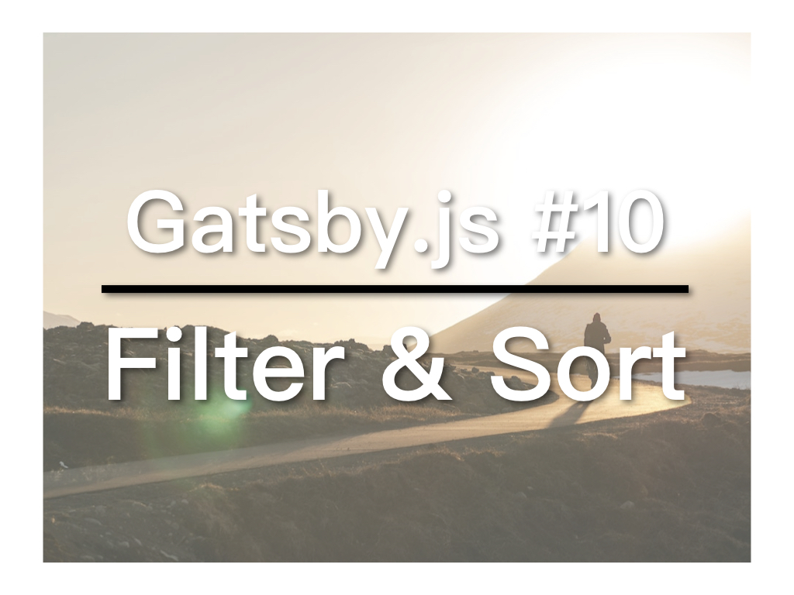

上一篇中，我们完成了一个简单的Index页面。今天，我们再加一些功能：1）在文章中设定是否为草稿，若是，则index不显示，这可以透过GraphQL的filter实现；2）为文章加入日期，让index可以按日期以倒序排列文章，这可以透过GraphQL的sort实现。


## 视频教学连结
* [YouTube](https://youtu.be/lePIzInlRcY)
* [B站](https://www.bilibili.com/video/av34549088/)
* [微博](https://weibo.com/1736214117/GFwag6N9u)
* [腾讯](http://v.qq.com/x/page/g07641g1y5l.html)

## Index列表
将连结列表改为ul显示
```
<ul>
{data.allMarkdownRemark.edges.map(post => (
  <li>
    <Link
      key={post.node.id} 
      to={post.node.frontmatter.path}>
      {post.node.frontmatter.title}
    </Link>
  </li>
))}
</ul>
```

## 增加frontmatter
为两篇blog文章加入新frontmatter：
```
---
path: '/blog-post-1'
title: 'My post'
draft: false
date: "2018-10-22"
---
```

## GraphQL的filter和sort
修改首页的index.js当中的GraphQL查询，先加入前面新增的frontmatter（draft和date）。再在limit后之后加入filter和sort：
```
export const pageQuery = graphql`
  query IndexQuery {  
    allMarkdownRemark(
      limit: 10 
      filter: { frontmatter: { draft: { eq: false } } }
      sort: {fields: frontmatter___date order: DESC}
    ) {
      edges {
        node {
          id
          frontmatter {
            title
            path
            draft
            date
          }
        }
      }
    }
  }
`
```
filter可以用条件限制查询内容。

sort可以根据fields加order进行顺序或倒序。


[繁体](https://nodejust.com/gatsbyjs/)