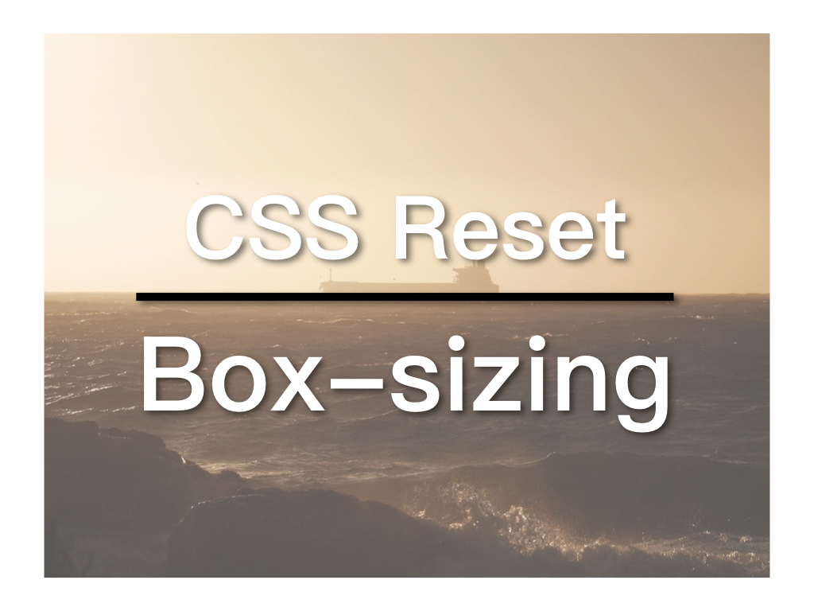

## box-sizing 是什么？

CSS 的[盒子模型 Box Model](https://zacklive.com/css-box-model/)不会将 padding 与 border 计算到容器（如 div）的的宽度（width）当中，这就导致你所设定的容器宽度未必是最终宽度（需要加上 padding 与 border）。这被很多开发者所诟病，因此就有了`box-sizing: border-box`的设定，其效果便是将 padding 和 border 纳入容器宽度。

##视频连结

1. [B站](https://www.bilibili.com/video/av42969946/)
2. [YouTube](https://youtu.be/K0JmFuh6F3E)

## 如何应用 box-sizing

这显然是很实用的设计，很多开发者将它用于所有 CSS 选择器：

```
* {
  box-sizing: border-box;
}
```

相对于**border-box**，原本的不计算 padding 与 border 的称为：**content-box**。详情请参考[W3Schools](https://www.w3schools.com/cssref/css3_pr_box-sizing.asp)

这一设定的问题是 box-sizing 是不被继承的。如果需要在某些地方用回 content-box，这个 content-box 内部的容器依然会是 border-box：

```
<div class="component"> <!-- I'm content-box -->
  <header> <!-- I'm border-box still -->
  </header>
</div>
```

因此 [Chris Coyier](https://css-tricks.com/inheriting-box-sizing-probably-slightly-better-best-practice/) 建议这样设定：

```
html {
  box-sizing: border-box;
}
*,
*:before,
*:after {
  box-sizing: inherit;
}
```

*::before 和 *::after 也被加了进来，并且所有元素都会继承上级的设定。

然而 Bootstrap 的 reset : Reboot.css 却推翻了这一设定，理由是， Google Chrome 中存在一个小 bug：`details`无法正确继承父级的 box-sizing 设定(一说 `summary` 也有同样的情况)。这个 [codepen](https://codepen.io/andrewbelcher/pen/mwWZEM) 演示了这个 bug。

这个 bug 在2016年就已经报告到 [Google Chrome](https://bugs.chromium.org/p/chromium/issues/detail?id=589475)，但一直没得到重视。而 Bootstrap 的做法是，放弃继承的部分：

```
*,
*::before,
*::after {
  box-sizing: border-box;;
}
```

但个人觉得，这样的做法有种削足就履的感觉。再说，这个 bug 没有得到 Google Chrome 的重视，也说明了它其实影响很小： 你上次用`details`是什么时候？相反层层继承是CSS的基本概念，远比这个小 bug 重要，特别网页中用到 component 时，某些 component 可能就是以 content-box 设计的。若没有了继承，它的设计就可能会乱套。因此，我比较倾向 Chris Coyier 的做法。

## CSS Reset 与 Bootstrap 4 的 Reboot.css

研究 box-sizing 的过程中，考虑了一下 CSS Reset 的问题，因为最好的做法是将 box-sizing 的设定放在 Reset 中。 CSS Reset 最流行的方案有两个： [Eric Meyer](https://meyerweb.com/eric/tools/css/reset/) 和 [Normalize.css](https://necolas.github.io/normalize.css/)。Eric Meyer 基本上取消掉预设设定（h1看起来跟h2一样），使得所有浏览器效果都一样。这意味著，你要重写所有基本设定，如h1和h2的字体大小等。而 Normalize.css 则是让浏览器回归基本，让你有一个一致的基础来进行设计。它其中一个原则是避免武断（opinionated），意即，只提供基本，不要求你使用某人的偏好。因此，Normalize.ccs 没有设定字体等会因人而异的内容。 box-sizing 的设定自然是不会出现在 Normalize.css 当中。

Bootstrap 4 也引入了自己的 CSS Reset 方案：[Reboot.css](https://getbootstrap.com/docs/4.0/content/reboot/)。它是基于 Normalize.css 的，加入了一些偏好设定，Bootstrap 的网站上有详细说明。Bootstrap 仍是全世界最流行的前端框架，它的偏好设定也是以适合绝大多数开发者为考量，并做到与时俱进。例如，我们之前讨论过的让网页使用[系统字体（System Font Stack）](https://zacklive.com/chinese-font-family/)， Reboot.css 也做了同样的处理。

但 Reboot.css 也有一些我不喜欢的地方。像上面提到的 box-sizing 的处理。另外，我习惯将 html 的字体设为 62.5%，即10px，这样之后设定 rem 时便是以 10px 为基础，而不是预设的 16px，更容易计算：

```
html {
  font-size: 62.5%;
}
body {
  font-size: 1.6rem;
}
```

还有使用系统字体的部分，我想加入微软雅黑（Microsoft YaHei）以加强对简体中文的支持：

```
$font-family-sans-serif: -apple-system, BlinkMacSystemFont, 'Microsoft YaHei', 'Segoe UI', Roboto,
  'Helvetica Neue', Arial, 'Noto Sans', sans-serif, 'Apple Color Emoji',
  'Segoe UI Emoji', 'Segoe UI Symbol', 'Noto Color Emoji' !default;
```

## Dawn.css

为了方便以后的开发，我对 Reboot.css 做了一点修改，主要是以上提到的几点，并上传到 GitHub，命名为： [Dawn.css](https://github.com/ZacharyChim/dawn.css)。如果你也认同这些修改的话，欢迎参考和提供意见。