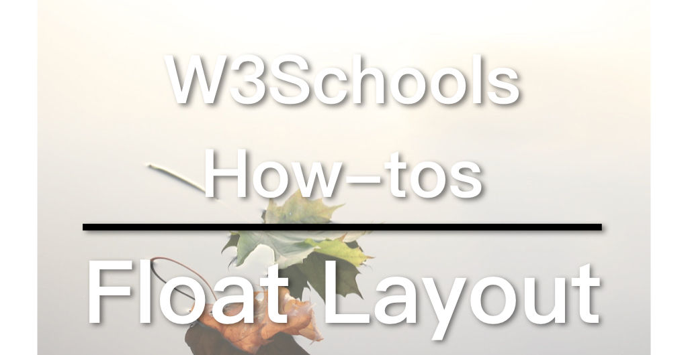

## W3Schools教学系列

[W3Schools](https://www.w3schools.com)是知名的网页设计／前端开发教学网站，不仅提供HTML、CSS、JavaScript等的详尽教学，还可以把它当作说明文件（Documents）。有经验的前端或多或少已经接触过这个网站，因为它经常出现在搜索结果的前几项。其中，它的[How To](https://www.w3schools.com/howto/default.asp)部分更是包含了大量非常实用的例子，例如，如何制作SlideShow（图片轮播）、Lightbox、Parallax（视差效果）等等。因此我想做一系列的影片专门介绍这些How To。

## 响应式网页布局

今天已经是2019年，基本上所有新建的网页都会是响应式(Responsive)，以适应在手机显示。而实现响应式网页布局主要有3种方法：

1. Float
2. Flexbox
3. [CSS Grid](https://zacklive.com/css-grid-intro/)

当然，以上三者都需要搭配[Media Query](https://zacklive.com/media-query/)使用。

其中CSS Grid是最新，也是我最推崇的，但由于太新，较旧的浏览器并不支持。不过，大部分的浏览器其实都已经支持了，我个人不会太担心。要想知道哪些浏览器支持CSS Grid（或其他新功能），可以前往[Can I Use](https://caniuse.com/#feat=css-grid)查询。CSS Grid完全就是为了网页布局及其他二维（横向加纵向）布局而设计的，相信未来的网页都会采用这一设计。

Flexbox也算新，但浏览器支持的情况比CSS Grid要好点。基本上，目前主流已经转向Flexbox，Bootstrap就是很好的例子。但其实，Flexbox是为一维布局设计的（横向或纵向），而网页布局往往是二维的，Flexbox并非最佳选择，但由于CSS Grid来得太迟，Flexbox又能完成任务，现在不少新的网页以及前端框架采用Flexbox。

Float原来是设计来处虑理文绕图之类的问题，后来被用于布局设计。Float布局有著各种各样的问题，已经在逐渐淘汰中，但由于过去应用太普遍，相信短时间内并不会消失，因此也有必要瞭解。

这三种设计，W3Schools都有介绍。我会分成三篇来讲，今天先从最古老的Float开始。

## Float网页布局

Float布局的重点是

1. 让元素靠向同一个方向（左或右）
2. 用百分比控制每一个元素的宽度
3. 透过Media Query改变元素宽度以适应不同屏幕尺寸

[W3Schools的例子](https://www.w3schools.com/css/tryit.asp?filename=trycss_website_layout_blog)

这个例子的重点有两处，一是设定左右两栅都向左float，宽度分别为75%和25%：

```
/* Left column */
.leftcolumn {   
  float: left;
  width: 75%;
}

/* Right column */
.rightcolumn {
  float: left;
  width: 25%;
  background-color: #f1f1f1;
  padding-left: 20px;
}
```

二是Media Query设定当屏幕尺寸小于800px时，让左右两栅的宽度都变成100%，以实现响应式设计（Responsive Design）：

```
@media screen and (max-width: 800px) {
  .leftcolumn, .rightcolumn {   
    width: 100%;
    padding: 0;
  }
}
```

或许你会注意到导航栏（.topnav）也进行了类似的处理，由于原理一样，就不多说了。

## 改进：移动优先原则（Mobile First）

之前介绍过[移动优先原则](https://zacklive.com/mobile-first/)，即先设计小屏幕版，再透过Media Query设定桌面版。W3Schools的这个例子并没有采取这一原则，我们可以自行修改，使之符合。方法很简单，只要将Median Query里的内容和外面相应的内容反过来即可，不要忘了把Media Query从max-width改为min-width。

```
/* Left column */
.leftcolumn {   
  float: left;
  width: 100%;
}

/* Right column */
.rightcolumn {
  float: left;
  width: 100%;
  background-color: #f1f1f1;
  padding: 0;
}
```

```
@media screen and (min-width: 800px) {
  .leftcolumn {   
    width: 75%;
  }
  .rightcolumn {
    width: 25%;
    padding-left: 20px;
  }
}
```

你可以试著自行将.topnav也修改一下，要注意，width如果没有特别指定便是auto，另外，我发现原本例子采用的400px作为断点，换成min-width之后没有反应，需要改为500px。具体原因，我也不太确定，如果你知道的话，欢迎告知。

我开了一个GitHub的仓库专门放W3Schools系列的代码，要查看Mobile First版的代码请移步：[W3Schools GitHub](https://github.com/ZacharyChim/W3Schools)