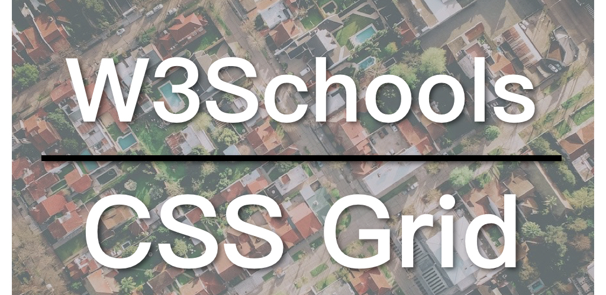

继续[W3Schools响应式网页布局](https://zacklive.com/w3schools-web-layout/)的实现，今日讲的是**CSS Grid**方案。CSS Grid就是为二维布局设计的，最适合用来做网页布局。目前主流的浏览器都已经支持CSS Grid，除非你很确定你的用户常使用较旧的浏览器，不然的话，建议使用CSS Grid来设计网页布局。如果你对CSS Grid并不熟悉，可以参考以下的教学：

* [CSS网格(CSS Grid)完整教学](https://zacklive.com/css-grid-intro/)
* [W3Schools CSS Grid教学](https://www.w3schools.com/css/css_grid.asp)

* [CSS Grid实现响应式网页布局例子](https://www.w3schools.com/css/tryit.asp?filename=trycss_grid_layout_named)

## 视频连结

* [B站](https://www.bilibili.com/video/av45523828/)
* [YouTube](https://youtu.be/7-RcgXc2KXg)

## CSS Grid响应式网页布局

透过CSS Grid实现响应式网页布局的方法有很多种，最简单，也最能体现CSS Grid的特点的方法是使用*grid-template-areas*（注意是复数，结尾有s）。这种方法同样可分为三步：

1. 为每一个Grid项赋与一个名字；
2. 用grid-template-areas来控制每一个Grid项所占的空间；
3. 通过**Media Query**改变每一个Grid项所占的空间。

在W3Schools的例子中，一开始便为每一个div取了一个相应的名称：

```
.item1 { grid-area: header; }
.item2 { grid-area: menu; }
.item3 { grid-area: main; }
.item4 { grid-area: right; }
.item5 { grid-area: footer; }
```

注意这里的*grid-area*是单数。接著在包含这些div的容器中控制它们的所占空间比例。

```
.grid-container {
  display: grid;
  grid-template-areas:
    'header header header header header header'
    'menu main main main right right'
    'menu footer footer footer footer footer';
  grid-gap: 10px;
  background-color: #2196F3;
  padding: 10px;
}
```

重点在于grid-template-areas，可以看到这里的设定便是CSS Grid最终的显示效果。其中menu是最小宽度单位，header等于六个menu；main等于三个menu；right等于两个menu；而footer则等于五个menu。menu的宽度为1个单位，但高度却跨两行。

在W3Schools的例子中，并没有实现响应式的部分，但我们可以自行加入媒体查询的部分来实现。透过这个实现，你可以看到CSS Grid的神奇、直观、易用的特点。

```
@media screen and (max-width: 700px) {
  .grid-container {
    grid-template-areas:
        'header'
        'menu'
        'main'
        'right'
        'footer'
  }
}
```

在媒体查询的部分，只要更改grid-template-areas的设定就能改变整个布局。

同样地，这个例子也没有采用移动优先原则。你也可以将这个例子改为移动优先作为练习，由于前两篇中都做过这样的尝试，这里就不再赘述了。

W3Schools系列的代码都在GitHub上：[W3Schools GitHub](https://github.com/ZacharyChim/W3Schools)

## W3Schools教学系列

[W3Schools](https://www.w3schools.com)是知名的网页设计／前端开发教学网站，不仅提供HTML、CSS、JavaScript等的详尽教学，还可以把它当作说明文件（Documents）。有经验的前端或多或少已经接触过这个网站，因为它经常出现在搜索结果的前几项。其中，它的[How To](https://www.w3schools.com/howto/default.asp)部分更是包含了大量非常实用的例子，例如，如何制作SlideShow（图片轮播）、Lightbox、Parallax（视差效果）等等。因此我想做一系列的影片专门介绍这些How To。

1. [Float响应式网页布局](https://zacklive.com/w3schools-web-layout/)
2. [Flexbox响应式网页布局](https://zacklive.com/w3schools-flex/)
3. [CSS Grid响应式网页布局](https://zacklive.com/w3schools-grid/)