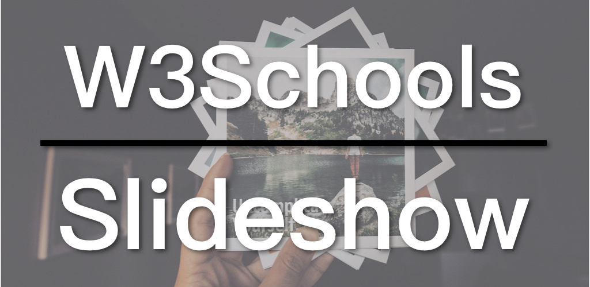

幻灯片（Slideshow）是网页上常见的一项功能，今日我们来看看W3Schools上的幻灯片教学。

* [W3Schools 幻灯片教学](https://www.w3schools.com/howto/howto_js_slideshow.asp)
* [幻灯片例子](https://www.w3schools.com/howto/tryit.asp?filename=tryhow_js_slideshow)
* [简化版幻灯片例子](https://zacharychim.github.io/W3Schools/4_slideshow/)

## 视频连结

* [B站](https://www.bilibili.com/video/av45927107/)
* [YouTube](https://youtu.be/ZXmceyqTnFo)

## 幻灯片（Slideshow）

我将实现幻灯片效果的基本逻辑整理如下：

1. 将所有幻灯片图片隐藏（`display: none`）；
2. JavaScript中设定图片索引为1，并显示索引所指的图片；
3. 每次显示图片前，先将所有图片再次隐藏。
4. 当点击左右箭头时，更改索引（左-1，右+1），或索引超过图片总数，则重置为1，反之亦然，再执行图片显示函数。

为了突出重点，我将W3Schools上的例子做了一些简化，移除了渐变特效、图片文字（Caption）和圆点导航等，只保留最基本的图片和左右箭头。

先看HTML，其实就是一个container、三张图片、加上左右箭头：

```
<div class="slideshow-container">

  <div class="mySlides fade">
    
  </div>

  <div class="mySlides fade">
    
  </div>

  <div class="mySlides fade">
    
  </div>

  <a class="prev" onclick="changeSlides(-1)">&#10094;</a>
  <a class="next" onclick="changeSlides(1)">&#10095;</a>

</div>
```

两个箭头都有`onclick`事件，对应的都是`changeSlides`函数，只是更改了图片索引。

再看CSS的部分：

```
.mySlides {
  display: none
}

/* Slideshow container */
.slideshow-container {
  max-width: 1000px;
  position: relative;
  margin: auto;
}

/* Next & previous buttons */
.prev, .next {
  cursor: pointer;
  position: absolute;
  top: 50%;
  width: auto;
  padding: 16px;
  margin-top: -22px;
  color: white;
  font-weight: bold;
  font-size: 18px;
  border-radius: 0 3px 3px 0;
  user-select: none;
}

/* Position the "next button" to the right */
.next {
  right: 0;
  border-radius: 3px 0 0 3px;
}
```

为了把两个箭头分别放在图片左右两边的中间位置，要先将container的position设为relative，作为箭头absolute的父级对象（`position: absolute` 相对于其第一个父级非预设，即static，的元素）。两个箭头的`top`设为50%，让其顶部出现在图片中央高度，再透过负的`margin-top`将箭头往上移动一点，以使其中间在图片高度的中央位置，因此`margin-top`的负值约为箭头所占高度的一半。接着，将右箭头移到右边：`right: 0`；

最后来看看JavaScript的部分：

```
var slideIndex = 1;
showSlides(slideIndex);

function changeSlides(n) {
  showSlides(slideIndex += n);
}

function showSlides(n) {
  var slides = document.getElementsByClassName("mySlides");
  
  if (n > slides.length) {slideIndex = 1}
  if (n < 1) {slideIndex = slides.length}
  
  for (var i = 0; i < slides.length; i++) {
    slides[i].style.display = "none";  
  }

  slides[slideIndex-1].style.display = "block";  
}
```

一开始就指定了图片索引为1，并马上执行`showSlides`，显示第一张图片。
接着是`changeSlides`函数，它的功能就是用新的图片索引来执行`showSlides`。
重点就在`showSlides`当中，首先透过`document.getElementsByClassName`取得所有图片，再判断传入的图片索引是否超出范围：少于1或大于图片总数，若是则重置索引。然后，用`for`循环将所有图片都隐藏起来。最后，根据索引显示图片。

这就是幻灯片最核心的逻辑。W3Schools的原例中还有更多辅助性的功能，理解了核心逻辑之后，相信也能简单地看懂这些额外的部分是怎么实现的。

考虑到W3Schools在大陆似乎无法访问，我将原例的代码也放到了GitHub上。

W3Schools系列的代码都在GitHub上：[W3Schools GitHub](https://github.com/ZacharyChim/W3Schools)

## W3Schools教学系列

[W3Schools](https://www.w3schools.com)是知名的网页设计／前端开发教学网站，不仅提供HTML、CSS、JavaScript等的详尽教学，还可以把它当作说明文件（Documents）。有经验的前端或多或少已经接触过这个网站，因为它经常出现在搜索结果的前几项。其中，它的[How To](https://www.w3schools.com/howto/default.asp)部分更是包含了大量非常实用的例子，例如，如何制作SlideShow（图片轮播）、Lightbox、Parallax（视差效果）等等。因此我想做一系列的影片专门介绍这些How To。

1. [Float响应式网页布局](https://zacklive.com/w3schools-web-layout/)
2. [Flexbox响应式网页布局](https://zacklive.com/w3schools-flex/)
3. [CSS Grid响应式网页布局](https://zacklive.com/w3schools-grid/)
4. [幻灯片如何实现](https://zacklive.com/w3schools-slideshow/)