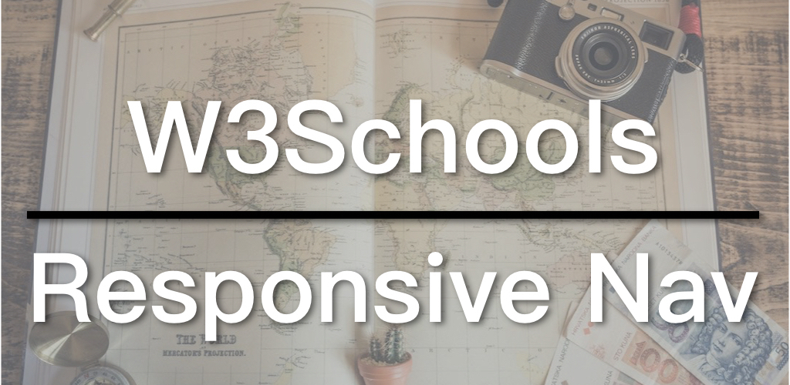

响应式导航即是让导航变成响应式。常见的做法是在小屏幕时不将全部导航项目列出，而是显示一个导航图标，点击该图标时才会显示出完整导航。今天我们就来按照W3Schools的方法完成一个响应式导航。

* [W3Schools 响应式导航教学](https://www.w3schools.com/howto/howto_js_topnav_responsive.asp)
* [响应式导航例子](https://www.w3schools.com/howto/tryit.asp?filename=tryhow_js_topnav)

## 视频连结

* [B站](https://www.bilibili.com/video/av46388163/)
* [YouTube](https://youtu.be/KWeK-y3KGJo)

## 响应式导航（Responsive Navigation)

实现响应式导航的重点在于：

1. 在大屏幕隐藏导航图标；显示全部导航项目。
2. 在小屏幕隐藏大部分导航项目，只显示首页与导航图标，点击图标才显示其他项目。
3. 当点击图标时，通过JavaScript为导航表加入`responsive`类，功能是将导航项目垂直列出。

以下是响应式导航的HTML部分：

```
<!DOCTYPE html>
<html>
<head>
<meta name="viewport" content="width=device-width, initial-scale=1">
<link rel="stylesheet" href="https://cdnjs.cloudflare.com/ajax/libs/font-awesome/4.7.0/css/font-awesome.min.css">
</head>
<body>

<div class="topnav" id="myTopnav">
  <a href="#home" class="active">Home</a>
  <a href="#news">News</a>
  <a href="#contact">Contact</a>
  <a href="#about">About</a>
  <a href="javascript:void(0);" class="icon" onclick="toggleNav()">
    <i class="fa fa-bars"></i>
  </a>
</div>

<div style="padding-left:16px">
  <h2>Responsive Topnav Example</h2>
  <p>Resize the browser window to see how it works.</p>
</div>

</body>
</html>
```

首先，在`<head>`的部分用`<link>`载入了一个[Font Awesome](https://fontawesome.com/)外部连结，为的是使用其中的导航图标。这一做法会载入Font Awesome的全部图标，而你真正用到的只有一个。如果你这样做，也可以利用[Fontello](http://fontello.com/)选择你会用到图标，生成自己的图标web font，再载入到你的网页中。

可以看到`topnav`中的最后一条连结便是导航图标。这里使用`javascript:void(0);`让连结的跳转功能无效。再给了一个`icon`类以及设定了`onclick`事件函数为`toggleNav`。

再来看CSS的部分：

```
body {
  margin: 0;
  font-family: Arial, Helvetica, sans-serif;
}

.topnav {
  overflow: hidden;
  background-color: #333;
}

.topnav a {
  float: left;
  display: block;
  color: #f2f2f2;
  text-align: center;
  padding: 14px 16px;
  text-decoration: none;
  font-size: 17px;
}

.topnav a:hover {
  background-color: #ddd;
  color: black;
}

.active {
  background-color: #4CAF50;
  color: white;
}

.topnav .icon {
  display: none;
}

@media screen and (max-width: 600px) {
  .topnav a:not(:first-child) {
    display: none;
  }

  .topnav a.icon {
    float: right;
    display: block;
  }

  .topnav.responsive {
    position: relative;
  }

  .topnav.responsive .icon {
    position: absolute;
    right: 0;
    top: 0;
  }

  .topnav.responsive a {
    float: none;
    display: block;
    text-align: left;
  }
}
```

重点有二：先是`.topnav .icon`设为了不显示`display: none;`；接着是媒体请求，我们来详细看看。

第一组将除了第一个（首页）之外的导航项目全部隐藏。第二组是显示导航图标并让其靠右。

接下来的三组都是`responsive`的设定。主要是将图标固定于右侧，再来是显示导航项目，并让其占满整行。

最后来看JavaScript：

```
function toggleNav() {
  var x = document.getElementById("myTopnav");
  if (x.className === "topnav") {
    x.className += " responsive";
  } else {
    x.className = "topnav";
  }
}
```

当点击图标时，取得`myTopnav`元素，并判断它的`className`是否只有`topnav`，若是则为它加入` responsive`（注意有一空格在前），否则，将它重设为`topnav`。加入`responsive`类则是显示全部导航项目，也就是媒体请求最后三组的设定；没有`responsive`便是只显示首页的导航图标。

这是最常见的响应式导航的实现方法，其他方法或大同小异，或增加细节与功能。若想要瞭解更多，以下两种导航是我觉得值得一看的：

1. [侧边栏滑入导航](https://www.w3schools.com/howto/howto_js_sidenav.asp)：改变`width`，`0`为隐藏，滑入效果则是由`transition`实现。
2. [全屏导航](https://www.w3schools.com/howto/howto_js_fullscreen_overlay.asp)：改变`width`和`height`；改动`width`是侧边滑入；改动`height`则是上下滑入。同样`0`为隐藏，滑入效果由`transition`实现。

W3Schools系列的代码都在GitHub上：[W3Schools GitHub](https://github.com/ZacharyChim/W3Schools)

## W3Schools教学系列

[W3Schools](https://www.w3schools.com)是知名的网页设计／前端开发教学网站，不仅提供HTML、CSS、JavaScript等的详尽教学，还可以把它当作说明文件（Documents）。有经验的前端或多或少已经接触过这个网站，因为它经常出现在搜索结果的前几项。其中，它的[How To](https://www.w3schools.com/howto/default.asp)部分更是包含了大量非常实用的例子，例如，如何制作SlideShow（图片轮播）、Lightbox、Parallax（视差效果）等等。因此我想做一系列的影片专门介绍这些How To。

W3Schools系列全部视频：

1. [Float响应式网页布局](https://zacklive.com/w3schools-web-layout/)
2. [Flexbox响应式网页布局](https://zacklive.com/w3schools-flex/)
3. [CSS Grid响应式网页布局](https://zacklive.com/w3schools-grid/)
4. [幻灯片如何实现](https://zacklive.com/w3schools-slideshow/)
5. [响应式导航如何实现](https://zacklive.com/w3schools-responsvie-nav/)
6. [灯箱效果如何实现](https://zacklive.com/w3schools-lightbox/)
7. [Parallax-视差效果如何实现](https://zacklive.com/w3schools-parallax/)
8. [可拖拉效果如何实现](https://zacklive.com/w3schools-draggable/)