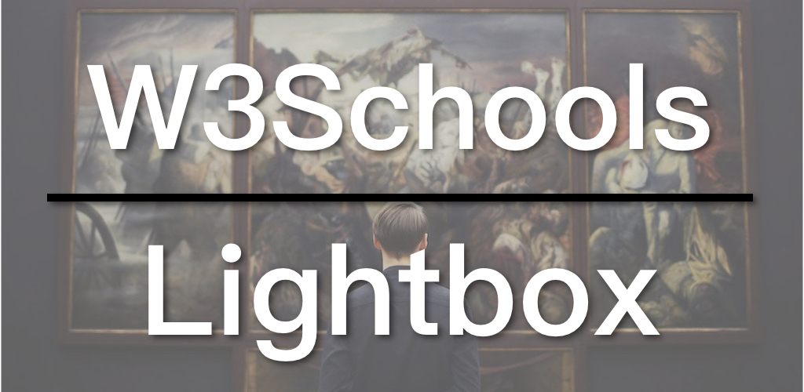

灯箱（Lightbox）效果是将图片放大弹出显示，并将背景变暗，以突出图片。这种效果可用于单张图片，也可用于图片库。其原理跟模态框（Modal）基本一样。W3Schools有分Modal Images和Lightbox两个教学，主要差别在于Lightbox是为多张图片设计，而Modal Images则是单张图片。为了方便理解这里选择Modal Images，若能理解此例，加上之前的[幻灯片](https://zacklive.com/w3schools-slideshow)，就差不多等于Lightbox中的例子。今天我们就来看看W3Schools是怎样实理灯箱效果。

* [W3Schools灯箱效果教学](https://www.w3schools.com/howto/howto_css_modal_images.asp)
* [灯箱效果例子](https://www.w3schools.com/howto/tryit.asp?filename=tryhow_js_topnav)

## 视频连结

* [B站](https://www.bilibili.com/video/av46844478/)
* [YouTube](https://youtu.be/Q88UFRlqMYA)

## 灯箱效果（Lightbox)

实现灯箱效果的重点在于：

1. 预设隐藏灯箱。
2. 当小图被点击时，显示灯箱。
3. 图片放大的效果可透过CSS动画实现。

以下是灯箱效果的HTML部分：

```


<div id="myModal" class="modal">

  <span class="close">&times;</span>

  

  <div id="caption"></div>
</div>
```

第一张图片是小图，设定了最大宽度为300px。接着是灯箱，也是一个拟态框（Modal），当中有关闭按钮、大图和标题。其中图片是没有指定src的，留给JavaScript来处理，标题也一样。灯箱一开始是隐藏的。

再来看CSS的部分：

```
/* Style the Image Used to Trigger the Modal */
#myImg {
  border-radius: 5px;
  cursor: pointer;
  transition: 0.3s;
}

#myImg:hover {opacity: 0.7;}

/* The Modal (background) */
.modal {
  display: none; /* Hidden by default */
  position: fixed; /* Stay in place */
  z-index: 1; /* Sit on top */
  padding-top: 100px; /* Location of the box */
  left: 0;
  top: 0;
  width: 100%; /* Full width */
  height: 100%; /* Full height */
  overflow: auto; /* Enable scroll if needed */
  background-color: rgb(0,0,0); /* Fallback color */
  background-color: rgba(0,0,0,0.9); /* Black w/ opacity */
}

/* Modal Content (Image) */
.modal-content {
  margin: auto;
  display: block;
  width: 80%;
  max-width: 700px;
}

/* Caption of Modal Image (Image Text) - Same Width as the Image */
#caption {
  margin: auto;
  display: block;
  width: 80%;
  max-width: 700px;
  text-align: center;
  color: #ccc;
  padding: 10px 0;
  height: 150px;
}

/* Add Animation - Zoom in the Modal */
.modal-content, #caption {
  animation-name: zoom;
  animation-duration: 0.6s;
}

@keyframes zoom {
  from {transform:scale(0)}
  to {transform:scale(1)}
}

/* The Close Button */
.close {
  position: absolute;
  top: 15px;
  right: 35px;
  color: #f1f1f1;
  font-size: 40px;
  font-weight: bold;
  transition: 0.3s;
}

.close:hover,
.close:focus {
  color: #bbb;
  text-decoration: none;
  cursor: pointer;
}

/* 100% Image Width on Smaller Screens */
@media only screen and (max-width: 700px){
  .modal-content {
    width: 100%;
  }
}
```

重点在`.modal`，一开始不显示，且是占满全屏。背景颜色是黑色，加了一点透明度。

放大动画用CSS动画实现，其实就是用transform将图片和标题的scale从0放大到1。

最后来看JavaScript：

```
// Get the modal
var modal = document.getElementById('myModal');

// Get the image and insert it inside the modal - use its "alt" text as a caption
var img = document.getElementById('myImg');
var modalImg = document.getElementById("img01");
var captionText = document.getElementById("caption");
img.onclick = function(){
  modal.style.display = "block";
  modalImg.src = this.src;
  captionText.innerHTML = this.alt;
}

// Get the <span> element that closes the modal
var span = document.getElementsByClassName("close")[0];

// When the user clicks on <span> (x), close the modal
span.onclick = function() { 
  modal.style.display = "none";
}
```

JavaScript的部分，主要是将第一张图片的资料用到灯箱当中，像是src等，并将灯箱显示出来。另外也完成了关闭按钮的功能：隐藏灯箱。

W3Schools系列的代码都在GitHub上：[W3Schools GitHub](https://github.com/ZacharyChim/W3Schools)

## W3Schools教学系列

[W3Schools](https://www.w3schools.com)是知名的网页设计／前端开发教学网站，不仅提供HTML、CSS、JavaScript等的详尽教学，还可以把它当作说明文件（Documents）。有经验的前端或多或少已经接触过这个网站，因为它经常出现在搜索结果的前几项。其中，它的[How To](https://www.w3schools.com/howto/default.asp)部分更是包含了大量非常实用的例子，例如，如何制作SlideShow（图片轮播）、Lightbox、Parallax（视差效果）等等。因此我想做一系列的影片专门介绍这些How To。

W3Schools系列全部视频：

1. [Float响应式网页布局](https://zacklive.com/w3schools-web-layout/)
2. [Flexbox响应式网页布局](https://zacklive.com/w3schools-flex/)
3. [CSS Grid响应式网页布局](https://zacklive.com/w3schools-grid/)
4. [幻灯片如何实现](https://zacklive.com/w3schools-slideshow/)
5. [响应式导航如何实现](https://zacklive.com/w3schools-responsvie-nav/)