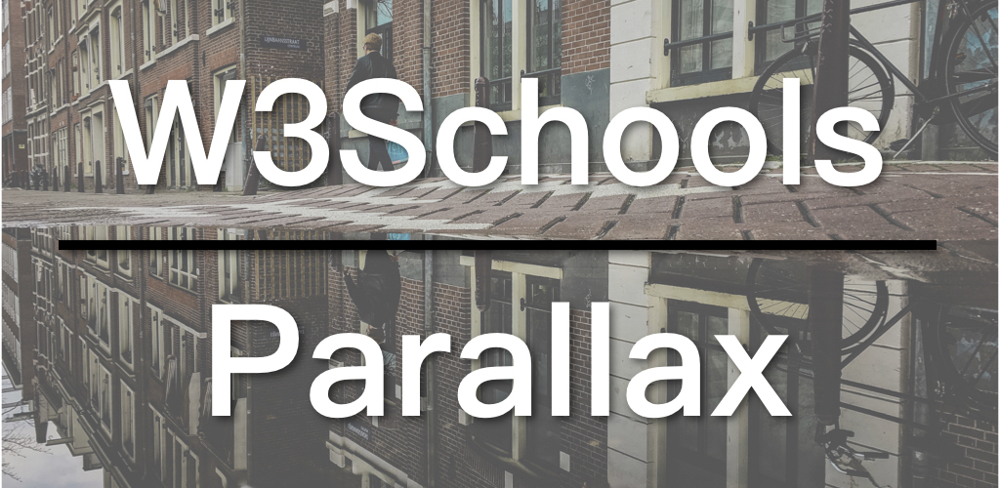

视差（parallax）效果是指背景图片的移动速度与前景不同，产生一种背景没动，只有前景在动的效果。视差效果看起来十分酷，有一段时间相当流行，并出现了各种不同的变化。现在也满常在一些主打设计的网站上看到。我看过W3Schools的教学后，发现实现方法远比想像中简单，至少最基本款是不难，完全就靠`background-attachment`一项设定来完成。

* [W3Schools视差效果教学](https://www.w3schools.com/howto/howto_css_parallax.asp)
* [视差效果例子](https://www.w3schools.com/howto/tryhow_css_parallax_demo.htm)
* [background-attachment讲解](https://www.w3schools.com/cssref/pr_background-attachment.asp)

## 视频连结

* [B站](https://www.bilibili.com/video/av48667387/)
* [YouTube](https://youtu.be/LoYzCMQIopk)

## 视差效果（Parallax)

实现视差效果的重点在于：

1. 用一个容器div来放背景图。
2. 设定容器高度，也就是视差图片的高度；若要占满全屏，可使用百分比-100%，但要将`body`和`html`的高度也设为100%，否则图片会被前景内容覆盖。
3. 最后设定图片的`background-attachment: fixed`，让背景图不随滚动条移动。

以下是视差效果的HTML部分：

```
<div class="parallax"></div>

<div style="height:1000px;background-color:blue;font-size:36px">
Scroll Up and Down this page to see the parallax scrolling effect.
This div is just here to enable scrolling.
Tip: Try to remove the background-attachment property to remove the scrolling effect.
</div>

<div class="parallax"></div>
```

HTML的部分很简单，就是一个视差容器，一个前景内容容器，最后再放一次视差容器，让背景图再出现一次。最后的那个容器也可省略，让效果提前结束。

再来看视差效果的CSS的部分：

```
body, html {
  height: 100%;
}

.parallax {
  /* The image used */
  background-image: url('img_parallax.jpg');

  /* Full height */
  height: 100%; 

  /* Create the parallax scrolling effect */
  background-attachment: fixed;
  background-position: center;
  background-repeat: no-repeat;
  background-size: cover;
}
```

同样也是非常简单，前面提过，我们要让背景图占满整个屏幕（height: 100%），就要将`body`和`html`的高度也设为100%。视差容器中先指定背景图片，再设定容器高度，最后便是一组背景设定：

1. `background-attachment: fixed;`：使背景图片不随滚动条移动；
2. `background-position: center;`使背景图片置中；
3. `background-repeat: no-repeat;`使背景图片不重覆；
4. `background-size: cover;`使背景图片覆盖整个容器。

这样便完成了视差效果，连JavaScript都不需用上，是不是很简单？

W3Schools系列的代码都在GitHub上：[W3Schools GitHub](https://github.com/ZacharyChim/W3Schools)

## W3Schools教学系列

[W3Schools](https://www.w3schools.com)是知名的网页设计／前端开发教学网站，不仅提供HTML、CSS、JavaScript等的详尽教学，还可以把它当作说明文件（Documents）。有经验的前端或多或少已经接触过这个网站，因为它经常出现在搜索结果的前几项。其中，它的[How To](https://www.w3schools.com/howto/default.asp)部分更是包含了大量非常实用的例子，例如，如何制作SlideShow（图片轮播）、Lightbox、Parallax（视差效果）等等。因此我想做一系列的影片专门介绍这些How To。

W3Schools系列全部视频：

1. [Float响应式网页布局](https://zacklive.com/w3schools-web-layout/)
2. [Flexbox响应式网页布局](https://zacklive.com/w3schools-flex/)
3. [CSS Grid响应式网页布局](https://zacklive.com/w3schools-grid/)
4. [幻灯片如何实现](https://zacklive.com/w3schools-slideshow/)
5. [响应式导航如何实现](https://zacklive.com/w3schools-responsvie-nav/)
6. [灯箱效果如何实现](https://zacklive.com/w3schools-lightbox/)
7. [Parallax-视差效果如何实现](https://zacklive.com/w3schools-parallax/)
8. [可拖拉效果如何实现](https://zacklive.com/w3schools-draggable/)