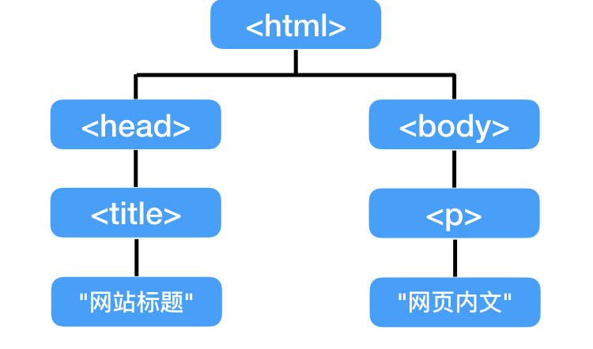

这是《JavaScript学徒》系列的第四课，本课会进入《JavaScript DOM 编程艺术》第3章，更深入地介绍DOM（Document Object Model 文档对象模型）。

##教学视频连结

* [YouTube](https://youtu.be/GGzf09XUEVQ)
* [YouKu](https://v.youku.com/v_show/id_XMzgwODA3NDgxMg==.html)

###DOM

D: Document - 文档；每一个网页都是一个文档，如：index.html。

O: Object - 对象；台湾翻译成物件，个人感觉更贴切；基本上可以理解成一个“东西”。JavaScript有三种对象：
1. 自定义对象（user-defined object）：由程序员自行创建的对象。
2. 内建对象（native object）：JavaScript内建对象，如[上一课](/javascript-dom-function-object))提过的Array, Math和Date。
3. 宿主对象（host object）：由浏览器提供的对象。**window**对象对应浏览器窗口，其属性与方法统称为浏览器对象模型 - BOM（Browser Object Model），提供`window.open`和`window.blur`等方法。

**document**对应网页自身；**window**对应浏览器。

M：Model - 模型；将文档对象看成如下的模型：

这个模型像一个家族谱，以`<head>`为例，在它上层的`<html>`称为**parent**父级元素(也叫节点)；在它下层的称为**child**子级；与它同层（具有相同父级）的称为**sibling**兄弟级。

其中，`<html>`是整个网页文档的起点，所以没有父级，也没有兄弟级，像一棵树的根，因此也称为**根元素**。

##节点

在图中的每一个项目（蓝色）都称为一个节点（**node**）。节点分三种：

1. 元素节点（element node），指HTML的元素（标签），如"p", "h1"等。
2. 文本节点（text node），网页的文字内容，像"p"底下的"网页内文"。
3. 属性节点（attribute node），像图片标签``，需要指定图片的位置"src"，这个"src"便是``的一个属性。同一个标签的文本节点和属性节点是sibling的关系。

**id**和**class**是两个比较特别的属性，常配合CSS使用。id是唯一标识符，如：`<ul id="purchases">`，有了这句之后，整个文档里不能有另一个同样具有"purchase"这个id的`<ul>`标签，这样便能用来进行专属设定，例如提供专门的CSS样式；而class可用于多个标签，例如让数个标签共享某些CSS设定。

《JavaScript DOM 编程艺术》是受到众人推崇的JavaScript入门书籍。《JavaScript学徒》系列将以此书为教材来制作JavaScript学习影片。